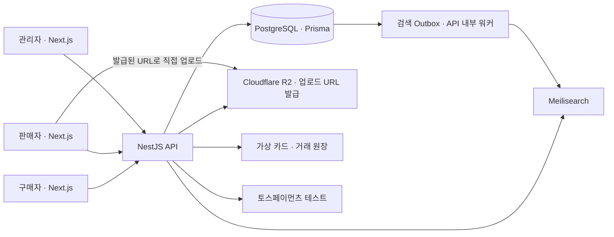

# 데모 마켓

**세 역할의 웹 앱과 공통 UI·검증 환경을 구축한 멀티 셀러 이커머스입니다.**
구매자·판매자·관리자 앱을 모노레포로 구성하고, AI에 작업을 위임하는 과정과
Storybook·MSW·Playwright·CI/CD를 통한 검토 체계를 함께 만들었습니다.
방문자는 가입 없이 데모 계정을 발급받아 구매·판매·운영 화면을 체험할 수 있습니다.

| 체험 | 주소 |
| --- | --- |
| 구매자 | <https://shop.demo-shopping.com> |
| 판매자 | <https://seller.demo-shopping.com> |
| 관리자 | <https://admin.demo-shopping.com> |
| 공통 UI · Storybook | <https://presenty1897.github.io/demo-shopping/> |

각 앱의 로그인 화면에서 **데모 계정 받기**를 누릅니다. 세 앱은 세션이 독립이므로 탭을
동시에 열 수 있습니다. 계정은 기본 24시간 유효하며, 가상 카드와 배송 시뮬레이터를 사용합니다.
토스페이먼츠 연동도 테스트 환경입니다. 실제 결제·운송은 일어나지 않습니다.

**같은 주문을 세 역할로 보려면 판매자 계정을 먼저 만드세요.** 그 스토어의 상품을 구매한 뒤
주문번호로 판매자 화면에서 찾습니다. [체험 순서와 확인할 결과](./docs/demo-guide.md)를 따르세요.
API 콜드 스타트와 검색 반영에 대기가 생길 수 있습니다.

## 한 화면을 세 가지 밀도로

상점의 표시 밀도를 바꾸면 상품 배치와 카드의 정보량이 함께 바뀝니다. 콘솔은 표준 밀도로 고정합니다.

| 1440px 상점 그리드 | 미니멀 | 표준 | 맥시멀 |
| --- | --- | --- | --- |
| 한 줄의 상품 수 | 3개 | 4개 | 6개 |
| 표현 의도 | 사진과 가격 중심 | 비교에 필요한 정보 | 더 많은 상품과 상세 정보 |

밀도 토큰·그리드 규칙은 공통 UI에 두고, 저장된 선택을 첫 페인트 전에 적용합니다.
[밀도 규칙](./packages/ui/src/density/density.ts) · [브라우저 검증](./e2e/tests/density.spec.ts)


## 구현 범위

| 역할 | 주요 기능 |
| --- | --- |
| 구매자 | 검색·속성 필터, 장바구니·재고 예약, 가상 카드·토스 테스트 결제, 쿠폰·적립금, 취소·반품, 리뷰·문의 |
| 판매자 | 속성 정의 기반 상품 등록, 옵션별 가격·재고, 주문 확인·발송, 클레임 처리, 매출·정산 |
| 관리자 | 카테고리·속성 관리, 입점 심사, 회원·상품·주문 조회, 쿠폰·정산, 데모 정책·정합성 확인 |

## 구조



| 영역 | 사용 기술 |
| --- | --- |
| 웹 | Next.js 16 · React 19 · Tailwind CSS 4 |
| API · DB | NestJS 12 · Prisma 7 · PostgreSQL 17 |
| 공통 | TypeScript 6 · pnpm workspace · Zod 계약·API 클라이언트 |
| 검증 | Vitest · 실제 PostgreSQL 통합 테스트 · MSW · Playwright · axe-core · Lighthouse CI |
| 배포 구성 | Vercel(웹) · Render(API·검색) · Neon(DB) · Cloudflare R2 |

API는 하나의 애플리케이션이며 도메인별 NestJS 모듈로 나눴습니다. 검색은 DB 변경과 같은
트랜잭션에 Outbox를 기록한 뒤 비동기로 반영합니다. 검색 엔진에 장애가 나도 상품 저장과
검색 동기화를 분리할 수 있습니다. [상세 구조와 경계](./docs/architecture.md)

## 프론트엔드 개발 기반

| 주제 | 구성과 목적 | 근거 |
| --- | --- | --- |
| 세 앱과 공통 패키지 | shop·seller·admin은 독립 앱으로, UI·API 계약·설정은 공통 패키지로 구성 | [워크스페이스](./pnpm-workspace.yaml), [공통 UI](./packages/ui), [API 계약](./packages/shared) |
| 컴포넌트 개발·검토 | Storybook에서 상태·밀도별 UI를 확인하고, 스토리 접근성 검사를 테스트에 연결 | [스토리](./packages/ui/stories), [접근성 검사](./packages/ui/test/story-a11y.spec.tsx) |
| API 모킹 환경 | MSW로 화면 테스트의 API 상태를 구성하고, 처리되지 않은 요청은 실패로 검출 | [MSW 하네스](./packages/api-mocks/src/node.ts) |
| 연결된 동작 검증 | 실제 API·DB 통합 테스트와 Playwright E2E로 구매·판매·부분 취소 등을 확인 | [API 테스트](./apps/api/test), [E2E](./e2e/tests) |
| 지속적인 검사·배포 | CI에서 타입·lint·빌드·테스트 검사, 관련 main 변경 시 Storybook 배포 | [CI](./.github/workflows/ci.yml), [Storybook 배포](./.github/workflows/storybook.yml) |

Storybook은 컴포넌트를 직접 검토하는 화면이고, CI는 코드로 정의한 조건을 자동 검사합니다.
Playwright E2E는 로컬·CI에서 실행한 서비스가 대상이며, 실제 배포 서비스의 동작 검증과 구분합니다.

## AI를 활용한 작업 구조화

설계·구현·테스트·검토에 AI를 활용했습니다. TASK에 범위·선행 조건·완료 기준을 작성하고,
사용자가 검토·승인한 작업을 worktree별로 위임했습니다. 조정 역할은 공통 파일 소유권과
브랜치 통합을 맡고, 작업자는 담당 범위의 구현과 검사를 수행하도록 나눴습니다.

**작업별 검사 통과가 전체 기능 완성을 뜻하지는 않았습니다.** 병행 구현 후 통합 검토에서
홈과 팔로우 기능 사이의 누락을 발견했고, 원래 TASK의 완료 기준을 통합 후 다시 대조하도록
규칙을 보완했습니다. 역할 분담·위임 절차·실패 사례는 [AI 작업 프로세스](./docs/ai-workflow.md)에 있습니다.

거래를 뒷받침하는 주문 분리·재고 예약·결제 복구·할인액 안분과 환불 계산은
[도메인 의사결정](./docs/WHY.md)에 정리했습니다.

## 검증과 측정

CI에서 구성한 스택의 공개 화면 6개를 측정했습니다. 측정 방식별 결과와 개선 전후는
[성능 문서](./docs/design/performance.md)에서 확인할 수 있습니다.

| 지표 | 기록된 결과 | 조건·의미 |
| --- | --- | --- |
| LCP | 1.54~1.60초 | 공개 화면 6개, DevTools throttling, 3회 중앙값 |
| LCP | 3.01~3.16초 | 같은 문서의 Lantern 시뮬레이션 결과. CI 상한은 3.4초 |
| 홈·검색 CLS | 0.223→0.000 / 0.366→0.000 | 늦게 나타나는 영역의 공간 확보 전후 |
| Lighthouse 접근성 | 0.96~1.00 | 공개 화면 측정 기록. 모든 화면·보조기기 검증을 뜻하지 않음 |
| 공통 JS gzip | 앱별 166.0~166.4KB | 모든 경로가 공유하는 청크. 개별 페이지 전체 JS 크기가 아님 |

API 성능 예산은 목록·상세 p95 300ms, 검색 p95 200ms입니다.
실제 DB를 사용하는 성능 테스트에서 시간과 쿼리 수를 검사합니다.

백엔드는 실제 DB의 제약·잠금·동시 요청을, 프론트는 공통 계약 기반 MSW 테스트로 검증합니다.
[구매·판매자·부분 취소·밀도 전환 E2E](./e2e/tests)도 구성했습니다. 키보드 조작 등 상세 검증 범위는
[검증 기록](./docs/portfolio-status.md)에 정리했습니다.

## 로컬 실행

Node.js 24, pnpm 9.15, Docker Compose가 필요합니다. 저장소를 클론한 루트에서 실행합니다.

```bash
pnpm install --frozen-lockfile
cp .env.example .env
node -e 'const fs = require("node:fs"); const crypto = require("node:crypto"); fs.appendFileSync(".env", "\nJWT_SECRET=" + crypto.randomBytes(48).toString("base64") + "\n")'
pnpm infra:up
pnpm db:deploy
pnpm db:seed
pnpm search:reindex
pnpm dev
```

새 환경에서 한 번 설정하는 절차입니다. 기존 `.env`가 있으면 덮어쓰지 말고
[실행 안내](./docs/getting-started.md)를 따릅니다. Google OAuth·토스·R2 키 없이도 데모 발급과
가상 카드 결제를 사용할 수 있습니다. 이미지 업로드와 외부 연동은 각각의 설정이 필요합니다.

기본 주소는 구매자 `localhost:3000`, 판매자 `localhost:3001`, 관리자 `localhost:3002`,
API `localhost:4000/api/v1/health`입니다. 포트 변경은 [실행 안내](./docs/getting-started.md)를 따릅니다.

## 범위와 문서

교환·실제 운송·실결제는 제공하지 않습니다. 구매자 클레임 진행 알림과 판매자 신규 리뷰 알림은
미구현이며, 외부 환불 성공 후 내부 기록 실패의 복구 보장은 추가 검증이 필요합니다.
[알려진 제한과 공개 전 점검](./docs/portfolio-status.md)

| 문서 | 내용 |
| --- | --- |
| [AI 작업 프로세스](./docs/ai-workflow.md) | 작업 분해·위임·검증·통합과 실패 사례 |
| [도메인 의사결정](./docs/WHY.md) | 여섯 가지 설계와 코드·테스트 근거 |
| [아키텍처](./docs/architecture.md) | 앱·데이터·외부 시스템 경계 |
| [실행 방법](./docs/getting-started.md) | 필수 환경 설정, 실행과 검사 |
| [체험 안내](./docs/demo-guide.md) | 같은 거래를 역할별로 확인하는 순서 |
| [데이터 모델](./docs/design/erd.md) · [상태 전이](./docs/design/state-machines.md) · [할인액 안분과 환불 계산](./docs/design/pricing.md) | 도메인 설계 |
| [작업 인덱스](./docs/tasks/README.md) · [결정 이력](./docs/decisions/DECISIONS.md) | 진행 상태와 판단 기록 |
