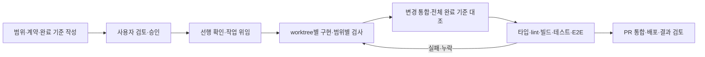

# AI를 활용한 작업 구조화와 검증

이 프로젝트는 AI를 설계 문서 초안, 구현, 테스트 작성, 코드 검토와 문서 정리에 활용했다.
제품 범위와 변경 판단을 사용자와 논의하고, 승인된 작업은 AI 작업자에게 위임하는 방식으로 진행했다.
이 문서는 저장소에 남은 작업 규약과 결정 기록으로 확인할 수 있는 과정을 정리한다.
모든 구현을 사람이 직접 작성했거나, 모든 변경을 사람이 줄 단위로 검토했다고 주장하지 않는다.

## 1. 먼저 위임할 수 있는 작업을 정의했다

큰 기능 이름만 전달하는 대신 TASK마다 목적·포함/제외 범위·선행 작업·설계·완료 기준을 적었다.
설계 초안을 검토·승인한 뒤 구현하고, 새 판단이 필요하면 문서와 범위를 갱신하는 절차를 두었다.

예를 들어 ‘상품 관리 화면’은 API 계약, 속성 검증, 편집 UI, 재고 변경을 모두 포함할 수 있다.
어느 계층까지 맡는지 명확하지 않으면 작업자가 다른 쪽에 없는 계약을 가정하게 된다.
API와 화면 작업을 나눌 때 공유 계약과 선행 조건을 함께 확인하도록 했다.

근거: [TASK 템플릿](./tasks/TASK-TEMPLATE.md),
[API·화면 작업 분할 기록](./decisions/2026-09-03-session-02.md),
[개발 규약](../CLAUDE.md)

## 2. 판단·조정·구현의 책임을 구분했다

| 역할 | 책임 |
| --- | --- |
| 사용자 | 제품 방향·범위·설계 변경에 대한 판단과 피드백, 승인 범위 설정, 포트폴리오 결과물 검토 |
| 조정 역할의 AI | 선행 조건 확인, 작업 배분, 공통 파일 소유권 조정, 결과 대조, 브랜치 통합과 검사 |
| 위임받은 AI 작업자 | 지정된 범위의 구현·테스트·문서 작성, 불명확한 계약과 범위 밖 문제 보고 |

승인은 정해진 범위 안의 실행을 허용하는 기준으로 사용했다. 반복 작업까지 매번 사용자가
다시 지시해야 하는 방식은 자율 실행의 목적과 맞지 않는다. 반면 제품·설계 변경을 승인 없이
기존 범위에 섞으면 검토할 기준 자체가 바뀐다. 이 경계를 문서로 관리하려 했다.

이는 역할과 규칙의 설명이다. 실제로 규칙이 누락되거나 검증이 부족한 사례도 있었고,
아래처럼 발견 후 절차를 보완했다.

## 3. 병행 작업은 파일과 계약의 경계로 나눴다

기능별 git worktree와 브랜치를 사용했다. 포트는 `PORT_OFFSET`, 로컬 컨테이너·볼륨은
`COMPOSE_PROJECT_NAME`으로 구분해 여러 작업 환경이 같은 포트나 DB를 사용하지 않도록 했다.

작업자에게는 담당 경로를 지정하고, 전체 TASK 인덱스와 결정 번호처럼 여러 작업이 함께
변경하는 파일은 조정 역할에 모았다. 병행 작업에서 같은 파일을 각자 고쳐 상대 변경을
덮어쓰거나, 존재하지 않는 API를 화면에서 먼저 가정하는 일을 줄이기 위한 규칙이다.

공통 API 타입·Zod 계약은 `packages/shared`, UI는 `packages/ui`, 테스트 대역은
`packages/api-mocks`에 두었다. 모노레포의 패키지 경계가 AI에게 설명하는 작업 경계이기도 했다.

근거: [개발 규약의 ‘병행 작업의 소유권’](../CLAUDE.md),
[API 실패 표현의 공통 소유권](./decisions/2026-09-05-session-05.md),
[포트 계산](../scripts/ports.mjs)

## 4. 작업자 검사와 통합 검사를 나눴다

구현 중에는 담당 패키지·변경 범위의 검사를 실행하고, 통합 시점에 전체 회귀를 확인하는
방식으로 검사 비용을 나눴다. 작업자의 완료 보고만으로 전체 TASK를 완료로 처리하지 않고,
완료 기준마다 구현과 검사 근거가 있는지 대조하도록 했다.

프론트 검증 수단도 역할이 다르다.

| 수단 | 확인하는 것 | 별도로 필요한 것 |
| --- | --- | --- |
| Storybook | 공통 컴포넌트의 상태·밀도를 서비스 흐름과 분리해 확인 | 실제 화면 배치·사용성 검토 |
| 스토리·접근성 테스트 | portable stories에 대한 구조적 axe 검사 등 | jsdom이 다루지 못하는 실제 레이아웃·브라우저 검토 |
| MSW 화면 테스트 | 통제된 API 상태에서 화면 반응, 요청과 오류 처리 | 실제 서버·DB와 연결되는 동작 |
| API 통합 테스트 | 실제 PostgreSQL의 제약·상태·동시성 | 브라우저 화면과 연결되는 동작 |
| Playwright E2E | 실행 중인 앱·API를 연결한 구매·판매·부분 취소·밀도 전환 | 배포 도메인·환경변수·쿠키 설정을 포함한 실제 서비스 검증 |

Storybook은 관련 경로의 main 변경 시 GitHub Pages로 배포하도록 구성했다. CI 자동 검사와
배포된 Storybook을 통한 시각적 검토는 다른 역할이다. 모든 PR의 화면을 이미지 비교로
자동 판정하는 시각 회귀 시스템을 구축했다고 설명하지 않는다.

근거: [스토리 접근성 검사](../packages/ui/test/story-a11y.spec.tsx),
[MSW 하네스](../packages/api-mocks/src/node.ts), [CI](../.github/workflows/ci.yml),
[Storybook 배포](../.github/workflows/storybook.yml), [E2E](../.github/workflows/e2e.yml)

## 5. 실제로 드러난 위임의 한계

**분리된 작업이 모두 통과해도 기능 사이가 비어 있을 수 있었다.**

커뮤니티 화면 작업을 세 갈래로 나눈 뒤 완료 기준을 다시 읽었을 때, 홈에 표시할 팔로우
브랜드 신상품 기능이 빠져 있었다. 작업자들은 각각의 브리프를 수행했지만, 홈과 팔로우의
경계에 있는 요구사항을 어느 브리프도 소유하지 않았다.

이 경험을 ‘나눈 뒤에 합쳐서 다시 읽는다’는 규칙으로 기록했다. 위임 계획에는 개별 파일뿐 아니라
여러 기능을 연결하는 요구사항의 책임도 있어야 한다. 통합 검토자는 작업자 보고를 합산하는 대신
원래 TASK의 완료 기준을 다시 확인해야 한다.

근거: [D-249 — 완료 기준을 세 갈래가 끝난 뒤 다시 읽었다](./decisions/2026-09-08-session-01.md)

**저장과 표시가 각각 동작해도 실제 기능에 연결되지 않을 수 있었다.**

데모 정책을 저장하는 API와 화면은 있었지만 계정 발급이 저장된 정책 대신 상수를 읽는
문제가 발견됐다. 이후 정책을 바꾼 뒤 실제 계정을 발급해 만료 시각을 확인하는 검사를 추가했다.
이 사례는 ‘저장된다’와 ‘보인다’ 외에 ‘바꾼 값이 다음 동작에 적용된다’를 물어야 한다는 근거다.

근거: [D-261 — 칸을 만들고 쓰는 쪽을 안 만들었다](./decisions/2026-09-08-session-01.md)

## 6. 포트폴리오에서 설명할 기여와 한계

설명할 기여는 작업 범위·공통 계약·파일 소유권·완료 기준을 정하고, AI가 만든 결과를
검사·통합·재검토하는 과정을 구성하고 보완한 것이다. 생성된 코드 양을 개인의 직접 작성량으로
제시하거나, 에이전트 수를 그대로 생산성 향상으로 해석하지 않는다.

기존 규약과 현재 모든 TASK의 검증 상태가 완전히 일치하지는 않는다. 이번 문서 정리에서도
가이드의 실제 동선과 완료 표시가 어긋난 부분을 발견해 재검증 대상으로 돌렸다.
현재 검증 범위와 배포 서비스 미검증 항목은 [점검표](./portfolio-status.md)에 기록한다.

토큰 비용·처리 시간·에이전트 수 등 회고 수치는 원본 범위와 산정 방법을 검증한 뒤 별도로
사용해야 한다. 이 문서는 그런 수치를 속도나 비용 개선의 증거로 사용하지 않는다.
