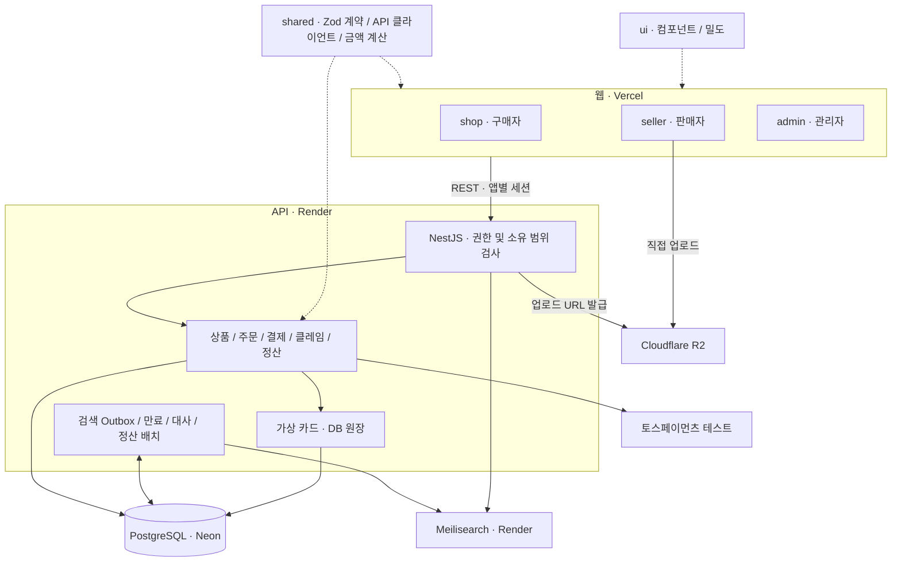
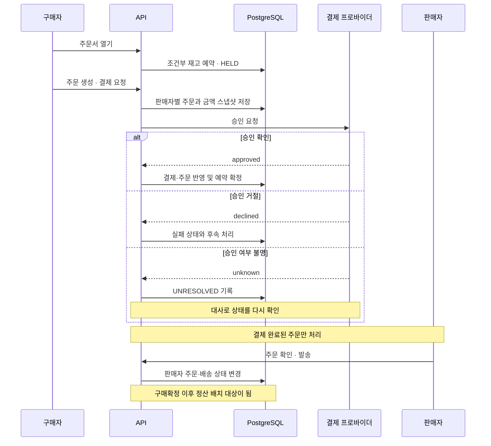

# 아키텍처

구매자·판매자·관리자는 독립된 Next.js 앱이며, 하나의 NestJS API와 PostgreSQL을 사용한다.
API 내부의 모듈·배치·검색 워커를 별도 배포 서비스로 표현하지 않는다.

## 책임과 데이터 경계

| 경계 | 책임 | 근거 |
| --- | --- | --- |
| 웹 ↔ API | 공통 Zod 계약과 클라이언트로 요청·응답 형식을 공유 | [`packages/shared`](../packages/shared/src/index.ts) |
| 인증 ↔ 권한 | 앱별 세션, 역할별 permission, `own/demo/any` 리소스 범위 | [권한 매트릭스](./design/permission-matrix.md) |
| 주문 ↔ 판매자 주문 | 결제는 Order, 판매자별 상태·배송은 SellerOrder, 상품 스냅샷은 OrderItem | [ERD](./design/erd.md) |
| DB ↔ 검색 | DB가 원본. 변경과 Outbox를 같은 트랜잭션에 기록하고 비동기 색인 | [Outbox](../apps/api/src/search/search-outbox.service.ts) |
| 결제 ↔ 프로바이더 | 가상 카드와 토스 테스트를 같은 포트 뒤에 둠. 결과 불명을 별도 상태로 처리 | [결제 포트](../apps/api/src/payment/payment-provider.ts) |
| 거래 ↔ 이력 | 재고·가상 카드·적립금 원장과 주문·클레임 상태 이력으로 변경 근거 보존 | [스키마](../apps/api/prisma/schema.prisma) |

데모 구매자의 개인 데이터는 계정에, 판매자 상품은 스토어에 속한다. 데모 관리자는 데모 소유
리소스를 처리할 수 있으며, 방문자마다 관리자 전용 데이터베이스가 생기는 구조는 아니다.
권한 범위와 목록별 집계 범위를 구분해야 한다.

## 거래가 지나가는 경로

이 그림은 주요 상태의 순서를 요약한다. 외부 프로바이더 호출까지 DB 트랜잭션 하나로
원자적으로 묶인다는 뜻은 아니다. 특히 외부 환불 성공 뒤 내부 기록 실패는
[추가 검증 항목](./portfolio-status.md)에 남아 있다.

## 배포 제약과 대응

API와 검색은 별도의 배포 서비스다. 웹은 데이터 응답을 기다리는 동안 안내를 표시한다.
검색 인덱스가 비어 있는 부팅에서는 DB를 원본으로 다시 색인한다. 배치가 API 프로세스 안에서
실행되므로 프로세스가 잠든 동안의 처리는 재기동과 다음 실행에 영향을 받는다.

[배포 설정](../render.yaml) · [콜드 스타트 정책](../apps/shop/src/lib/wake-policy.ts) ·
[검색 인덱서](../apps/api/src/search/search-indexer.service.ts)
