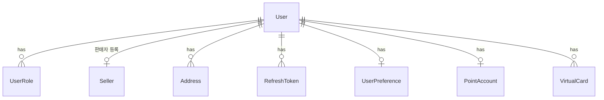
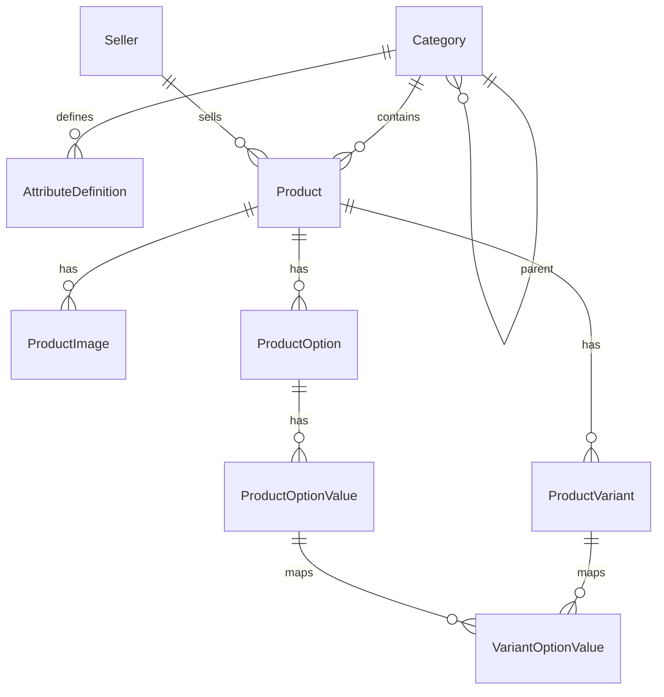
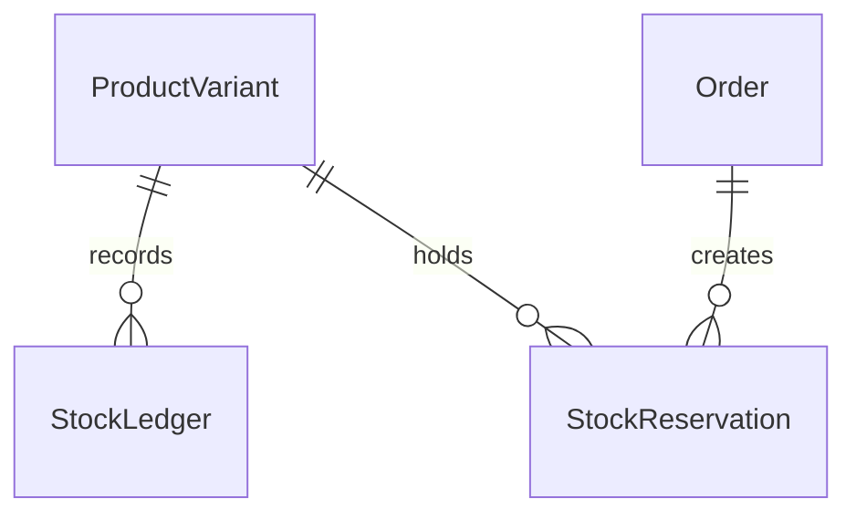
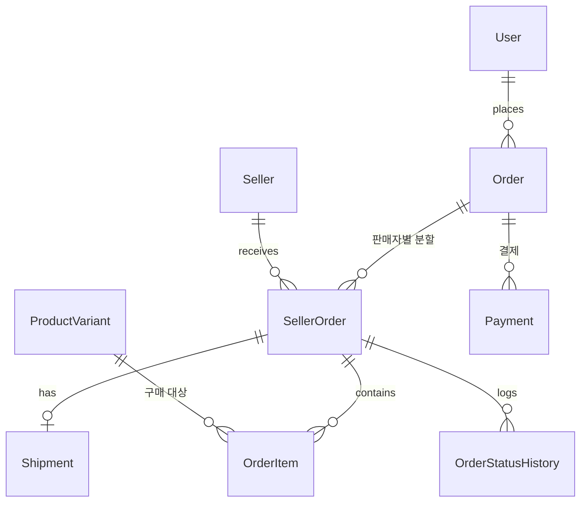
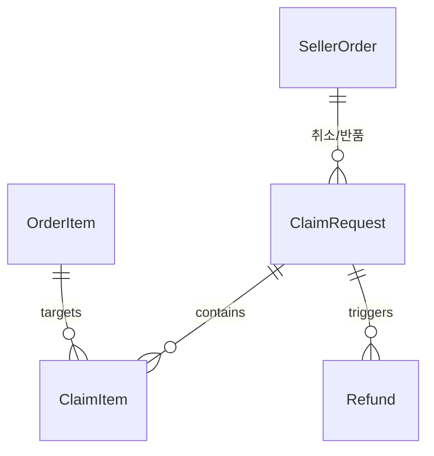
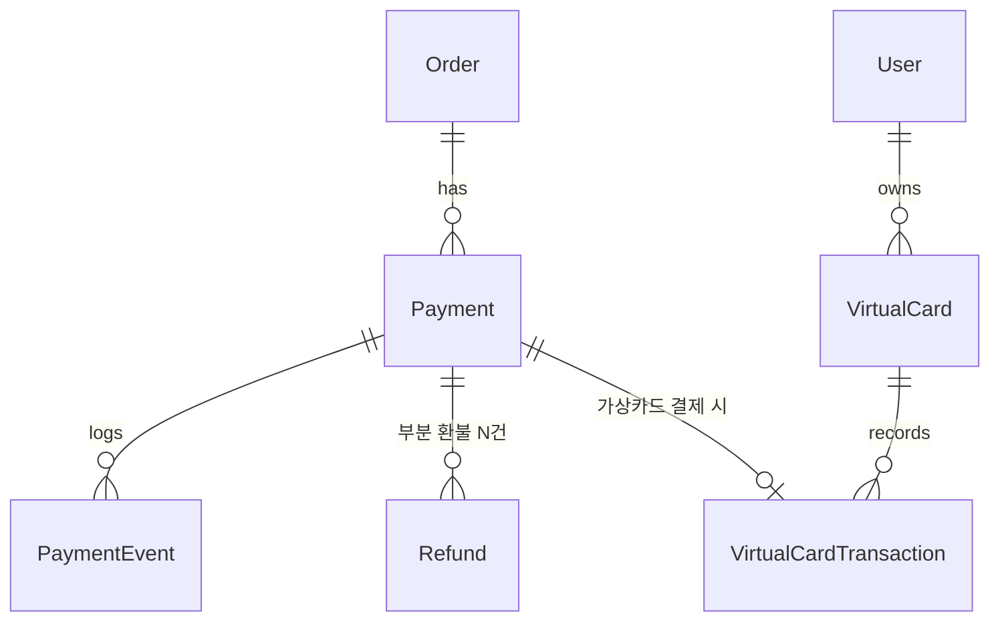
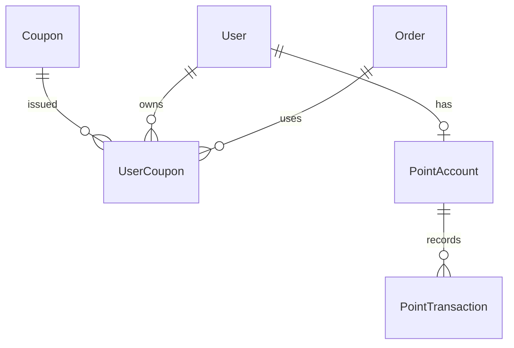
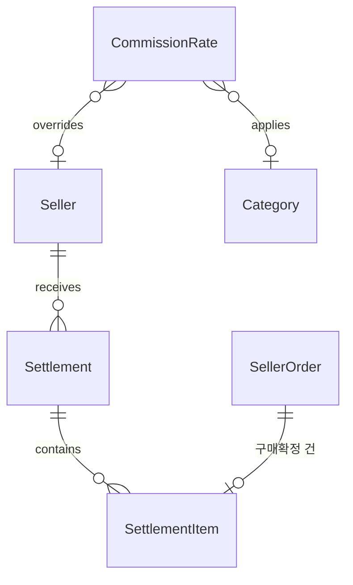
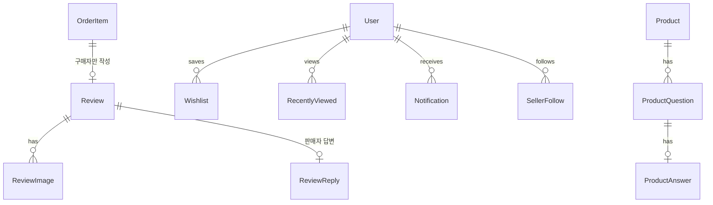

# 데이터 모델 (ERD)

> 현재 유효한 스키마 설계만 담는다. 구현이 시작되면 컬럼 타입·제약의 단일 출처는 `apps/api/prisma/schema.prisma` 이고,
> 이 문서의 역할은 **테이블의 목적과 관계, 그리고 왜 이렇게 나눴는지**로 좁아진다.
>
> 최종 갱신: 2026-09-02

## 설계 원칙

1. **금액은 정수(원 단위)로 저장한다.** 부동소수 금액 계산 금지.
2. **주문·결제·정산에 관련된 값은 스냅샷으로 남긴다.** 상품명·가격이 나중에 바뀌어도 과거 주문서는 그대로여야 한다.
3. **잔액이 있는 것은 원장(ledger)을 둔다.** 재고, 적립금, 가상 카드. 현재값은 원장의 결과이며 대사가 가능해야 한다.
4. **상태 변경은 이력을 남긴다.** 누가 언제 무엇을 왜 바꿨는지 추적 가능해야 한다.
5. **동시 변경은 성격에 따라 다르게 막는다.**
   - 사람이 편집하는 데이터(카테고리·상품 정보) → **낙관적 잠금**(`version`). 충돌을 사용자에게 알리고 선택하게 한다
   - 수량·잔액(재고·적립금·가상카드) → **행 잠금으로 직렬화**. 알릴 대상이 없으므로 순서대로 처리하고 부족한 요청만 실패시킨다
   - 트리 구조 이동 → **어드바이저리 락**. 경로 재계산이 겹치면 트리가 깨진다
6. 삭제는 대부분 소프트 삭제(`deletedAt`)로 처리한다. 주문 이력이 걸린 데이터를 물리 삭제하지 않는다. **id 는 재사용하지 않는다.**

---

## 1. 계정 · 인증



| 테이블 | 목적 | 비고 |
| --- | --- | --- |
| `User` | 계정 | `googleSub` 로 Google 계정 연결. `isDemo`, `demoExpiresAt` 로 데모 계정 구분 |
| `UserRole` | 역할 | BUYER / SELLER / ADMIN. **다대다** — 한 사람이 구매자이면서 판매자일 수 있다 |
| `Seller` | 판매자(스토어) | 브랜드명, 로고, 승인 상태, 개별 수수료율(선택) |
| `Address` | 배송지 | 기본 배송지 플래그 |
| `RefreshToken` | 세션 | `app` 컬럼으로 shop/seller/admin 구분 — **앱별 세션이 독립**이므로 필요 |
| `UserPreference` | 사용자 설정 | 표시 밀도(3단계), 언어, 통화 |

**왜 역할을 다대다로 두는가**: 판매자도 물건을 산다. 역할을 단일 컬럼으로 두면 판매자가 구매자 앱을 쓸 수 없거나, 계정을 두 개 만들어야 한다.

---

## 2. 카탈로그



| 테이블 | 목적 | 비고 |
| --- | --- | --- |
| `Category` | 카테고리 트리 | 자기 참조. `path`(`/1/5/12/`)를 캐시해 하위 전체 조회를 한 번에. **`id` 는 재사용하지 않는다** — 결번이 생겨도 채우지 않으며, 재사용하면 과거 스냅샷이 엉뚱한 카테고리를 가리킨다 |
| `AttributeDefinition` | 속성 **정의** | 카테고리에 연결. 타입, 선택지, 필터 노출 여부, 표시 순서. **상위 카테고리에서 상속** |
| `Product` | 상품 | 속성 **값**은 `attributes` JSONB. 목록 표시용 `minPrice`, `ratingAvg`, `salesCount` 캐시 |
| `ProductOption` | 옵션 정의 | "색상", "사이즈"와 표시 순서 |
| `ProductOptionValue` | 옵션 값 | "블랙", "M". `meta` JSONB 에 색상칩 hex 등 |
| `ProductVariant` | **SKU** | 재고·가격의 실제 단위. 옵션 없는 상품도 Variant 1개를 강제 생성. `maxPurchaseQuantity` 로 1회 주문 최대 수량 제한 |
| `VariantOptionValue` | 조합 매핑 | Variant ↔ 옵션값 다대다 |

**속성을 정의/값으로 나눈 이유**: 정의가 테이블이어야 상품 등록 폼과 검색 필터 UI를 정의로부터 자동 생성할 수 있다. 값까지 테이블로 빼면(순수 EAV) 상품 목록 20개 조회에 조인이 폭증한다. 필터링·패싯은 Meilisearch 가 담당하므로 DB 는 값을 통째로 읽고 쓰기만 하면 된다.

**대가**: DB 가 값의 타입·범위를 강제하지 못한다. 저장 직전 `AttributeDefinition` 을 읽어 zod 스키마를 동적 생성해 검증하는 코드가 **필수**다.

---

## 3. 재고



| 테이블 | 목적 |
| --- | --- |
| `StockLedger` | 재고 변동 원장. 입고 / 판매 / 취소 / 반품입고 / 관리자조정을 전부 행으로 기록 |
| `StockReservation` | 주문서 작성 시 15분간 재고 선점. `HELD` → `CONFIRMED` / `RELEASED` |

```
가용재고 = ProductVariant.stock − SUM(StockReservation WHERE status='HELD' AND expiresAt > now)
```

예약 생성은 `UPDATE ... WHERE stock - reserved >= qty` 조건부 갱신으로 동시성을 막는다. 실패하면 즉시 품절 처리한다.
만료된 예약을 정리하는 스케줄러가 필수이며, 이 스케줄러의 동작 여부는 헬스체크 대상이다.

---

## 4. 주문 · 배송



| 테이블 | 목적 | 비고 |
| --- | --- | --- |
| `Order` | 주문서 | **결제 단위**. 총 상품금액·할인·배송비·적립금 사용·실결제액. 수령인 정보는 스냅샷 |
| `SellerOrder` | 판매자별 주문 | **배송·취소·정산 단위**. 상태가 여기에 붙는다 |
| `OrderItem` | 주문 항목 | 상품 스냅샷(JSONB), 단가, 수량, 항목별 할인 안분액 |
| `Shipment` | 배송 | 운송사·운송장번호는 가상 생성. 상태 전이도 가상 진행 |
| `OrderStatusHistory` | 상태 이력 | 이전/이후 상태, 사유, 처리 주체 |

**왜 2단으로 나누는가**: 한 주문에 여러 판매자 상품이 섞일 수 있다. 판매자 A는 배송완료인데 B는 준비중일 수 있어야 하고, B만 취소할 수 있어야 하며, 정산도 판매자별로 나간다. 상태를 `Order` 에 두면 이 셋이 전부 불가능해진다.

**할인 안분**: 주문 단위로 적용된 쿠폰·적립금을 `OrderItem` 까지 안분해 저장한다. 부분 취소 시 "이 항목에 할인이 얼마 붙어 있었나"를 그 자리에서 알 수 있어야 한다. 안분 규칙은 `docs/design/pricing.md` 참조.

---

## 5. 클레임 (취소 · 반품)



| 테이블 | 목적 |
| --- | --- |
| `ClaimRequest` | 취소(배송 전) / 반품(배송 후) 요청. 유형·상태·사유·귀책(고객/판매자) |
| `ClaimItem` | 대상 주문 항목과 수량 — **부분 취소·부분 반품을 위해 항목 단위** |
| `Refund` | 환불 실행 기록. 결제 1건에 환불 N건이 붙을 수 있다 |

교환은 구현하지 않는다. 반품 후 재구매로 안내한다.

---

## 6. 결제



| 테이블 | 목적 | 비고 |
| --- | --- | --- |
| `Payment` | 결제 | `provider` = VIRTUAL_CARD / TOSS. 승인액·누적취소액을 함께 보관 |
| `PaymentEvent` | 결제 이벤트 로그 | 웹훅 원문 포함. **멱등 처리의 근거** |
| `Refund` | 환불 | 부분 환불이 여러 번 발생하므로 별도 테이블 |
| `VirtualCard` | 가상 카드 | 한도, 사용액, 상태. 데모 계정 발급 시 1장 자동 지급 |
| `VirtualCardTransaction` | 카드 원장 | 승인/취소/환불 시 잔액 변화 기록 |

두 프로바이더는 `PaymentProvider { authorize, capture, cancel, refund }` 인터페이스 뒤에 둔다.
가상 카드는 한도 초과·잔액 부족·승인 거절을 **의도적으로 재현**할 수 있어야 한다. 결제 실패 시 재고 예약이 제대로 해제되는지 시연하기 위한 장치다.

---

## 7. 할인 (쿠폰 · 적립금)



| 테이블 | 목적 | 비고 |
| --- | --- | --- |
| `Coupon` | 쿠폰 정책 | `issuerType` = PLATFORM / SELLER. **부담 주체가 정산을 가른다** |
| `UserCoupon` | 발급된 쿠폰 | 발급/사용/만료 상태, 사용된 주문 |
| `PointAccount` | 적립금 잔액 | 사용자당 1개 |
| `PointTransaction` | 적립금 원장 | 적립/사용/복구/만료/조정. `balanceAfter` 를 함께 저장해 대사 가능 |

- 적립은 **구매확정 시점**에 지급한다. 배송완료 직후 주면 반품 시 회수할 수 없다.
- 환불 시 적립금은 **현금이 아니라 적립금으로** 복구된다.
- 플랫폼 쿠폰·적립금은 플랫폼 부담이라 판매자 정산에서 차감하지 않는다. 판매자 쿠폰만 차감한다.

---

## 8. 정산



| 테이블 | 목적 |
| --- | --- |
| `Settlement` | 주간 정산서. 판매액·수수료·판매자쿠폰·반품차감·지급액, 상태(대기/승인/지급완료) |
| `SettlementItem` | 정산서에 포함된 SellerOrder 별 내역 |
| `CommissionRate` | 수수료율. 카테고리 기본율 + 판매자별 개별율(우선) |

```
지급액 = 판매액 − 플랫폼 수수료 − 판매자 부담 쿠폰 − 반품 차감
```

실제 이체는 없다. 관리자가 "지급완료" 처리하면 상태만 바뀐다.

---

## 9. 회원 부가 기능



| 테이블 | 목적 | 비고 |
| --- | --- | --- |
| `Review` | 리뷰 | `orderItemId` **unique** — 구매한 항목당 1개. 구매 검증이 스키마로 강제된다 |
| `ReviewImage` / `ReviewReply` | 사진, 판매자 답변 | |
| `Wishlist` / `RecentlyViewed` | 찜, 열람 이력 | |
| `ProductQuestion` / `ProductAnswer` | 상품 문의 | 판매자가 답변, 비공개 문의 지원 |
| `SellerFollow` | 브랜드 팔로우 | |
| `Notification` | 앱 내 알림 | 주문 상태 변경, 배송 시작, 재입고. 이메일·푸시는 범위 외 |
| `Report` | 신고 | 리뷰·문의·상품 대상. 관리자가 처리 |

**리뷰의 구매 검증을 외래키로 처리하는 이유**: 애플리케이션에서 "주문했는지" 검사하는 대신 `orderItemId` 를 unique 로 걸면, 구매하지 않은 사람은 애초에 리뷰 행을 만들 수 없다. 중복 리뷰도 DB 가 막는다.

---

## 10. 데모 계정

| 관련 컬럼 | 위치 | 목적 |
| --- | --- | --- |
| `isDemo`, `demoExpiresAt` | `User` | 데모 계정 식별과 만료 시각 |
| `createdByDemo` | 데모가 생성 가능한 테이블 | 만료 시 일괄 삭제 대상 표시 |

- 상품 카탈로그는 공용이고, 장바구니·주문·리뷰·판매자 상품 등 개인 데이터만 격리한다.
- 만료 스케줄러가 `demoExpiresAt < now` 인 계정과 그 계정이 생성한 데이터를 삭제한다.
- 관리자 데모 계정의 파괴적 작업 차단 범위는 별도 TASK 에서 정의한다. (미확정)
