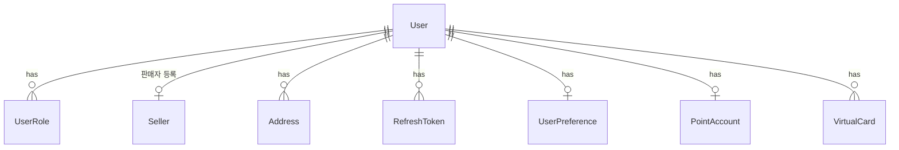
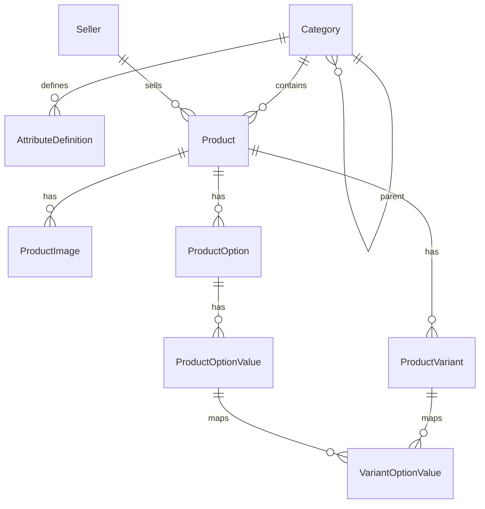
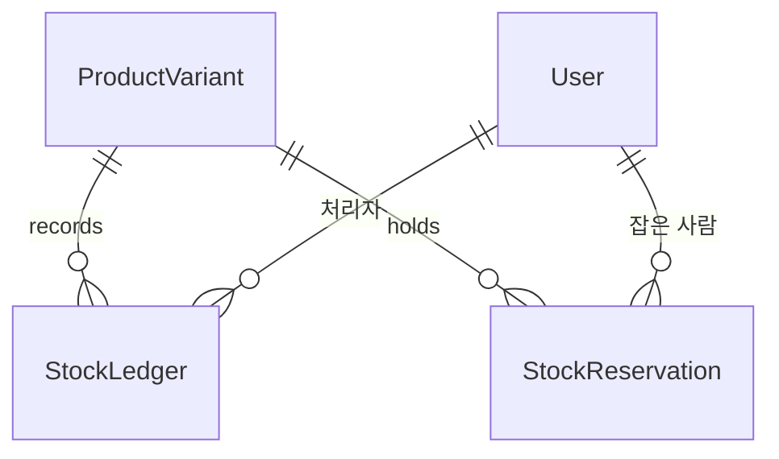
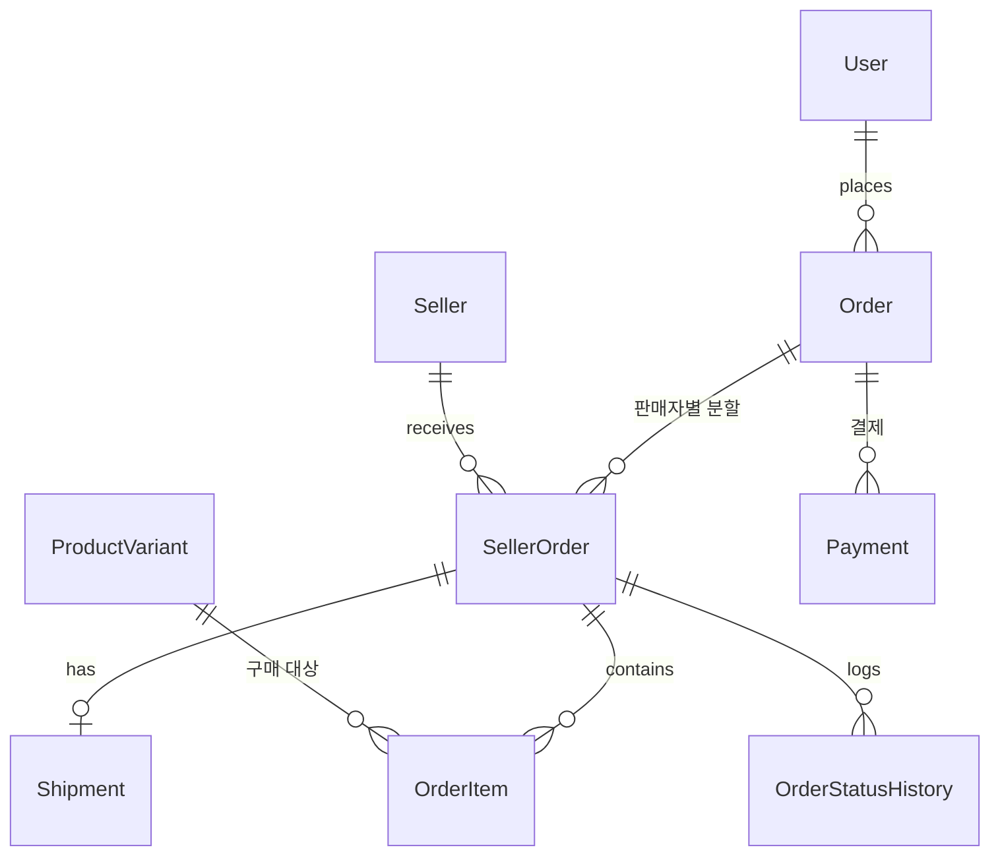
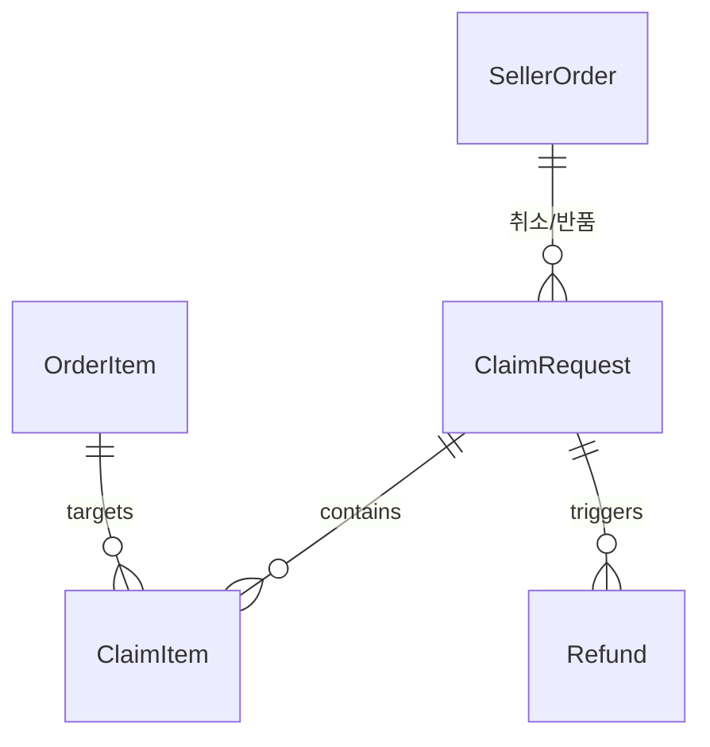
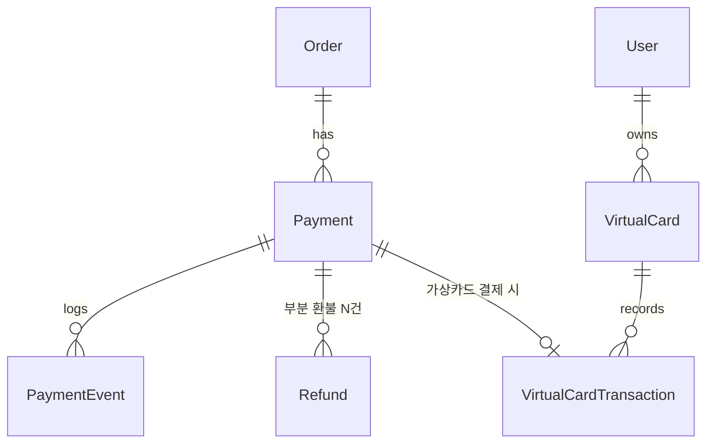
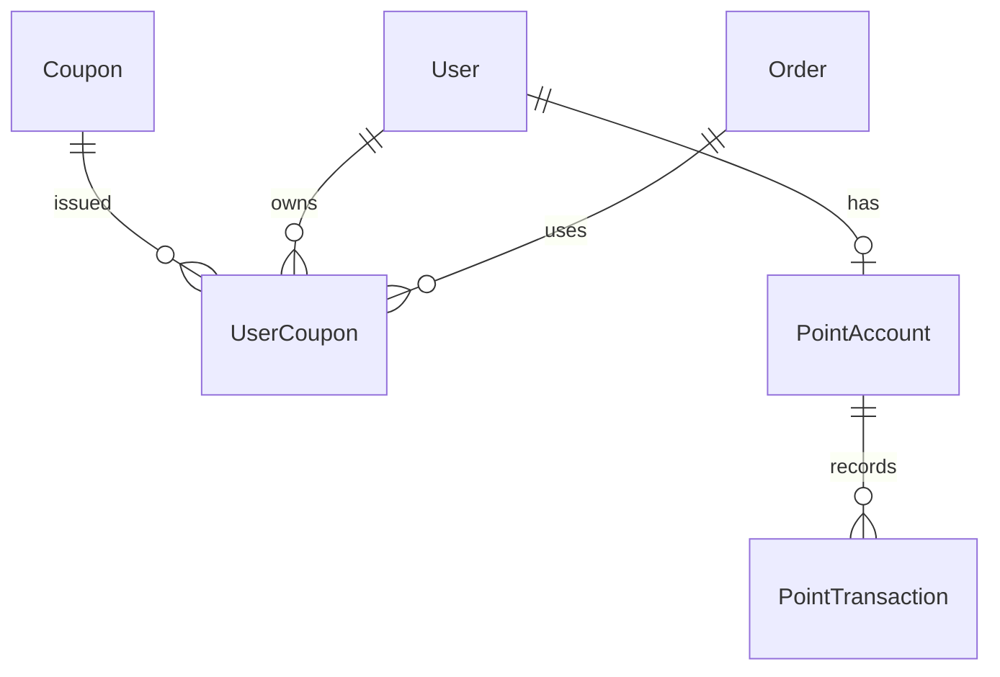
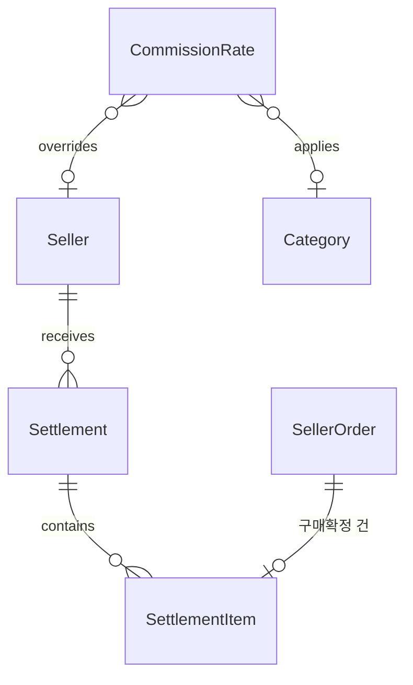
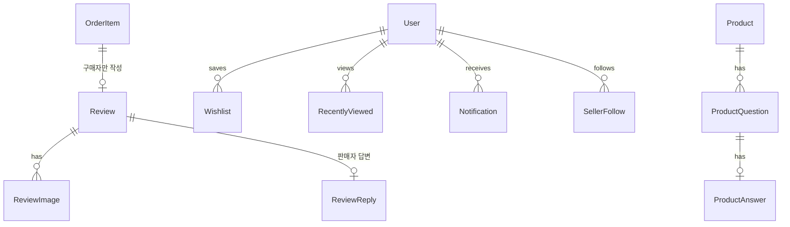

# 데이터 모델 (ERD)

> 현재 유효한 스키마 설계만 담는다. 구현이 시작되면 컬럼 타입·제약의 단일 출처는 `apps/api/prisma/schema.prisma` 이고,
> 이 문서의 역할은 **테이블의 목적과 관계, 그리고 왜 이렇게 나눴는지**로 좁아진다.
>
> 최종 갱신: 2026-09-04

## 설계 원칙

1. **금액은 정수(원 단위)로 저장한다.** 부동소수 금액 계산 금지.
2. **주문·결제·정산에 관련된 값은 스냅샷으로 남긴다.** 상품명·가격이 나중에 바뀌어도 과거 주문서는 그대로여야 한다.
3. **잔액이 있는 것은 원장(ledger)을 둔다.** 재고, 적립금, 가상 카드. 현재값은 원장의 결과이며 대사가 가능해야 한다.
4. **상태 변경은 이력을 남긴다.** 누가 언제 무엇을 왜 바꿨는지 추적 가능해야 한다.
5. **동시 변경은 성격에 따라 다르게 막는다.**
   - 사람이 편집하는 데이터(카테고리·상품 정보) → **낙관적 잠금**(`version`). 충돌을 사용자에게 알리고 선택하게 한다
   - 수량·잔액(재고·적립금·가상카드) → **행 잠금으로 직렬화**. 알릴 대상이 없으므로 순서대로 처리하고 부족한 요청만 실패시킨다
   - 트리 구조 이동 → **어드바이저리 락**. 경로 재계산이 겹치면 트리가 깨진다
6. 삭제는 대부분 소프트 삭제(`deletedAt`)로 처리한다. 주문 이력이 걸린 데이터를 물리 삭제하지 않는다. **id 는 재사용하지 않는다.**

---

## 1. 계정 · 인증



| 테이블 | 목적 | 비고 |
| --- | --- | --- |
| `User` | 계정 | `googleSub` 로 Google 계정 연결. `isDemo`·`demoExpiresAt` 로 데모 구분, `deletedAt` 로 탈퇴 |
| `UserRole` | 역할 | **다대다** — 한 사람이 구매자이면서 판매자일 수 있다. 역할 → 퍼미션 매핑은 코드 상수 |
| `Seller` | 판매자(스토어) | 브랜드명·스토어 URL·로고, 승인 상태, 개별 수수료율(선택). 편집자가 둘이라 낙관적 잠금 대상 |
| `Address` | 배송지 | 기본 배송지는 **사용자당 1개** — 부분 유니크 인덱스로 강제 |
| `RefreshToken` | 세션 | `app` 컬럼으로 shop/seller/admin 구분 — **앱별 세션이 독립**이므로 필요. 토큰은 해시만 보관 |
| `UserPreference` | 사용자 설정 | 표시 밀도(3단계), 언어, 통화, 앱 내 알림 수신 여부 |

**왜 역할을 다대다로 두는가**: 판매자도 물건을 산다. 역할을 단일 컬럼으로 두면 판매자가 구매자 앱을 쓸 수 없거나, 계정을 두 개 만들어야 한다.

### 설계 판단

컬럼과 제약의 단일 출처는 `apps/api/prisma/schema.prisma` 다(TASK-0020 에서 구현). 여기에는 **왜 그렇게 나눴는가**만 남긴다.

**식별자는 UUIDv7.** 사용자 id 는 URL 과 토큰에 실려 나간다. 연번이면 가입자 수가 드러나고 순회가 가능하다. v4 가 아니라 v7 인 이유는 시간 접두사가 남아 삽입이 B-tree 오른쪽 끝에 몰리기 때문이다. 2장의 `Category` 가 짧은 정수 id 를 유지하는 것과 다른데, 이것은 의도된 차이다 — `Category` 는 `path` 캐시(`/1/5/12/`)에 id 를 문자열로 이어붙이므로 짧아야 하고, 외부에 노출되지 않는다.

**소프트 삭제(`deletedAt`)를 두는 이유.** 주문·리뷰·정산이 `User` 를 참조한다. 탈퇴를 물리 삭제로 처리하면 과거 주문서의 참조가 끊기고, 스냅샷만으로는 "누구의 주문이었나"를 되짚을 수 없다. 그래서 행은 남기고 로그인 경로에서만 뺀다.

**그런데 소프트 삭제는 Google 유니크와 충돌한다.** 평범한 유니크 제약이면 탈퇴자의 남은 행이 그 Google 계정을 영구히 점유해 **재가입이 불가능**해진다. 해법은 **살아있는 계정만 인덱스에 넣는 부분 유니크 인덱스**(`WHERE "deletedAt" IS NULL`)다. 중복 가입은 여전히 DB 가 막고, 탈퇴하면 식별자가 자동으로 풀린다. 개인정보 파기가 필요해지면 이 컬럼을 비우면 되고(TASK-0025), 그때도 스키마는 그대로다.

**기본 배송지는 사용자당 1개 — 애플리케이션이 아니라 DB 가 막는다.** "이미 기본 배송지가 있는가"를 서비스에서 확인하면 동시에 들어온 두 요청이 **둘 다 0개를 읽고 둘 다 1개를 쓴다.** 기본 배송지 행만 인덱스에 넣는 부분 유니크 인덱스(`WHERE "isDefault"`)를 두면, 일반 배송지는 몇 개든 두면서 기본은 하나로 강제된다. 기본 배송지 교체는 한 트랜잭션에서 해제 후 지정한다.

**`Address` 는 예외적으로 물리 삭제한다.** 원칙 6 의 예외다. 주문이 수령인 정보를 스냅샷으로 갖기 때문에(4장) 이 행을 가리키는 참조가 없고, 탈퇴 계정의 개인정보를 실제로 지울 수 있어야 하기 때문이다.

**데모 계정은 Google 신원이 없다.** 그래서 신원 컬럼은 비어 있을 수 있고, 비어 있는 값은 유니크 인덱스에서 서로 충돌하지 않으므로 데모를 몇 개 발급하든 문제가 없다. 대신 두 가지를 DB 제약으로 못 박는다 — **데모에는 항상 만료 시각이 있고 실계정에는 없다**, **살아있는 실계정에는 항상 Google 신원이 있다**. 이게 없으면 "데모인가"라는 질문의 답이 어느 컬럼을 읽느냐에 따라 달라지고, 만료 정리 스케줄러가 실계정을 지울 수 있다.

**앱별 독립 세션은 `RefreshToken.app` 으로 표현한다.** 쿠키에 `Domain` 을 지정하지 않는다는 결정(D 2장)의 서버 쪽 절반이다. shop 토큰을 admin API 에 들이밀어도 `app` 으로 걸러진다. 판매자 세션만 끊고 구매자 세션은 유지하는 것도 이 컬럼 덕분에 가능하다. 토큰 원문은 저장하지 않고 해시만 남긴다 — 이 테이블이 유출돼도 세션을 재생할 수 없어야 한다.

**수수료율은 basis point 정수**(1bp = 0.01%, 10000 = 100%). 금액이 정수(원)인데 비율만 부동소수면 정산에서 `0.1 + 0.2` 류의 오차가 다시 들어온다. bp 는 국내 커머스 수수료가 쓰는 해상도(3.5%, 12.75%)를 정확히 표현하면서 정수로 남는다. 범위(0~10000)는 DTO 가 아니라 DB 가 강제한다 — 정산이 이 값을 곱하므로, 음수나 100% 초과가 들어가면 판매자에게 주문액보다 많은 돈이 계산되고 아무도 눈치채지 못한다. 카테고리 기본율과의 우선순위는 `docs/design/pricing.md` 5장.

**낙관적 잠금은 `Seller` 에만 건다.** 이 행만 편집자가 둘이다 — 판매자가 브랜드 소개를 고치는 동안 운영자가 승인·정지 상태를 바꾼다. last-write-wins 면 한쪽 작업이 조용히 되돌아간다(D 4장). `User` 프로필은 본인만 고치므로 걸지 않는다. 필요 없는 곳에 버전을 달면 갱신마다 충돌 처리 코드만 늘어난다.

**외래키 정책이 두 가지인 이유.** 개인 데이터(역할·배송지·설정·세션)는 계정과 함께 사라져야 하므로 `Cascade` 다. `Seller` 는 `Restrict` 다 — 스토어에는 상품·주문·정산이 걸려 있어서, 계정을 지우려는 시도는 조용히 카탈로그를 지우는 대신 **실패해야** 한다.

**DB 가 책임지는 규칙** — 애플리케이션 검증만으로는 동시 요청에 뚫리는 것들이다.

| 제약 | 보장하는 것 |
| --- | --- |
| `User_googleSub_active_key` | 살아있는 계정은 Google 계정당 1개. 탈퇴하면 식별자가 풀린다 |
| `Address_userId_default_key` | 사용자당 기본 배송지 1개 |
| `UserRole(userId, role)` | 같은 역할을 두 번 부여할 수 없다 |
| `User_demo_expiry_check` | 데모에는 만료가 있고 실계정에는 없다 |
| `User_google_identity_check` | 살아있는 실계정에는 Google 신원이 있다 |
| `Seller_commissionRateBp_check` | 수수료율은 0~10000 bp |
| `RefreshToken.tokenHash` unique | 같은 토큰이 두 번 발급·저장되지 않는다 |

### 권한 — 퍼미션 기반 RBAC

권한은 **퍼미션 단위**로 정의하고 역할에 매핑한다. 데모 제한이 별도 장치가 아니라 권한 체계의 일부가 된다.

**역할 × 퍼미션 전체 표는 [`permission-matrix.md`](./permission-matrix.md) 에 있다.** 그 문서는
`packages/shared/src/auth/role-permissions.ts` 에서 **생성**되며 손으로 고치지 않는다. 여기에 표를 한 벌 더
적지 않는 이유는 컬럼 타입을 `schema.prisma` 에만 두는 것과 같다 — 두 곳에 적힌 권한표는 반드시 한쪽이 낡고,
낡은 권한표는 없는 것보다 나쁘다.

| 역할 | 성격 |
| --- | --- |
| `BUYER` | 자기 데이터만 |
| `SELLER_OWNER` | 자기 스토어의 product·order·claim·coupon·settlement |
| `ADMIN_OPERATOR` | 전체 read + catalog/product/coupon write + claim.handle + seller.approve |
| `ADMIN_SUPER` | 전부 (delete · settlement.pay · user.delete 포함) |
| `DEMO_ADMIN` | `ADMIN_OPERATOR` 퍼미션 + **리소스 스코프 `demo`** |

**리소스 스코프**가 퍼미션을 보완한다. 퍼미션은 "무엇을 할 수 있나"만 답하고, "누구 것에"는 스코프가 답한다.

| 스코프 | 의미 |
| --- | --- |
| `own` | 자기가 소유한 리소스만 |
| `demo` | **데모 계정이 만든 리소스만** — 시드·실계정 데이터는 조회만 |
| `any` | 전부 |

```
SELLER_OWNER    product.write:own
ADMIN_OPERATOR  product.write:any
DEMO_ADMIN      product.write:demo      ← 시드·실계정 상품은 못 건드린다
                seller.approve:demo     ← 데모 판매자의 신청만 승인 가능
```

`demo` 스코프의 목적은 **실계정 보호**이지 데모 간 격리가 아니다. 판매자 데모가 입점 신청하면 관리자 데모가 승인할 수 있어야 관리자 콘솔이 조회만 되는 껍데기가 되지 않는다. 상세는 TASK-0105.

**기본 거부**: 퍼미션이 지정되지 않은 엔드포인트는 접근 불가다. 부여를 빠뜨려도 무방비로 열리지 않는다.

**역할 → 퍼미션은 테이블이 아니다.** `UserRole` 은 "누가 어떤 역할인가"만 저장하고, "그 역할이 무엇을 할 수
있나"는 코드 상수다. 테이블이면 배포와 리뷰 없이 `UPDATE` 한 줄로 권한이 넓어지고, 그 사실이 어디에도
남지 않는다. `packages/shared` 의 역할 목록과 `Role` 열거형이 어긋나면 타입 검사와 테스트가 함께 깨진다.

**데모 여부는 리소스 쪽에서만 읽는다.** 권한 판정 함수는 "요청자가 데모인가"라는 입력을 받지 않는다.
데모 관리자가 제한되는 이유는 요청자의 플래그가 아니라 `DEMO_ADMIN` 역할의 그랜트에 `demo` 스코프가
붙어 있기 때문이고, 그래서 `isDemo` 를 읽는 코드는 행을 소유 정보로 바꾸는 매퍼 하나뿐이다(TASK-0105 F8).

---

## 2. 카탈로그



| 테이블 | 목적 | 비고 |
| --- | --- | --- |
| `Category` | 카테고리 트리 | 자기 참조. `path`(`/1/5/12/`)를 캐시해 하위 전체 조회를 한 번에. **최대 3단계.** 부모 간선은 `(parentId, parentPath) → (id, path)` **복합 외래키**이고, 여기에 CHECK 제약이 더해져 순환·잘못된 경로·4단계를 **DB 가 표현 불가능하게** 만든다. **`id` 는 재사용하지 않는다** — 결번이 생겨도 채우지 않으며, 재사용하면 과거 스냅샷이 엉뚱한 카테고리를 가리킨다 |
| `AttributeDefinition` | 속성 **정의** | 카테고리에 연결. 타입, 선택지, 필터 노출 여부, 표시 순서. **상위 카테고리에서 상속**. 타입은 `TEXT` / `NUMBER` / `SELECT` / `MULTI_SELECT` / `BOOLEAN` 다섯 가지 |
| `Product` | 상품 | 판매자·카테고리·상태. 속성 **값**은 `attributes` JSONB. 목록 표시용 `minPrice`·`ratingAvg`·`ratingCount`·`salesCount` 캐시. 편집자가 둘이라 낙관적 잠금 대상 |
| `ProductImage` | 상품 이미지 | 표시 순서. **유일하게 물리 삭제**한다 — 가리키는 행이 없고 주문 스냅샷은 URL 을 문자열로 복사한다 |
| `ProductOption` | 옵션 정의 | "색상", "사이즈"와 표시 순서 |
| `ProductOptionValue` | 옵션 값 | "블랙", "M". `meta` JSONB 에 색상칩 hex 등 |
| `ProductVariant` | **SKU** | 재고·가격의 실제 단위. 옵션 없는 상품도 Variant 1개. `maxPurchaseQuantity` 로 1회 주문 최대 수량 제한. **판매자당 live SKU 유일** |
| `VariantOptionValue` | 조합 매핑 | Variant ↔ 옵션값. 복합 외래키 3개로 한 상품 안에 묶인다 |

### 카테고리 트리의 불변식을 DB 가 쥔다

`path` 는 캐시이므로 **어긋날 수 있다**는 것이 이 설계의 유일한 위험이다. 그래서 세 가지를 스키마로 못박았다.

| 규칙 | 어떻게 |
| --- | --- |
| `path` = 부모 `path` + 자기 `id` | CHECK. `parentPath` 열을 따로 두어 비교 대상을 만든다 |
| 부모 간선이 그 경로를 실제로 가리킨다 | `(parentId, parentPath) → (id, path)` **복합 외래키** |
| `depth` 는 `path` 에서 파생되고 1~3 | CHECK 2개 |

**순환 참조는 검사 대상이 아니라 표현 불가능**이 된다. 위 세 규칙 아래에서 모든 노드의 `path` 는 부모보다 반드시 길고, 순환은 "자기보다 긴 자기 경로"를 요구하기 때문이다. 깊이 상한도 같은 방식으로 파생된다 — `depth` 가 `path` 를 따라가므로, 이동으로 4단계가 되면 그 행 자체가 거부된다.

이 제약들이 애플리케이션 검증의 **대체재가 아니라 최종 방어선**이다. 서비스 계층은 같은 규칙을 미리 확인해 400 과 사람이 읽을 메시지를 돌려주고, DB 는 어떤 코드 경로로도 깨진 트리가 커밋되지 않게 한다. 동시 요청 두 건이 각자 "지금 트리는 정상이고 내 변경도 정상"이라고 판단하는 상황에서는 애플리케이션 검증만으로 부족하다.

**이동은 한 문장이다.** 옮기는 노드와 하위 전체를 하나의 `UPDATE ... WHERE path LIKE '/1/5/%'` 로 다시 쓴다. 복합 외래키가 `ON UPDATE NO ACTION` 이라 검증 시점이 **문장 끝**이고, 그때 트리는 이미 다시 일관적이다. 두 문장으로 나누면 중간 상태에서 외래키가 거부한다. 비용도 하위 노드 수와 무관한 인덱스 범위 스캔 1회다.

**동시 구조 변경은 어드바이저리 락으로 직렬화한다**(DECISIONS 4). 제약이 손상을 막아 주더라도, 락이 없으면 진 요청이 원시 제약 위반(500)을 받거나 — 더 나쁘게 — *성공했다고 답하면서 아무 행도 옮기지 않는다.* 락이 있으면 두 요청 모두 최신 트리를 읽고 각자 의미 있는 답(성공 또는 400)을 받는다.

**이름·슬러그 편집은 낙관적 잠금(`version`)이다.** 구조 변경은 `version` 을 건드리지 않는다 — 남이 형제 순서를 바꿨다는 이유로 이름 편집이 충돌로 튕기면 알림이 소음이 된다.

**속성을 정의/값으로 나눈 이유**: 정의가 테이블이어야 상품 등록 폼과 검색 필터 UI를 정의로부터 자동 생성할 수 있다. 값까지 테이블로 빼면(순수 EAV) 상품 목록 20개 조회에 조인이 폭증한다. 필터링·패싯은 Meilisearch 가 담당하므로 DB 는 값을 통째로 읽고 쓰기만 하면 된다.

**대가**: DB 가 값의 타입·범위를 강제하지 못한다. 저장 직전 `AttributeDefinition` 을 읽어 zod 스키마를 동적 생성해 검증하는 코드가 **필수**다.

**필수 속성은 판매 중일 때만 요구된다.** 값이 *틀린* 것(정의에 없는 키, 선택지 밖의 값, 어긋난 타입)은 어느 상태에서도 거부되지만, *비어 있는* 필수 속성은 저장 결과가 `판매중` 일 때만 막는다. 초안은 작성 중인 것이고 비운 채 닫을 수 있어야 한다. 가격에 대해 CHECK 이 하는 말과 같은 모양이다 — 판매 중인 상품에만 요구한다.

### 속성 상속 — 계통이 단위다

속성은 카테고리 하나가 아니라 **그 카테고리와 그 아래 전부**에 적용된다. "코트"의 유효 속성은 자신과 조상들의 정의를 합친 것이고, 조회는 `path` 에서 조상 id 배열을 만들어 한 문장으로 끝낸다.

같은 `key` 가 한 계통에 둘 나타나면 **가까운(깊은) 정의가 이긴다.** 새 정의를 만들 때 계통 중복은 거부하지만, 해석 규칙 자체는 중복을 오류가 아니라 **가림**으로 정의한다. 카테고리 이동이 속성을 보지 않고 두 정의를 한 계통으로 합칠 수 있기 때문이다 — 거기서 오류를 내면 트리를 한 번 드래그한 대가로 관리자 화면 전체가 멈춘다.

### 상품 3단 구조 — 무엇이 무엇의 단위인가

가격과 재고의 단위는 **Variant**다(D-024). 상품은 그 Variant 들을 묶는 것이고, 옵션은 Variant 를 고르는 방법이다.

**옵션 없는 상품도 Variant 를 하나 갖는다.** 예외 분기를 없애기 위해서다 — 장바구니·주문·재고·검색 어디에도 "옵션이 없는 경우"가 없다. 이것은 규칙이 아니라 **인덱스의 결과**다: 조합의 정규형(옵션값 id 를 정렬해 이어붙인 문자열)이 옵션 없는 상품에서는 빈 문자열이고, `(상품, 정규형)` 부분 유니크 인덱스가 빈 문자열도 값으로 취급한다.

**가격은 Variant 절대값이다.** "기본가 + 추가금"이면 할인의 적용 대상이 모호해지고, 주문 스냅샷이 한 정수가 아니라 두 값의 관계가 된다.

**일부 조합만 판매하는 것은 Variant 의 부재가 아니라 비활성화다.** 조합은 전부 만들어 두고 개별 Variant 를 끈다. 그래야 옵션 그리드가 "블랙/XL 은 품절"을 그릴 수 있고, 이미 그 조합으로 주문한 이력이 가리킬 행이 남는다.

### 조합의 불변식을 DB 가 쥔다

카테고리 트리와 같은 수법이다 — 비정규화 컬럼을 두되, **그 컬럼이 거짓말을 할 수 없게** 복합 외래키로 원본에 묶는다.

| 규칙 | 어떻게 |
| --- | --- |
| Variant 는 한 옵션당 값을 정확히 하나 갖는다 | 매핑 행에 옵션 id 를 두고 `(Variant, 옵션)` 유니크. 옵션 id 가 값과 어긋나지 못하도록 `(옵션값, 옵션) → 옵션값(id, 옵션)` 복합 외래키 |
| 매핑은 한 상품 안에서만 일어난다 | 매핑 행에 상품 id 를 두고 Variant·옵션 양쪽으로 복합 외래키. **다른 상품의 옵션값을 가진 Variant 가 표현 불가능**해진다 |
| 같은 조합의 살아있는 Variant 는 하나뿐 | Variant 에 조합 정규형을 두고 `(상품, 정규형)` 부분 유니크 인덱스 |
| 판매자당 live SKU 유일 | Variant 에 판매자 id 사본을 두고 `(판매자, SKU)` 부분 유니크. 사본은 `(상품, 판매자) → 상품(id, 판매자)` 복합 외래키로 상품과 묶인다 |

조합이 둘이면 "행이 두 개"가 문제가 아니다. 매장이 구매자의 선택을 Variant 로 해석할 때 **답이 둘**이 되고, 새로고침마다 다른 가격이 보인다.

**정규형과 매핑 행의 일치는 DB 가 쥐지 못한다.** 판별에 집계가 필요하고 CHECK 에는 집계를 쓸 수 없다. 서비스가 둘을 한 트랜잭션에서 함께 쓴다.

### 주문 스냅샷이 가능한 모양

주문 테이블은 M07 에 생기지만, **그때 스키마를 바꾸면 늦다.** 설계 원칙 2를 가능하게 하는 성질은 넷이다.

1. **가격이 절대값이다.** 정수 하나를 복사하면 그 시점의 판매가가 완전히 보존된다.
2. **금액이 전부 정수(원)다.** 스키마 어디에도 부동소수 컬럼이 없다. 별점 평균조차 정수(×100)로 둔다 — `Float` 하나를 들이면 금액 컬럼을 지키는 가드가 의미를 잃는다.
3. **참조가 끊기지 않는다.** 상품·Variant·옵션·옵션값은 전부 소프트 삭제이고 id 는 재사용되지 않는다. 매핑에서 옵션값으로 가는 외래키가 `NO ACTION` 이라 조합 이름의 출처도 남는다.
4. **스냅샷이 현재 행들로 완결된다.** 상품명·조합·SKU·단가가 세 테이블의 지금 행에서 전부 만들어진다. 다른 시점의 값을 되짚어야 하는 컬럼이 없다.

### 캐시 컬럼은 파생이지 누산이 아니다

`minPrice` 는 쓰기 끝에서 Variant 로부터 **다시 계산**한다. 증분(`min(옛값, 새값)`)은 **가격을 올렸을 때 틀린다** — 최저가 Variant 가 비싸지면 최저가는 올라가야 하는데 증분식은 내려가기만 한다. 파생이므로 "갱신은 한 곳에서만"이 지킬 수 있는 규칙이 된다.

`minPrice` 는 **주문 가능한** Variant 의 최저가다. 비활성 Variant 를 세면 목록에 뜬 가격으로 살 수 없는 상품이 생긴다. 하나도 없으면 NULL 이고, 그 상태의 상품은 CHECK 이 `판매 중`이 되는 것을 막는다.

### 상품 쓰기는 행 잠금 위에 낙관적 잠금을 얹는다

상품 쓰기는 한 문장이 아니다 — Variant 를 다시 쓰고 그 결과로 `minPrice` 를 파생한다. 두 트랜잭션이 겹치면 각자 **자기 변경만 담긴 스냅샷**에서 최저가를 구한다(READ COMMITTED 에서 `SET` 절의 서브쿼리는 문장 시작 시점의 스냅샷을 유지한다). 나중에 커밋한 쪽이 남의 인하를 못 본 값을 덮어쓰고, 어떤 제약도 반대하지 않는다.

그래서 쓰기는 상품 행을 `FOR UPDATE` 로 먼저 잠근 **뒤에** `version` 을 비교한다. 잠금이 직렬화를 만들고, `version` 이 그 결과를 사용자에게 설명한다(D 4장 — 사람이 편집하는 데이터). 순서가 반대면 이미 잠기지 않은 스냅샷에서 읽은 version 으로 판정하게 되어 두 편집이 모두 통과한다.

### 옵션 축은 바꾸지 않는다. 값만 바꾼다

옵션 값의 추가는 그 값이 참여하는 조합의 Variant 생성, 삭제는 그 조합의 Variant 비활성화다. **옵션 축(색상·사이즈라는 축) 자체의 추가·삭제는 지원하지 않는다** — 조합의 원소 수가 달라져 기존 Variant 의 정규형이 전부 무효가 되고, 주문 이력이 걸린 뒤에는 되돌릴 수 없다.

**초안 전체 교체도 아직 없다.** 편집기 저장 계약(TASK-0113)이 받기로 했으나, 안전 조건을 지금 표현할 수 없어 열어 둔 채로 두었다: "한 번도 판매된 적 없다"를 판정하려면 과거 상태 이력이나 주문 참조가 필요한데, 상태 이력 컬럼이 없고 주문 테이블은 M07 에 생긴다. 현재 상태가 `초안` 이라는 것만으로는 부족하다 — 판매 중이던 상품을 내려도 `초안` 이다. 그래서 축 변경은 상태와 무관하게 400 이고, 판매자는 초안을 지우고 다시 만든다. 주인은 TASK-0113 7.1.

### 상태와 강제 숨김

상품 상태는 `초안 / 판매중 / 판매자가 내림 / 관리자 강제 숨김` 넷이다. 강제 숨김은 **판매자가 설정하거나 해제할 수 없다** — 그렇지 않으면 강제 숨김이 아니다. 전용 퍼미션을 만들지 않고 **스코프로 표현**한다: `product.write` 를 `own` 이 아닌 스코프로 든 호출자만 그 전이를 할 수 있다. 판매자의 그랜트는 `product.write:own` 하나뿐이다.

### DB 가 쥐는 것과 애플리케이션이 쥐는 것

| 규칙 | 어디서 | 왜 |
| --- | --- | --- |
| 카테고리당 live key 유일 | 부분 유니크 인덱스 | 두 요청이 동시에 통과할 수 있는 검사다 |
| key 형식(`^[a-z][a-z0-9_]{0,39}$`) | CHECK | JSONB 키이자 Meilisearch 필터 필드명. 잘못되면 **오류 없이** 아무것도 매치하지 않는다 |
| 선택지는 `SELECT`/`MULTI_SELECT` 에만, 최소 1개 | CHECK | 선택지 0개인 SELECT 는 어떤 값도 통과시키지 못해 그 카테고리를 저장 불가로 만든다 |
| 라벨 비어 있지 않음 · 표시 순서 ≥ 0 | CHECK | |
| **계통 전체의 key 유일** | **애플리케이션** + 트리 어드바이저리 락 | 다른 행을 조회해야 답할 수 있고 **CHECK 에는 서브쿼리를 쓸 수 없다.** 접두사 관계를 표현하는 배제 연산자도 없다 |
| **선택지 중복 없음** | **애플리케이션** | 중복 판정에 집계가 필요하고 CHECK 에는 집계를 쓸 수 없다 |
| **값의 타입·필수·선택지** | **애플리케이션** (동적 zod) | JSONB 이므로 DB 가 볼 수 없다. 이것이 이 설계의 유일한 방어선이다 |
| 판매자당 live SKU 유일 · 상품당 live 조합 유일 | 부분 유니크 인덱스 | 두 요청이 동시에 통과할 수 있는 검사다 |
| Variant 는 한 옵션당 값 하나 · 매핑이 한 상품 안에 머문다 | 유니크 + 복합 외래키 3개 | 위 "조합의 불변식" 절 |
| 금액·수량의 하한, 정가 ≥ 판매가, 별점 짝, 속성 값이 객체 | CHECK | 애플리케이션 검증은 임포트 스크립트가 우회한다 |
| 판매 중인 상품에는 가격이 있다 | CHECK | `minPrice` 가 NULL 인 것은 주문 가능한 Variant 가 없다는 뜻이다. 그래서 상품은 항상 초안으로 삽입되고 `minPrice` 를 계산하는 그 문장이 요청된 상태로 옮긴다 |
| **조합 정규형이 매핑 행과 일치** | **애플리케이션** (같은 트랜잭션) | 집계가 필요하고 CHECK 에 집계를 쓸 수 없다 |
| **`minPrice` 가 실제 최저가와 같다** | **애플리케이션 + 상품 행 잠금** | 〃. 경합이 있고, 그래서 음성 대조군을 갖는다 |
| **판매자 소유권** | **애플리케이션** (`assertResourceAccess`) | 행을 읽어야 알 수 있고, DB 에는 요청자가 누구인지가 없다 |

DB 가 쥔 규칙은 위반 INSERT 를 실제로 시도해 거부되는 것으로 확인한다. 경계 쪽으로 넘어온 규칙은 **DB 가 그 위반을 실제로 받아들이는 것**까지 확인한다 — "DB 가 막아 주겠지"가 나중에 애플리케이션 검사를 지우는 근거가 되지 않게 하기 위해서다. 애플리케이션으로 넘어온 셋 중 **계통 key 유일만 경합이 있다** — 나머지 둘은 요청 하나만 보고 답할 수 있는 판정이라 두 요청이 동시에 통과할 여지가 없다. 그래서 동시성 스펙과 음성 대조군을 갖는 것은 그 규칙 하나다.

---

## 3. 재고



| 테이블 | 목적 |
| --- | --- |
| `StockLedger` | 재고 변동 원장. 모든 변동이 행으로 남고, 현재 재고는 그 합이다 |
| `StockReservation` | 주문서 작성 시 15분간 재고 선점. `HELD` → `CONFIRMED` / `RELEASED` |

```
가용재고 = ProductVariant.stock − ProductVariant.reserved
```

### 예약은 주문을 가리키지 않는다 (TASK-0048)

`Order` 가 예약을 만드는 것처럼 그렸던 관계를 지웠다. 예약은 **주문서에 들어갈 때**
잡히고 주문 행은 결제 준비 단계에서야 생긴다 — 없는 표를 가리키는 컬럼은 외래키를
걸 수 없고, 외래키 없는 uuid 는 아무것도 지켜 주지 않는다.

그래서 예약이 드는 것은 **누가**(`userId`)와 **어느 주문서 시도**(`checkoutId`)다.
`checkoutId` 는 주문서에 들어가는 쪽이 발급하는 불투명한 값이고, 그것으로 「이 시도의
예약 전부」를 한 번에 푼다 — 결제 실패와 이탈이 그 모양이다. 주문과의 연결은
`Order` 를 만드는 TASK-0049 의 스키마 변경이다.

### `reserved` 는 캐시다 — 합계를 매번 세지 않는다

가용재고 식이 `SUM(...)` 이 아니라 컬럼 하나인 이유는 **상품 조회마다 집계가 붙지
않게** 하기 위해서다. 대신 캐시가 어긋날 수 있고, 그것을 찾는 것이
`ReservationService.reconcile()` 이다 — `reserved` 와 `HELD` 합계가 다른 variant 를
한 문장으로 찾아낸다. TASK-0051 의 점검 배치가 그것을 주기로 부른다.

**「유효한 HELD」가 아니라 「전체 HELD」와 견준다.** 만료된 예약은 스케줄러가
`RELEASED` 로 바꾸기 전까지 여전히 `HELD` 이고 `reserved` 도 여전히 그것을 세고 있다.
그 둘의 차이는 어긋남이 아니라 **아직 치우지 않은 것**이고, 치우는 일이 TASK-0051 이다.
그래서 그 스케줄러가 멈추면 재고가 잠긴다.

### 잡는 일 전체가 한 문장이다

```sql
UPDATE "ProductVariant" SET "reserved" = "reserved" + $q
 WHERE "id" = $id AND "stock" - "reserved" >= $q
```

읽고 판단하고 쓰는 대신 조건부 갱신인 이유는, 읽은 값이 쓰는 순간에도 참이라는 보장이
없기 때문이다. 재고 1개에 열 명이 동시에 들어오면 열 명 모두 「1개 남았다」를 읽고 열
명 모두 통과한다. 조건을 `WHERE` 에 두면 판단과 갱신이 한 문장이 되고, 아홉은 **0행
갱신**으로 진다. 잠금을 따로 잡을 필요도 없다 — 갱신 자신이 잠금이다.

### 확정은 예약을 먼저 줄이고 재고를 나중에 줄인다

`ProductVariant_reserved_check` 가 `reserved <= stock` 을 **문장마다** 검사한다.
재고 1 · 예약 1 에서 `stock` 을 먼저 0으로 내리면 그 순간 `reserved(1) > stock(0)` 이라
제약이 확정 자체를 거절한다. 순서는 예약 → 재고다.

원장에 남는 유형은 `SALE` 이 아니라 **`RESERVE_CONFIRM`** 이다. 둘을 묶으면 원장만
보고서는 예약을 거친 판매와 그렇지 않은 판매를 구분할 수 없고, 예약이 새는지 확인할
방법이 사라진다.

### 데이터베이스가 지키는 것

| 제약 | 막는 것 |
| --- | --- |
| `ProductVariant_reserved_check` (`0 <= reserved <= stock`) | 오버셀. 조건부 갱신이 나중에 틀리게 고쳐지더라도 이 줄은 남는다 |
| `StockReservation_quantity_check` (`quantity >= 1`) | 0개 예약 같은 뜻 없는 행 |
| `ON DELETE RESTRICT` (variant) | 남이 잡아 둔 조합을 판매자가 지우는 것 |
| `ON DELETE CASCADE` (user) | 탈퇴한 계정의 예약이 남아 재고를 영구히 잠그는 것 |

| 인덱스 | 쓰임 |
| --- | --- |
| `(status, expiresAt)` | 만료 스케줄러가 풀 것을 고른다 (TASK-0051 ①) |
| `(checkoutId)` | 한 주문서 시도의 예약 전부를 한 번에 푼다 |
| `(variantId, status)` | 정합성 점검이 variant 별 `HELD` 합계를 낸다 |

### 원장이 현재값을 설명한다

`ProductVariant.stock` 은 **현재값**이고 원장이 그것을 설명한다. "대사가 가능해야
한다"(CLAUDE.md 6장)를 검사 가능한 문장 넷으로 푼다.

| # | 성질 |
| --- | --- |
| L1 | `stock` = 원장 `quantity` 의 합 |
| L2 | `balanceAfter(n)` = `balanceAfter(n-1)` + `quantity(n)` |
| L3 | 마지막 행의 `balanceAfter` = 현재 `stock` |
| L4 | `seq` 가 1부터 빈틈 없이 이어진다 |

L1 만으로는 부족하다. 합계가 맞아도 `balanceAfter` 가 엉뚱하면 "그때 재고가
얼마였나"에 답하지 못하고, 그것이 `balanceAfter` 를 저장하는 유일한 이유다.
L4 는 행이 지워졌거나 잠금 밖에서 삽입됐다는 신호다.

**초기 재고도 원장에 남는다.** Variant 가 만들어질 때 재고가 0 이 아니면 `INBOUND`
행이 함께 생긴다. 그러지 않으면 L1 이 모든 상품에서 태어나는 순간부터 거짓이다.

### 변동 유형과 부호

| 유형 | 부호 | 언제 |
| --- | --- | --- |
| `INBOUND` | + | 입고. Variant 생성 시의 초기 재고도 여기 |
| `SALE` | − | 판매 확정 차감 |
| `CANCEL` | + | 주문 취소로 되돌아옴 |
| `RETURN_IN` | + | 반품 입고 |
| `RESERVE_CONFIRM` | − | 예약 확정에 따른 실차감 |
| `ADJUST` | ± | 관리자·판매자 조정. **사유 필수** |

부호는 유형이 정하고 CHECK 이 그것을 강제한다. 유형과 부호가 어긋난 행은 형식이
완벽한 채로 원장을 읽는 모든 쪽을 거짓말하게 만든다. `ADJUST` 만 양방향이고,
그래서 그것만 사유를 요구한다 — 나머지는 유형 자체가 무슨 일이 있었는지 말한다.

### 원장 행의 자리는 `(variantId, seq)` 다

전역 id 를 두지 않는다. 원장은 **행들 사이의 순서 자체가 데이터**이고,
UUIDv7 은 같은 밀리초 안에서 순서를 정해 주지 않아 잔액 사슬이 거꾸로 보일 수
있다. `seq` 는 Variant 행 잠금을 쥔 채 `직전 최대 + 1` 로 계산하므로, 잠금을
지나지 않은 삽입은 기본키 충돌로 거부되거나 빈틈(L4)을 남긴다.

**원장은 append-only 다.** 수정·삭제는 트리거가 거부한다. 잘못 적은 변동은 반대
방향 `ADJUST` 로 상쇄한다 — 그래야 누가 무엇을 되돌렸는지도 원장에 남는다.
그래서 이 테이블에는 `updatedAt` 이 없다.

**같은 변동은 한 번만 기록된다.** 주문·취소·반품은 재시도되는 경로이고, 같은
주문 항목의 `SALE` 이 두 번 기록되면 두 행 다 형식이 완벽해 원장만 보고는 알 수
없다. `(variantId, type, refType, refId)` 부분 유니크 인덱스가 그것을 표현
불가능하게 만든다. 참조 없는 변동(판매자의 입고·조정)은 여러 번 있는 것이
정상이라 인덱스가 부분적이다.

### 재고 변경은 한 경로만 지난다

`ProductVariant.stock` 을 쓰는 코드는 재고 서비스 하나뿐이다 — 상품 등록도, 옵션
값 추가도, 상품 편집기의 절대값 수정도 전부 그 경로를 지나 원장을 남긴다.
절대값은 잠금 안에서 조정량으로 환산되므로 그 사이 팔린 수량이 이력에서
사라지지 않는다. 규칙은 스펙이 검사한다.

### 동시 변경

수량은 **행 잠금으로 직렬화**한다(DECISIONS 4). 알릴 대상이 없기 때문이다 —
구매자는 재고 숫자를 모른다. 잠금은 명시적으로, 그리고 **먼저** 잡는다: 잠금 안에서
결정하는 것이 셋(충분한가, 몇 번째 자리인가, 이후 잔액은 얼마인가)이고, `UPDATE`
에 딸려 나중에 잡히는 잠금은 쓰기는 지켜도 판정은 못 지킨다.

**`stock >= 0` CHECK 은 경합을 잡지 못한다.** 재고 1개에 −1 두 건이 잠금 없이
겹치면 둘 다 `0` 을 쓴다. `0 >= 0` 이라 제약은 침묵하고, 손상은 음수가 아니라
**원장 합계와 어긋나는 것**으로 나타난다.

예약 생성은 `UPDATE ... WHERE stock - reserved >= qty` 조건부 갱신으로 막는다.
결정할 것이 "충분한가" 하나뿐이라 방식이 다르다. 실패하면 즉시 품절 처리한다.
만료된 예약을 정리하는 스케줄러가 필수이며, 이 스케줄러의 동작 여부는 헬스체크
대상이다.

### 품절과 품절 임박은 하나의 술어가 정한다

판매자 콘솔은 재고를 세 단계로 본다. 기준값은 `packages/shared` 의
`LOW_STOCK_THRESHOLD`(기본 5) 하나이고, 목록 필터와 화면 배지가 그것을 공유한다.

| 단계 | 조건 | 목록 필터 | 배지 |
| --- | --- | --- | --- |
| 품절 | 총재고 = 0 | `stock=out` | 품절 |
| 품절 임박 | 0 < 총재고 ≤ `LOW_STOCK_THRESHOLD` | `stock=low` | 품절 임박 |
| — | 총재고 > `LOW_STOCK_THRESHOLD` | (없음) | 없음 |

**두 단계가 겹치지 않는 것이 요점이다.** "≤ 5" 하나로 두면 재고 0 인 상품이 두 필터에
다 걸리고, 그러면 어느 배지를 그릴지 고르는 규칙이 화면에 생긴다 — 기준값을 공유한
의미가 거기서 사라진다. 판정은 서버가 한 번만 하고 응답의 `isLowStock` 으로 나간다.

여기서 "총재고" 는 Variant `stock` 의 합이다. 예약이 붙으면(M07) 위의 가용재고 식으로
바뀌고, 바뀌는 곳은 집계 SQL 한 곳과 술어 한 곳뿐이다.

### DB 가 쥐는 것과 애플리케이션이 쥐는 것

| 규칙 | 어디서 |
| --- | --- |
| 한 자리에 한 행 | 기본키 `(variantId, seq)` |
| 같은 참조의 같은 변동은 한 번뿐 | 부분 유니크 인덱스 |
| 유형과 부호, 0 아님, 잔액 하한, 자리 하한, 참조 짝, `ADJUST` 의 사유 | CHECK |
| 원장은 수정·삭제되지 않는다 | 트리거 |
| 현재 재고가 음수가 아니다 | CHECK (`ProductVariant`) |
| **L1~L4** | **애플리케이션 + Variant 행 잠금** — 전부 다른 행을 집계해야 답할 수 있고 CHECK 에 집계를 쓸 수 없다 |
| **판매자 소유권** | **애플리케이션** — 행을 읽어야 알 수 있고 DB 에는 요청자가 없다 |

경계로 넘어온 규칙은 **대사**로 지킨다. `reconcile` 이 L1~L4 를 한 문장으로
검사하고 어긋난 Variant 와 **어느 성질이 깨졌는지**를 돌려준다. "합계가 다르다"만
아는 점검은 행이 사라진 것인지, 잠금 밖에서 쓰인 것인지, 잔액이 틀린 것인지를
구분하지 못한다.

---

## 4. 주문 · 배송



| 테이블 | 목적 | 비고 |
| --- | --- | --- |
| `Order` | 주문서 | **결제 단위**. 총 상품금액·할인·배송비·적립금 사용·실결제액. 수령인 정보는 스냅샷 |
| `SellerOrder` | 판매자별 주문 | **배송·취소·정산 단위**. 상태가 여기에 붙는다 |
| `OrderItem` | 주문 항목 | 상품 스냅샷(JSONB), 단가, 수량, 항목별 할인 안분액 |
| `Shipment` | 배송 | 운송사·운송장번호는 가상 생성. 상태 전이도 가상 진행 |
| `OrderStatusHistory` | 상태 이력 | 이전/이후 상태, 사유, 처리 주체 |

**왜 2단으로 나누는가**: 한 주문에 여러 판매자 상품이 섞일 수 있다. 판매자 A는 배송완료인데 B는 준비중일 수 있어야 하고, B만 취소할 수 있어야 하며, 정산도 판매자별로 나간다. 상태를 `Order` 에 두면 이 셋이 전부 불가능해진다.

**할인 안분**: 주문 단위로 적용된 쿠폰·적립금을 `OrderItem` 까지 안분해 저장한다. 부분 취소 시 "이 항목에 할인이 얼마 붙어 있었나"를 그 자리에서 알 수 있어야 한다. 안분 규칙은 `docs/design/pricing.md` 참조.

---

## 5. 클레임 (취소 · 반품)



| 테이블 | 목적 |
| --- | --- |
| `ClaimRequest` | 취소(배송 전) / 반품(배송 후) 요청. 유형·상태·사유·귀책(고객/판매자) |
| `ClaimItem` | 대상 주문 항목과 수량 — **부분 취소·부분 반품을 위해 항목 단위** |
| `Refund` | 환불 실행 기록. 결제 1건에 환불 N건이 붙을 수 있다 |

교환은 구현하지 않는다. 반품 후 재구매로 안내한다.

---

## 6. 결제



| 테이블 | 목적 | 비고 |
| --- | --- | --- |
| `Payment` | 결제 | `provider` = VIRTUAL_CARD / TOSS. 승인액·누적취소액을 함께 보관 |
| `PaymentEvent` | 결제 이벤트 로그 | 웹훅 원문 포함. **멱등 처리의 근거** |
| `Refund` | 환불 | 부분 환불이 여러 번 발생하므로 별도 테이블 |
| `VirtualCard` | 가상 카드 | 한도, 사용액, 상태. 데모 계정 발급 시 1장 자동 지급 |
| `VirtualCardTransaction` | 카드 원장 | 승인/취소/환불 시 잔액 변화 기록 |

두 프로바이더는 `PaymentProvider { authorize, capture, cancel, refund }` 인터페이스 뒤에 둔다.
가상 카드는 한도 초과·잔액 부족·승인 거절을 **의도적으로 재현**할 수 있어야 한다. 결제 실패 시 재고 예약이 제대로 해제되는지 시연하기 위한 장치다.

---

## 7. 할인 (쿠폰 · 적립금)



| 테이블 | 목적 | 비고 |
| --- | --- | --- |
| `Coupon` | 쿠폰 정책 | `issuerType` = PLATFORM / SELLER. **부담 주체가 정산을 가른다** |
| `UserCoupon` | 발급된 쿠폰 | 발급/사용/만료 상태, 사용된 주문 |
| `PointAccount` | 적립금 잔액 | 사용자당 1개 |
| `PointTransaction` | 적립금 원장 | 적립/사용/복구/만료/조정. `balanceAfter` 를 함께 저장해 대사 가능 |

- 적립은 **구매확정 시점**에 지급한다. 배송완료 직후 주면 반품 시 회수할 수 없다.
- 환불 시 적립금은 **현금이 아니라 적립금으로** 복구된다.
- 플랫폼 쿠폰·적립금은 플랫폼 부담이라 판매자 정산에서 차감하지 않는다. 판매자 쿠폰만 차감한다.

---

## 8. 정산



| 테이블 | 목적 |
| --- | --- |
| `Settlement` | 주간 정산서. 판매액·수수료·판매자쿠폰·반품차감·지급액, 상태(대기/승인/지급완료) |
| `SettlementItem` | 정산서에 포함된 SellerOrder 별 내역 |
| `CommissionRate` | 수수료율. 카테고리 기본율 + 판매자별 개별율(우선) |

```
지급액 = 판매액 − 플랫폼 수수료 − 판매자 부담 쿠폰 − 반품 차감
```

실제 이체는 없다. 관리자가 "지급완료" 처리하면 상태만 바뀐다.

---

## 9. 회원 부가 기능



| 테이블 | 목적 | 비고 |
| --- | --- | --- |
| `Review` | 리뷰 | `orderItemId` **unique** — 구매한 항목당 1개. 구매 검증이 스키마로 강제된다 |
| `ReviewImage` / `ReviewReply` | 사진, 판매자 답변 | |
| `Wishlist` / `RecentlyViewed` | 찜, 열람 이력 | |
| `ProductQuestion` / `ProductAnswer` | 상품 문의 | 판매자가 답변, 비공개 문의 지원 |
| `SellerFollow` | 브랜드 팔로우 | |
| `Notification` | 앱 내 알림 | 주문 상태 변경, 배송 시작, 재입고. 이메일·푸시는 범위 외 |
| `Report` | 신고 | 리뷰·문의·상품 대상. 관리자가 처리 |

**리뷰의 구매 검증을 외래키로 처리하는 이유**: 애플리케이션에서 "주문했는지" 검사하는 대신 `orderItemId` 를 unique 로 걸면, 구매하지 않은 사람은 애초에 리뷰 행을 만들 수 없다. 중복 리뷰도 DB 가 막는다.

---

## 10. 데모 계정

| 관련 컬럼 | 위치 | 목적 |
| --- | --- | --- |
| `isDemo`, `demoExpiresAt` | `User` | 데모 계정 식별과 만료 시각 |

`createdByDemo` 컬럼은 **두지 않았다.** 소유는 이미 외래키로 표현돼 있고(`userId` ·
`sellerId`), 같은 사실을 두 곳에 적으면 한 곳만 갱신되는 날이 온다. 정리는 소유를 따라 내려간다.

상품 카탈로그는 공용이고 개인 데이터만 격리한다. 만료 스케줄러가 `demoExpiresAt <= now` 인 계정을
15분마다 최대 50건씩 수거한다(TASK-0025).

### 만료 시 무엇이 어떻게 되나

| 대상 | 처리 | 왜 |
| --- | --- | --- |
| `RefreshToken` · `UserPreference` · `Address` · `UserRole` | 하드 삭제 | 그 계정만의 것이고 아무것도 가리키지 않는다 |
| `Product` · `ProductOption` · `ProductVariant` | **소프트 삭제** | 아래 |
| `Seller` | `SUSPENDED` + 사유 | `Product.sellerId` 가 `RESTRICT` 다. 행은 남기고 상태로 닫는다 |
| `User` | 소프트 삭제 | 아래 |
| `StockLedger` | **건드리지 않는다** | append-only 이고, 사라진 상품의 재고 이력이 남는 것이 옳다 |

**상품을 하드 삭제할 수 없는 이유는 주문이 아니라 재고 원장이다.** `StockLedger_append_only`
트리거가 원장 행의 UPDATE · DELETE 를 거부하고, `StockLedger.variantId` 가 `ProductVariant` 를
`ON DELETE RESTRICT` 로 잡는다. 모든 Variant 는 태어나면서 개시 `INBOUND` 를 하나 가지므로
**원장 행이 없는 Variant 는 없다.** `User` 도 같다 — `StockLedger.actorId` 가 `RESTRICT` 라
재고를 한 번이라도 조정한 계정은 지워지지 않는다.

목록과 상세가 이미 `deletedAt IS NULL` 로 거르므로, 구매자에게는 사라진 것과 같다.

**정리 계획은 코드에 데이터로 있다** — `apps/api/src/demo/demo-cleanup-plan.ts`. 계정이 소유할 수
있는 테이블을 `schema.prisma` 에서 읽어 계획과 대조하는 검사가 있어서, 새 테이블이 생기면 그것을
쓸지 말지 정할 때까지 실패한다. 이 표와 코드가 어긋나는 상태로는 CI 가 통과하지 않는다.

관리자 데모 계정의 파괴적 작업 차단 범위는 별도 TASK 에서 정의한다. (미확정)

## 11. 검색 인덱스 · 아웃박스 (TASK-0038)

검색 엔진은 데이터베이스가 아니다. `Product` 가 사실이고 Meilisearch 의 문서는 그 **사본**이며,
둘을 잇는 것이 `SearchOutbox` 다.

```
상품 저장(트랜잭션) ─┬─ Product · Variant · …
                     └─ SearchOutbox 행         ← 같은 트랜잭션 안
                                ↓ (1초 폴링)
                        인덱싱 워커 → Meilisearch
                                ↓
                        SearchOutbox 행 삭제
```

**왜 아웃박스인가.** 색인 쓰기를 상품 트랜잭션에 묶으면 검색 엔진 장애가 **상품 등록을 막는다.**
트랜잭션 밖에서 직접 부르면 커밋이 롤백됐을 때 **유령 문서**가 남는다. 트랜잭션 안에서 행을 쓰고
밖에서 적용하면 둘 다 피한다 — 이벤트는 상품 변경이 존재할 때 정확히 존재한다.

| 열 | 뜻 |
| --- | --- |
| `productId` | 문서 id. **외래키가 아니다** — `REMOVE` 는 행이 사라진 뒤에 처리된다 |
| `kind` | `UPSERT` · `REMOVE` 둘뿐. 생성 · 수정 · 가격 · 재고 변동은 전부 「지금의 행에서 문서를 다시 만든다」로 끝난다 |
| `attempts` · `nextAttemptAt` | 이벤트별 백오프. 문서 하나가 못 만들어져도 뒤의 큐를 막지 않는다 |
| `lastError` | 새벽 3시에 큐를 읽는 사람을 위한 것 |

처리된 행은 **지운다.** 큐이지 원장이 아니고, 무엇이 색인됐는지의 기록은 인덱스 자신이다. 남아 있는
행의 수가 곧 `/health` 의 `searchIndex.pending` 이다.

### 인덱스 문서

| 필드 | 쓰임 |
| --- | --- |
| `name` · `brandName` · `categoryLabel` · `hangul` · `chosung` · `description` | 검색 (이 **순서가 순위다**) |
| `categoryId` · `sellerId` · `price` · `inStock` · `ratingAvg` · `attr_*` | 필터 · 패싯 |
| `price` · `salesCount` · `ratingAvg` · `createdAt` | 정렬 |

`attr_*` 는 **아무도 선언하지 않는다.** 인덱서가 `AttributeDefinition` 의 키를 읽어 만든다 —
D-005(코드 수정 없이 속성을 추가한다)가 검색에서도 성립하는 지점이다.

`inStock` 은 수량이 아니라 **불리언**이다. 42개 중 1개가 팔린 것은 검색하는 사람에게 보이지 않으므로
이벤트도 나지 않는다. 0을 넘나들 때만 문서가 바뀐다.

`createdAt` 은 epoch 초다. Meilisearch 는 숫자를 정렬하고, ISO 문자열은 사전순으로 정렬된다 —
UTC 에서는 우연히 맞고 오프셋이 붙는 날 조용히 틀린다.

### `hangul` · `chosung` — 자모와 초성 (TASK-0103)

한글 입력은 조합 중 상태를 거친다. 「코ㅌ」는 완성형 `코` 뒤에 호환 자모 `ㅌ` 라 「코트」와 **한
글자도 겹치지 않는다.** 그래서 양쪽을 같은 모양으로 편다 — 색인할 이름도, 입력된 검색어도.

| 필드 | 「울 롱코트」가 어떻게 들어가나 |
| --- | --- |
| `hangul` | `["ㅇㅜㄹ", "ㄹㅗㅇㅋㅗㅌㅡ"]` |
| `chosung` | `["ㅇ", "ㄹㅋㅌ"]` |

**낱말 단위다.** 한 덩어리로 이어 붙이면 접두어가 이름 전체의 첫머리에만 걸린다.

**상품명과 브랜드명에서만 만든다.** 설명까지 펴면 문서가 배로 늘고, 설명을 초성으로 찾는 사람은
없다. 실측으로 두 필드는 이름+브랜드 길이의 5.4~6.3배이고(JSON 문자 수), 설명이 아무리 길어져도
움직이지 않는다.

**이 두 필드에서는 오타 보정을 끈다.** 거기 든 것은 사람이 친 낱말이 아니라 펴 놓은 글자열이고,
「한 글자 다름」은 뜻이 없이 후보만 넓힌다.

색인과 검색어를 펴는 함수는 **`packages/shared` 의 같은 것**이다. 두 벌이면 한쪽만 고쳐지는 날
아무것도 찾히지 않고, 그때 증상은 「검색이 안 된다」이지 「두 구현이 갈렸다」가 아니다.

## 12. 장바구니 (TASK-0045)

담는 단위는 **Variant** 다. 가격과 재고를 들고 있는 것이 Variant 이고, 「검정 M」과 「검정 L」은
다른 물건이다.

| 표 | 무엇 |
| --- | --- |
| `Cart` | 계정당 하나. `Cart_userId_key` 가 그것을 지킨다 |
| `CartItem` | Variant + 수량 + **담을 때의 가격** |

**재고를 예약하지 않는다** (D-026). 담고 안 사는 사람 때문에 재고가 잠기면 파는 쪽이 손해이고,
예약은 주문서에 들어갈 때다(TASK-0048). 그래서 담을 때 통과한 수량이 조회할 때도 살 수 있다는
보장은 없고, 그 간극을 메우는 것이 `notices` 다 — 거절이 아니라 알림이다.

### 왜 가격을 저장하나

지금 얼마인지는 `ProductVariant` 가 안다. 필요한 것은 「지금 얼마인가」가 아니라 **「담을 때
얼마였나」**이고, 그 둘을 비교하는 것이 가격 변동 알림이다. 사본이 없으면 비교할 대상이 없다.

주문의 스냅샷과는 다르다. 주문은 결제된 사실을 영구히 붙잡지만 이쪽은 **알림을 위한 기준선**이다.
그래서 이미 있는 줄에 다시 담아도 기준선을 갱신하지 않는다 — 다시 담았다고 해서 그 사이의 인상을
못 본 것이 되지는 않는다.

### 데이터베이스가 지키는 것

| 제약 | 막는 것 |
| --- | --- |
| `Cart_userId_key` | 동시에 두 번 열면 장바구니가 둘이 되는 것. 애플리케이션의 find-or-create 는 그 경합에서 둘 다 통과시킨다 |
| `CartItem_cartId_variantId_key` | 같은 물건이 두 줄로 남는 것 |
| `(variantId, sellerId) → ProductVariant(id, sellerId)` | `sellerId` 사본이 다른 판매자를 가리키는 것. 그 사본은 판매자별 그룹핑(D-023)을 조인 없이 하기 위한 것이다 |
| `ON DELETE RESTRICT` (variant) | 남의 장바구니에 든 것을 판매자가 지우는 것 |
| `quantity >= 1` · `priceAtAdded >= 0` | 뜻 없는 값 |

### 동시에 담기 — 트랜잭션 밖에서 만들고, 안에서 잠근다

같은 상품을 동시에 세 번 담았더니 수량이 3이 아니라 **1** 이 됐다. 원인은 트랜잭션 안에서
장바구니 행을 만들려 한 것이다 — **Postgres 는 트랜잭션 안의 한 문장이 실패하면 그 트랜잭션
전체를 중단시킨다.** 유니크 위반을 잡아 다시 읽어도 이후의 모든 문장이 거절된다.

그래서 만드는 일은 트랜잭션 **밖에서** 각자의 문장으로 하고, 트랜잭션 안에서는 그 행을
`FOR UPDATE` 로 잠근다. 잠금이 없으면 동시에 담은 둘이 모두 「지금 0개 있으니 2개는 괜찮다」를
읽고 둘 다 통과한다 — 상한 검사가 읽은 값이 쓰는 시점에는 낡은 것이다.

잠그는 것은 **장바구니**이지 Variant 가 아니다. 재고를 예약하지 않으므로 Variant 를 잠글 이유가
없고, 잠그면 같은 인기 상품을 담는 사람들이 서로를 기다리게 된다.
