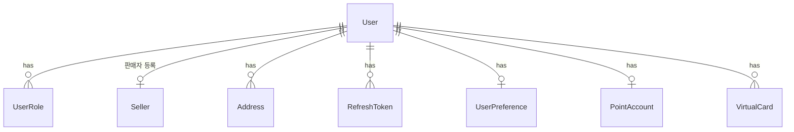
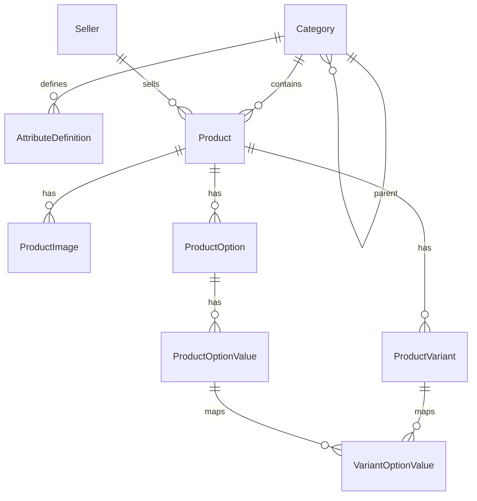
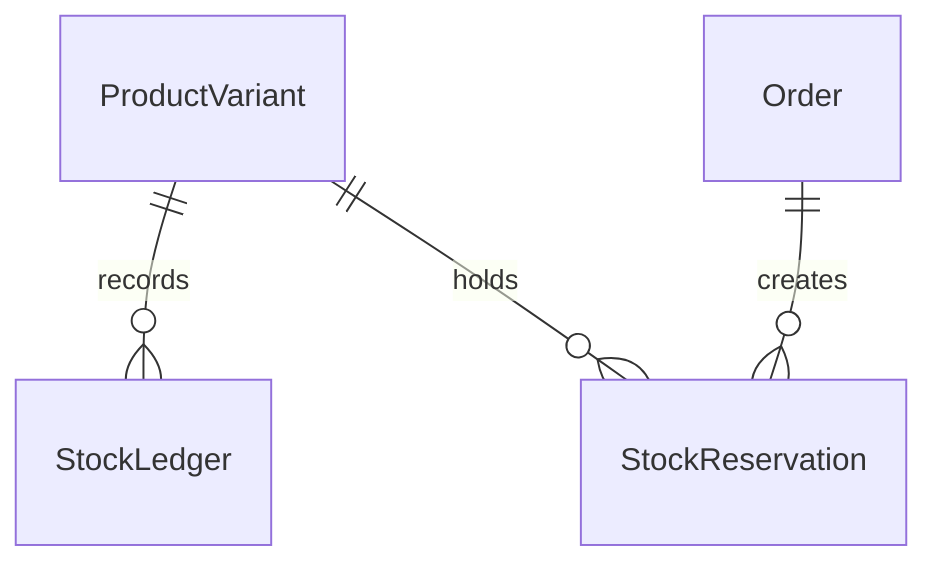
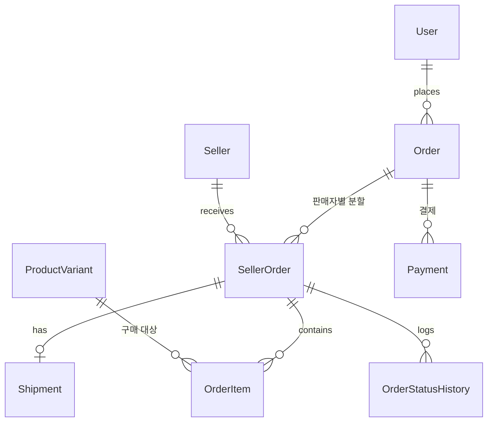
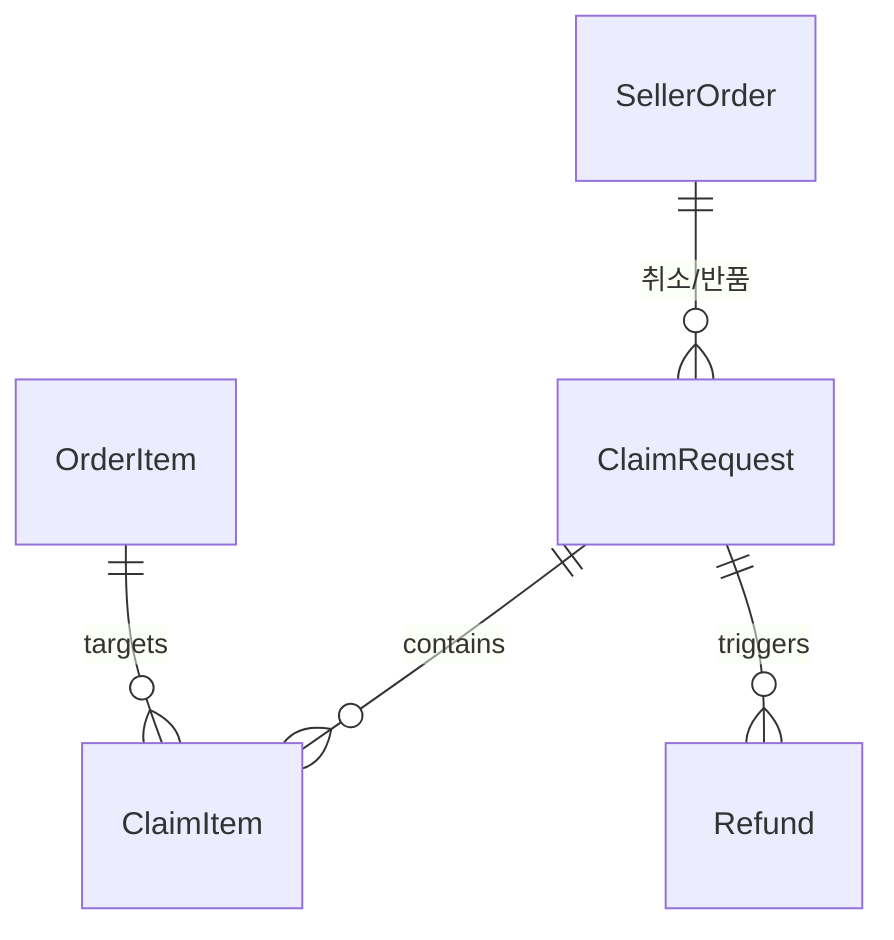
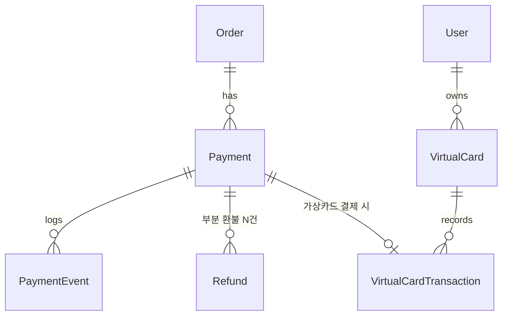
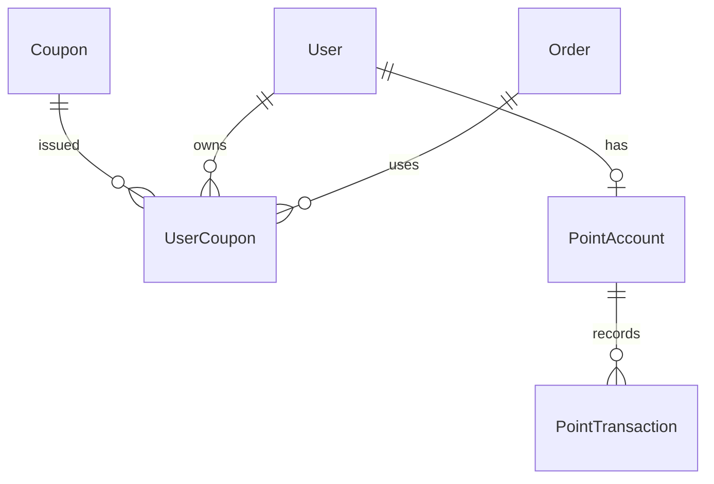
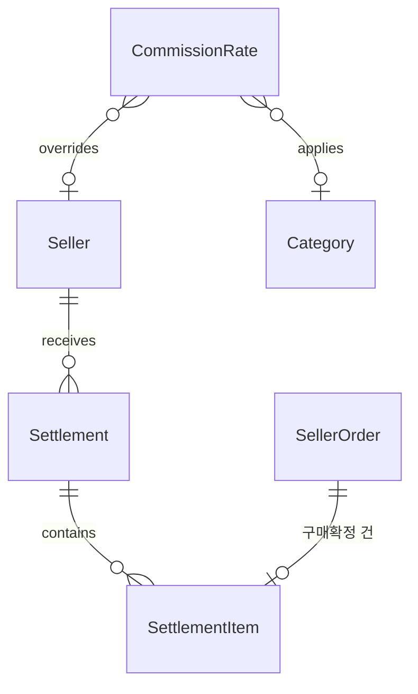
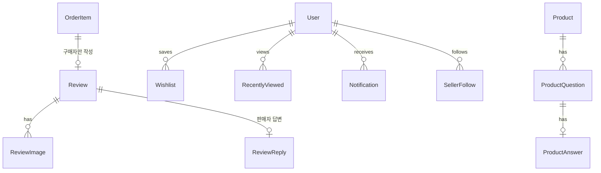

# 데이터 모델 (ERD)

> 현재 유효한 스키마 설계만 담는다. 구현이 시작되면 컬럼 타입·제약의 단일 출처는 `apps/api/prisma/schema.prisma` 이고,
> 이 문서의 역할은 **테이블의 목적과 관계, 그리고 왜 이렇게 나눴는지**로 좁아진다.
>
> 최종 갱신: 2026-09-03

## 설계 원칙

1. **금액은 정수(원 단위)로 저장한다.** 부동소수 금액 계산 금지.
2. **주문·결제·정산에 관련된 값은 스냅샷으로 남긴다.** 상품명·가격이 나중에 바뀌어도 과거 주문서는 그대로여야 한다.
3. **잔액이 있는 것은 원장(ledger)을 둔다.** 재고, 적립금, 가상 카드. 현재값은 원장의 결과이며 대사가 가능해야 한다.
4. **상태 변경은 이력을 남긴다.** 누가 언제 무엇을 왜 바꿨는지 추적 가능해야 한다.
5. **동시 변경은 성격에 따라 다르게 막는다.**
   - 사람이 편집하는 데이터(카테고리·상품 정보) → **낙관적 잠금**(`version`). 충돌을 사용자에게 알리고 선택하게 한다
   - 수량·잔액(재고·적립금·가상카드) → **행 잠금으로 직렬화**. 알릴 대상이 없으므로 순서대로 처리하고 부족한 요청만 실패시킨다
   - 트리 구조 이동 → **어드바이저리 락**. 경로 재계산이 겹치면 트리가 깨진다
6. 삭제는 대부분 소프트 삭제(`deletedAt`)로 처리한다. 주문 이력이 걸린 데이터를 물리 삭제하지 않는다. **id 는 재사용하지 않는다.**

---

## 1. 계정 · 인증



| 테이블 | 목적 | 비고 |
| --- | --- | --- |
| `User` | 계정 | `googleSub` 로 Google 계정 연결. `isDemo`·`demoExpiresAt` 로 데모 구분, `deletedAt` 로 탈퇴 |
| `UserRole` | 역할 | **다대다** — 한 사람이 구매자이면서 판매자일 수 있다. 역할 → 퍼미션 매핑은 코드 상수 |
| `Seller` | 판매자(스토어) | 브랜드명·스토어 URL·로고, 승인 상태, 개별 수수료율(선택). 편집자가 둘이라 낙관적 잠금 대상 |
| `Address` | 배송지 | 기본 배송지는 **사용자당 1개** — 부분 유니크 인덱스로 강제 |
| `RefreshToken` | 세션 | `app` 컬럼으로 shop/seller/admin 구분 — **앱별 세션이 독립**이므로 필요. 토큰은 해시만 보관 |
| `UserPreference` | 사용자 설정 | 표시 밀도(3단계), 언어, 통화, 앱 내 알림 수신 여부 |

**왜 역할을 다대다로 두는가**: 판매자도 물건을 산다. 역할을 단일 컬럼으로 두면 판매자가 구매자 앱을 쓸 수 없거나, 계정을 두 개 만들어야 한다.

### 설계 판단

컬럼과 제약의 단일 출처는 `apps/api/prisma/schema.prisma` 다(TASK-0020 에서 구현). 여기에는 **왜 그렇게 나눴는가**만 남긴다.

**식별자는 UUIDv7.** 사용자 id 는 URL 과 토큰에 실려 나간다. 연번이면 가입자 수가 드러나고 순회가 가능하다. v4 가 아니라 v7 인 이유는 시간 접두사가 남아 삽입이 B-tree 오른쪽 끝에 몰리기 때문이다. 2장의 `Category` 가 짧은 정수 id 를 유지하는 것과 다른데, 이것은 의도된 차이다 — `Category` 는 `path` 캐시(`/1/5/12/`)에 id 를 문자열로 이어붙이므로 짧아야 하고, 외부에 노출되지 않는다.

**소프트 삭제(`deletedAt`)를 두는 이유.** 주문·리뷰·정산이 `User` 를 참조한다. 탈퇴를 물리 삭제로 처리하면 과거 주문서의 참조가 끊기고, 스냅샷만으로는 "누구의 주문이었나"를 되짚을 수 없다. 그래서 행은 남기고 로그인 경로에서만 뺀다.

**그런데 소프트 삭제는 Google 유니크와 충돌한다.** 평범한 유니크 제약이면 탈퇴자의 남은 행이 그 Google 계정을 영구히 점유해 **재가입이 불가능**해진다. 해법은 **살아있는 계정만 인덱스에 넣는 부분 유니크 인덱스**(`WHERE "deletedAt" IS NULL`)다. 중복 가입은 여전히 DB 가 막고, 탈퇴하면 식별자가 자동으로 풀린다. 개인정보 파기가 필요해지면 이 컬럼을 비우면 되고(TASK-0025), 그때도 스키마는 그대로다.

**기본 배송지는 사용자당 1개 — 애플리케이션이 아니라 DB 가 막는다.** "이미 기본 배송지가 있는가"를 서비스에서 확인하면 동시에 들어온 두 요청이 **둘 다 0개를 읽고 둘 다 1개를 쓴다.** 기본 배송지 행만 인덱스에 넣는 부분 유니크 인덱스(`WHERE "isDefault"`)를 두면, 일반 배송지는 몇 개든 두면서 기본은 하나로 강제된다. 기본 배송지 교체는 한 트랜잭션에서 해제 후 지정한다.

**`Address` 는 예외적으로 물리 삭제한다.** 원칙 6 의 예외다. 주문이 수령인 정보를 스냅샷으로 갖기 때문에(4장) 이 행을 가리키는 참조가 없고, 탈퇴 계정의 개인정보를 실제로 지울 수 있어야 하기 때문이다.

**데모 계정은 Google 신원이 없다.** 그래서 신원 컬럼은 비어 있을 수 있고, 비어 있는 값은 유니크 인덱스에서 서로 충돌하지 않으므로 데모를 몇 개 발급하든 문제가 없다. 대신 두 가지를 DB 제약으로 못 박는다 — **데모에는 항상 만료 시각이 있고 실계정에는 없다**, **살아있는 실계정에는 항상 Google 신원이 있다**. 이게 없으면 "데모인가"라는 질문의 답이 어느 컬럼을 읽느냐에 따라 달라지고, 만료 정리 스케줄러가 실계정을 지울 수 있다.

**앱별 독립 세션은 `RefreshToken.app` 으로 표현한다.** 쿠키에 `Domain` 을 지정하지 않는다는 결정(D 2장)의 서버 쪽 절반이다. shop 토큰을 admin API 에 들이밀어도 `app` 으로 걸러진다. 판매자 세션만 끊고 구매자 세션은 유지하는 것도 이 컬럼 덕분에 가능하다. 토큰 원문은 저장하지 않고 해시만 남긴다 — 이 테이블이 유출돼도 세션을 재생할 수 없어야 한다.

**수수료율은 basis point 정수**(1bp = 0.01%, 10000 = 100%). 금액이 정수(원)인데 비율만 부동소수면 정산에서 `0.1 + 0.2` 류의 오차가 다시 들어온다. bp 는 국내 커머스 수수료가 쓰는 해상도(3.5%, 12.75%)를 정확히 표현하면서 정수로 남는다. 범위(0~10000)는 DTO 가 아니라 DB 가 강제한다 — 정산이 이 값을 곱하므로, 음수나 100% 초과가 들어가면 판매자에게 주문액보다 많은 돈이 계산되고 아무도 눈치채지 못한다. 카테고리 기본율과의 우선순위는 `docs/design/pricing.md` 5장.

**낙관적 잠금은 `Seller` 에만 건다.** 이 행만 편집자가 둘이다 — 판매자가 브랜드 소개를 고치는 동안 운영자가 승인·정지 상태를 바꾼다. last-write-wins 면 한쪽 작업이 조용히 되돌아간다(D 4장). `User` 프로필은 본인만 고치므로 걸지 않는다. 필요 없는 곳에 버전을 달면 갱신마다 충돌 처리 코드만 늘어난다.

**외래키 정책이 두 가지인 이유.** 개인 데이터(역할·배송지·설정·세션)는 계정과 함께 사라져야 하므로 `Cascade` 다. `Seller` 는 `Restrict` 다 — 스토어에는 상품·주문·정산이 걸려 있어서, 계정을 지우려는 시도는 조용히 카탈로그를 지우는 대신 **실패해야** 한다.

**DB 가 책임지는 규칙** — 애플리케이션 검증만으로는 동시 요청에 뚫리는 것들이다.

| 제약 | 보장하는 것 |
| --- | --- |
| `User_googleSub_active_key` | 살아있는 계정은 Google 계정당 1개. 탈퇴하면 식별자가 풀린다 |
| `Address_userId_default_key` | 사용자당 기본 배송지 1개 |
| `UserRole(userId, role)` | 같은 역할을 두 번 부여할 수 없다 |
| `User_demo_expiry_check` | 데모에는 만료가 있고 실계정에는 없다 |
| `User_google_identity_check` | 살아있는 실계정에는 Google 신원이 있다 |
| `Seller_commissionRateBp_check` | 수수료율은 0~10000 bp |
| `RefreshToken.tokenHash` unique | 같은 토큰이 두 번 발급·저장되지 않는다 |

### 권한 — 퍼미션 기반 RBAC

권한은 **퍼미션 단위**로 정의하고 역할에 매핑한다. 데모 제한이 별도 장치가 아니라 권한 체계의 일부가 된다.

**역할 × 퍼미션 전체 표는 [`permission-matrix.md`](./permission-matrix.md) 에 있다.** 그 문서는
`packages/shared/src/auth/role-permissions.ts` 에서 **생성**되며 손으로 고치지 않는다. 여기에 표를 한 벌 더
적지 않는 이유는 컬럼 타입을 `schema.prisma` 에만 두는 것과 같다 — 두 곳에 적힌 권한표는 반드시 한쪽이 낡고,
낡은 권한표는 없는 것보다 나쁘다.

| 역할 | 성격 |
| --- | --- |
| `BUYER` | 자기 데이터만 |
| `SELLER_OWNER` | 자기 스토어의 product·order·claim·coupon·settlement |
| `ADMIN_OPERATOR` | 전체 read + catalog/product/coupon write + claim.handle + seller.approve |
| `ADMIN_SUPER` | 전부 (delete · settlement.pay · user.delete 포함) |
| `DEMO_ADMIN` | `ADMIN_OPERATOR` 퍼미션 + **리소스 스코프 `demo`** |

**리소스 스코프**가 퍼미션을 보완한다. 퍼미션은 "무엇을 할 수 있나"만 답하고, "누구 것에"는 스코프가 답한다.

| 스코프 | 의미 |
| --- | --- |
| `own` | 자기가 소유한 리소스만 |
| `demo` | **데모 계정이 만든 리소스만** — 시드·실계정 데이터는 조회만 |
| `any` | 전부 |

```
SELLER_OWNER    product.write:own
ADMIN_OPERATOR  product.write:any
DEMO_ADMIN      product.write:demo      ← 시드·실계정 상품은 못 건드린다
                seller.approve:demo     ← 데모 판매자의 신청만 승인 가능
```

`demo` 스코프의 목적은 **실계정 보호**이지 데모 간 격리가 아니다. 판매자 데모가 입점 신청하면 관리자 데모가 승인할 수 있어야 관리자 콘솔이 조회만 되는 껍데기가 되지 않는다. 상세는 TASK-0105.

**기본 거부**: 퍼미션이 지정되지 않은 엔드포인트는 접근 불가다. 부여를 빠뜨려도 무방비로 열리지 않는다.

**역할 → 퍼미션은 테이블이 아니다.** `UserRole` 은 "누가 어떤 역할인가"만 저장하고, "그 역할이 무엇을 할 수
있나"는 코드 상수다. 테이블이면 배포와 리뷰 없이 `UPDATE` 한 줄로 권한이 넓어지고, 그 사실이 어디에도
남지 않는다. `packages/shared` 의 역할 목록과 `Role` 열거형이 어긋나면 타입 검사와 테스트가 함께 깨진다.

**데모 여부는 리소스 쪽에서만 읽는다.** 권한 판정 함수는 "요청자가 데모인가"라는 입력을 받지 않는다.
데모 관리자가 제한되는 이유는 요청자의 플래그가 아니라 `DEMO_ADMIN` 역할의 그랜트에 `demo` 스코프가
붙어 있기 때문이고, 그래서 `isDemo` 를 읽는 코드는 행을 소유 정보로 바꾸는 매퍼 하나뿐이다(TASK-0105 F8).

---

## 2. 카탈로그



| 테이블 | 목적 | 비고 |
| --- | --- | --- |
| `Category` | 카테고리 트리 | 자기 참조. `path`(`/1/5/12/`)를 캐시해 하위 전체 조회를 한 번에. **최대 3단계.** 부모 간선은 `(parentId, parentPath) → (id, path)` **복합 외래키**이고, 여기에 CHECK 제약이 더해져 순환·잘못된 경로·4단계를 **DB 가 표현 불가능하게** 만든다. **`id` 는 재사용하지 않는다** — 결번이 생겨도 채우지 않으며, 재사용하면 과거 스냅샷이 엉뚱한 카테고리를 가리킨다 |
| `AttributeDefinition` | 속성 **정의** | 카테고리에 연결. 타입, 선택지, 필터 노출 여부, 표시 순서. **상위 카테고리에서 상속** |
| `Product` | 상품 | 속성 **값**은 `attributes` JSONB. 목록 표시용 `minPrice`, `ratingAvg`, `salesCount` 캐시 |
| `ProductOption` | 옵션 정의 | "색상", "사이즈"와 표시 순서 |
| `ProductOptionValue` | 옵션 값 | "블랙", "M". `meta` JSONB 에 색상칩 hex 등 |
| `ProductVariant` | **SKU** | 재고·가격의 실제 단위. 옵션 없는 상품도 Variant 1개를 강제 생성. `maxPurchaseQuantity` 로 1회 주문 최대 수량 제한 |
| `VariantOptionValue` | 조합 매핑 | Variant ↔ 옵션값 다대다 |

### 카테고리 트리의 불변식을 DB 가 쥔다

`path` 는 캐시이므로 **어긋날 수 있다**는 것이 이 설계의 유일한 위험이다. 그래서 세 가지를 스키마로 못박았다.

| 규칙 | 어떻게 |
| --- | --- |
| `path` = 부모 `path` + 자기 `id` | CHECK. `parentPath` 열을 따로 두어 비교 대상을 만든다 |
| 부모 간선이 그 경로를 실제로 가리킨다 | `(parentId, parentPath) → (id, path)` **복합 외래키** |
| `depth` 는 `path` 에서 파생되고 1~3 | CHECK 2개 |

**순환 참조는 검사 대상이 아니라 표현 불가능**이 된다. 위 세 규칙 아래에서 모든 노드의 `path` 는 부모보다 반드시 길고, 순환은 "자기보다 긴 자기 경로"를 요구하기 때문이다. 깊이 상한도 같은 방식으로 파생된다 — `depth` 가 `path` 를 따라가므로, 이동으로 4단계가 되면 그 행 자체가 거부된다.

이 제약들이 애플리케이션 검증의 **대체재가 아니라 최종 방어선**이다. 서비스 계층은 같은 규칙을 미리 확인해 400 과 사람이 읽을 메시지를 돌려주고, DB 는 어떤 코드 경로로도 깨진 트리가 커밋되지 않게 한다. 동시 요청 두 건이 각자 "지금 트리는 정상이고 내 변경도 정상"이라고 판단하는 상황에서는 애플리케이션 검증만으로 부족하다.

**이동은 한 문장이다.** 옮기는 노드와 하위 전체를 하나의 `UPDATE ... WHERE path LIKE '/1/5/%'` 로 다시 쓴다. 복합 외래키가 `ON UPDATE NO ACTION` 이라 검증 시점이 **문장 끝**이고, 그때 트리는 이미 다시 일관적이다. 두 문장으로 나누면 중간 상태에서 외래키가 거부한다. 비용도 하위 노드 수와 무관한 인덱스 범위 스캔 1회다.

**동시 구조 변경은 어드바이저리 락으로 직렬화한다**(DECISIONS 4). 제약이 손상을 막아 주더라도, 락이 없으면 진 요청이 원시 제약 위반(500)을 받거나 — 더 나쁘게 — *성공했다고 답하면서 아무 행도 옮기지 않는다.* 락이 있으면 두 요청 모두 최신 트리를 읽고 각자 의미 있는 답(성공 또는 400)을 받는다.

**이름·슬러그 편집은 낙관적 잠금(`version`)이다.** 구조 변경은 `version` 을 건드리지 않는다 — 남이 형제 순서를 바꿨다는 이유로 이름 편집이 충돌로 튕기면 알림이 소음이 된다.

**속성을 정의/값으로 나눈 이유**: 정의가 테이블이어야 상품 등록 폼과 검색 필터 UI를 정의로부터 자동 생성할 수 있다. 값까지 테이블로 빼면(순수 EAV) 상품 목록 20개 조회에 조인이 폭증한다. 필터링·패싯은 Meilisearch 가 담당하므로 DB 는 값을 통째로 읽고 쓰기만 하면 된다.

**대가**: DB 가 값의 타입·범위를 강제하지 못한다. 저장 직전 `AttributeDefinition` 을 읽어 zod 스키마를 동적 생성해 검증하는 코드가 **필수**다.

---

## 3. 재고



| 테이블 | 목적 |
| --- | --- |
| `StockLedger` | 재고 변동 원장. 입고 / 판매 / 취소 / 반품입고 / 관리자조정을 전부 행으로 기록 |
| `StockReservation` | 주문서 작성 시 15분간 재고 선점. `HELD` → `CONFIRMED` / `RELEASED` |

```
가용재고 = ProductVariant.stock − SUM(StockReservation WHERE status='HELD' AND expiresAt > now)
```

예약 생성은 `UPDATE ... WHERE stock - reserved >= qty` 조건부 갱신으로 동시성을 막는다. 실패하면 즉시 품절 처리한다.
만료된 예약을 정리하는 스케줄러가 필수이며, 이 스케줄러의 동작 여부는 헬스체크 대상이다.

---

## 4. 주문 · 배송



| 테이블 | 목적 | 비고 |
| --- | --- | --- |
| `Order` | 주문서 | **결제 단위**. 총 상품금액·할인·배송비·적립금 사용·실결제액. 수령인 정보는 스냅샷 |
| `SellerOrder` | 판매자별 주문 | **배송·취소·정산 단위**. 상태가 여기에 붙는다 |
| `OrderItem` | 주문 항목 | 상품 스냅샷(JSONB), 단가, 수량, 항목별 할인 안분액 |
| `Shipment` | 배송 | 운송사·운송장번호는 가상 생성. 상태 전이도 가상 진행 |
| `OrderStatusHistory` | 상태 이력 | 이전/이후 상태, 사유, 처리 주체 |

**왜 2단으로 나누는가**: 한 주문에 여러 판매자 상품이 섞일 수 있다. 판매자 A는 배송완료인데 B는 준비중일 수 있어야 하고, B만 취소할 수 있어야 하며, 정산도 판매자별로 나간다. 상태를 `Order` 에 두면 이 셋이 전부 불가능해진다.

**할인 안분**: 주문 단위로 적용된 쿠폰·적립금을 `OrderItem` 까지 안분해 저장한다. 부분 취소 시 "이 항목에 할인이 얼마 붙어 있었나"를 그 자리에서 알 수 있어야 한다. 안분 규칙은 `docs/design/pricing.md` 참조.

---

## 5. 클레임 (취소 · 반품)



| 테이블 | 목적 |
| --- | --- |
| `ClaimRequest` | 취소(배송 전) / 반품(배송 후) 요청. 유형·상태·사유·귀책(고객/판매자) |
| `ClaimItem` | 대상 주문 항목과 수량 — **부분 취소·부분 반품을 위해 항목 단위** |
| `Refund` | 환불 실행 기록. 결제 1건에 환불 N건이 붙을 수 있다 |

교환은 구현하지 않는다. 반품 후 재구매로 안내한다.

---

## 6. 결제



| 테이블 | 목적 | 비고 |
| --- | --- | --- |
| `Payment` | 결제 | `provider` = VIRTUAL_CARD / TOSS. 승인액·누적취소액을 함께 보관 |
| `PaymentEvent` | 결제 이벤트 로그 | 웹훅 원문 포함. **멱등 처리의 근거** |
| `Refund` | 환불 | 부분 환불이 여러 번 발생하므로 별도 테이블 |
| `VirtualCard` | 가상 카드 | 한도, 사용액, 상태. 데모 계정 발급 시 1장 자동 지급 |
| `VirtualCardTransaction` | 카드 원장 | 승인/취소/환불 시 잔액 변화 기록 |

두 프로바이더는 `PaymentProvider { authorize, capture, cancel, refund }` 인터페이스 뒤에 둔다.
가상 카드는 한도 초과·잔액 부족·승인 거절을 **의도적으로 재현**할 수 있어야 한다. 결제 실패 시 재고 예약이 제대로 해제되는지 시연하기 위한 장치다.

---

## 7. 할인 (쿠폰 · 적립금)



| 테이블 | 목적 | 비고 |
| --- | --- | --- |
| `Coupon` | 쿠폰 정책 | `issuerType` = PLATFORM / SELLER. **부담 주체가 정산을 가른다** |
| `UserCoupon` | 발급된 쿠폰 | 발급/사용/만료 상태, 사용된 주문 |
| `PointAccount` | 적립금 잔액 | 사용자당 1개 |
| `PointTransaction` | 적립금 원장 | 적립/사용/복구/만료/조정. `balanceAfter` 를 함께 저장해 대사 가능 |

- 적립은 **구매확정 시점**에 지급한다. 배송완료 직후 주면 반품 시 회수할 수 없다.
- 환불 시 적립금은 **현금이 아니라 적립금으로** 복구된다.
- 플랫폼 쿠폰·적립금은 플랫폼 부담이라 판매자 정산에서 차감하지 않는다. 판매자 쿠폰만 차감한다.

---

## 8. 정산



| 테이블 | 목적 |
| --- | --- |
| `Settlement` | 주간 정산서. 판매액·수수료·판매자쿠폰·반품차감·지급액, 상태(대기/승인/지급완료) |
| `SettlementItem` | 정산서에 포함된 SellerOrder 별 내역 |
| `CommissionRate` | 수수료율. 카테고리 기본율 + 판매자별 개별율(우선) |

```
지급액 = 판매액 − 플랫폼 수수료 − 판매자 부담 쿠폰 − 반품 차감
```

실제 이체는 없다. 관리자가 "지급완료" 처리하면 상태만 바뀐다.

---

## 9. 회원 부가 기능



| 테이블 | 목적 | 비고 |
| --- | --- | --- |
| `Review` | 리뷰 | `orderItemId` **unique** — 구매한 항목당 1개. 구매 검증이 스키마로 강제된다 |
| `ReviewImage` / `ReviewReply` | 사진, 판매자 답변 | |
| `Wishlist` / `RecentlyViewed` | 찜, 열람 이력 | |
| `ProductQuestion` / `ProductAnswer` | 상품 문의 | 판매자가 답변, 비공개 문의 지원 |
| `SellerFollow` | 브랜드 팔로우 | |
| `Notification` | 앱 내 알림 | 주문 상태 변경, 배송 시작, 재입고. 이메일·푸시는 범위 외 |
| `Report` | 신고 | 리뷰·문의·상품 대상. 관리자가 처리 |

**리뷰의 구매 검증을 외래키로 처리하는 이유**: 애플리케이션에서 "주문했는지" 검사하는 대신 `orderItemId` 를 unique 로 걸면, 구매하지 않은 사람은 애초에 리뷰 행을 만들 수 없다. 중복 리뷰도 DB 가 막는다.

---

## 10. 데모 계정

| 관련 컬럼 | 위치 | 목적 |
| --- | --- | --- |
| `isDemo`, `demoExpiresAt` | `User` | 데모 계정 식별과 만료 시각 |
| `createdByDemo` | 데모가 생성 가능한 테이블 | 만료 시 일괄 삭제 대상 표시 |

- 상품 카탈로그는 공용이고, 장바구니·주문·리뷰·판매자 상품 등 개인 데이터만 격리한다.
- 만료 스케줄러가 `demoExpiresAt < now` 인 계정과 그 계정이 생성한 데이터를 삭제한다.
- 관리자 데모 계정의 파괴적 작업 차단 범위는 별도 TASK 에서 정의한다. (미확정)
