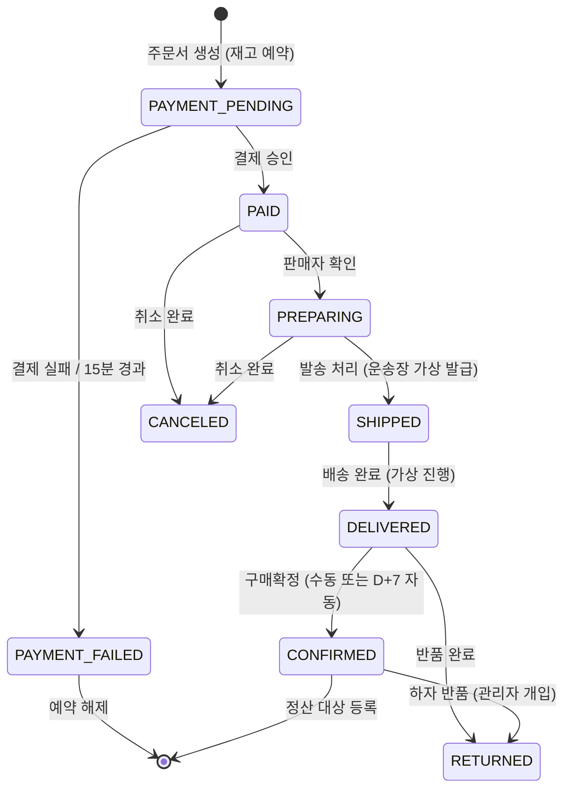
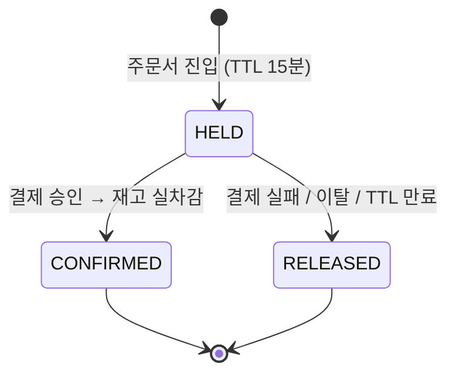
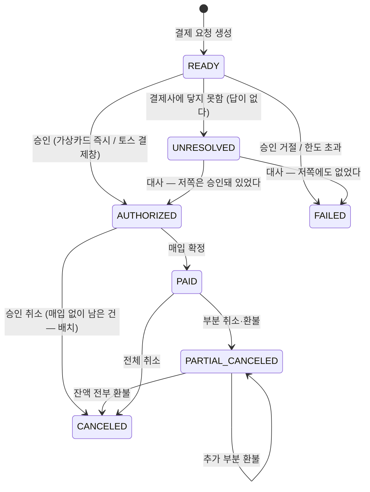
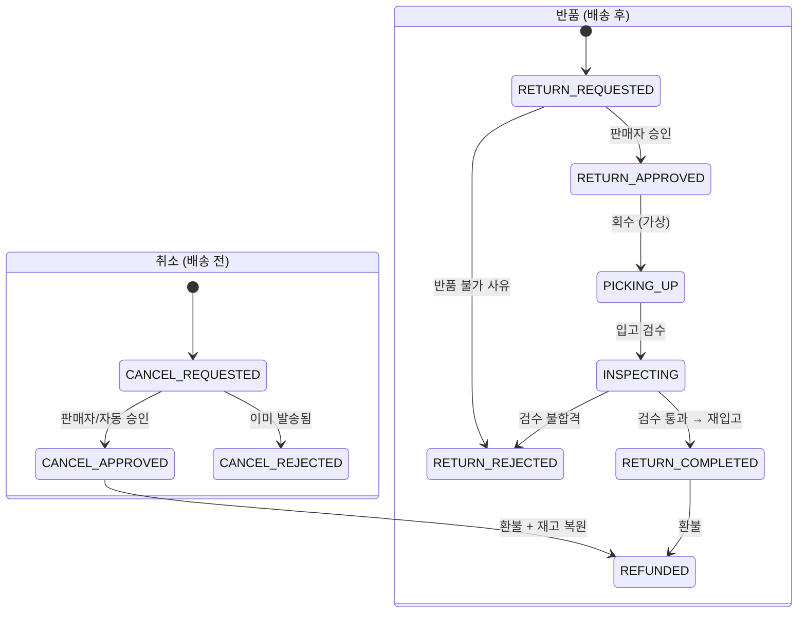
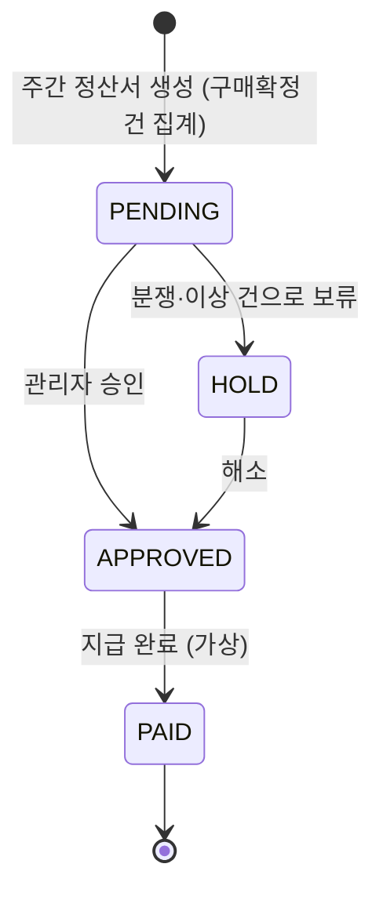
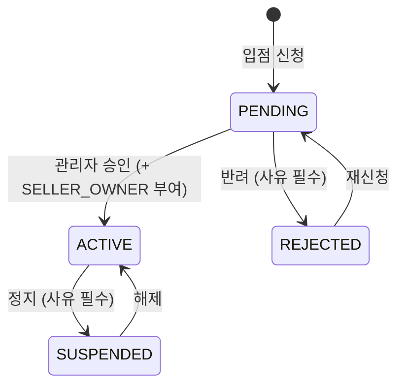
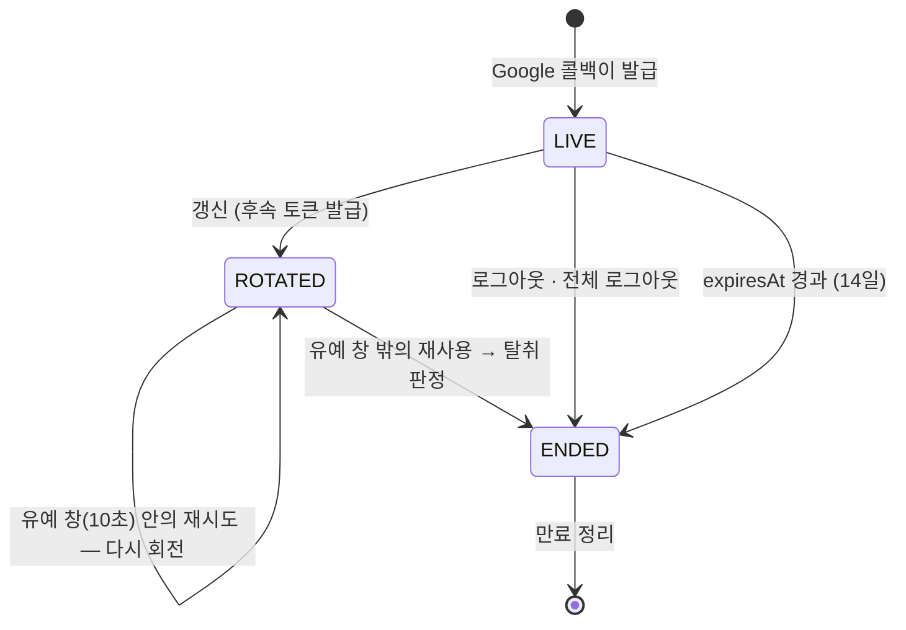
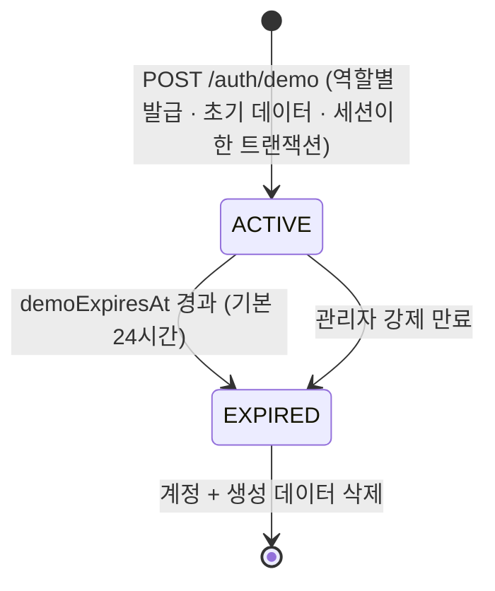
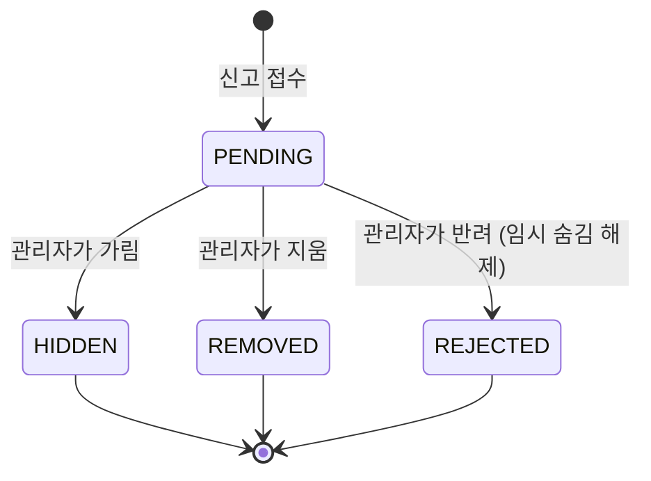

# 상태 머신

> 현재 유효한 상태 전이만 담는다. 최종 갱신: 2026-09-04

## 1. 주문 (SellerOrder)

상태는 `Order` 가 아니라 **`SellerOrder` 에 붙는다.** 판매자 A는 배송완료인데 B는 준비중일 수 있어야 하기 때문이다.



| 상태 | 의미 | 가능한 행동 |
| --- | --- | --- |
| `PAYMENT_PENDING` | 결제 대기 (재고 예약됨) | 결제, 이탈 |
| `PAID` | 결제 완료 | 판매자 확인, 구매자 취소 |
| `PREPARING` | 상품 준비중 | 발송, 취소 |
| `SHIPPED` | 배송중 | 배송완료 처리 |
| `DELIVERED` | 배송 완료 | 구매확정, 반품 신청 |
| `CONFIRMED` | 구매확정 | 리뷰 작성, **적립금 지급**, **정산 대상** |
| `CANCELED` / `RETURNED` | 취소 / 반품 완료 | 종료 |

**전이마다 「누가」가 붙는다** (TASK-0059). 역할이 아니라 **주체**다 — `SYSTEM` 이 그 차이를
만든다: 배송 시뮬레이터와 D+7 자동 확정에는 사람이 없고, 역할을 그대로 쓰면 그 둘을 표현할 수
없어 관리자 계정을 빌려 쓰게 된다. 그러면 이력에 「관리자가 확정했다」는 거짓이 남는다.

| 전이 | 주체 | 조건 |
| --- | --- | --- |
| `PAYMENT_PENDING → PAID` · `→ PAYMENT_FAILED` | **`SYSTEM` 뿐** | 사람이 「결제됨」을 누르는 화면은 없다. 결제가 끝났다는 사실의 결과다 |
| `PAID → PREPARING` | 판매자 · `SYSTEM` | |
| `PREPARING → SHIPPED` | 판매자 | **운송장이 있어야 한다** — 「보냈다」는데 어디 있는지 모르는 상태를 막는다 |
| `SHIPPED → DELIVERED` | `SYSTEM`(시뮬레이터) · 판매자 | 시뮬레이터가 멈춘 데모에서 판매자가 흐름을 이어 갈 수 있어야 한다. **판매자는 전용 라우트로 간다** — 전이 라우트로 직접 찍으면 배송 표가 안 따라온다 (TASK-0060 4.1) |
| `DELIVERED → CONFIRMED` | 구매자 · `SYSTEM`(D+7) | **기간은 `FULFILLMENT_PACE` 가 정한다** — `demo` 5분 / `realistic` 7일. 배송 진행 속도와 **같은 축**이다: 배송은 6분인데 확정이 7일이면 데모에서 흐름이 끊긴다 (TASK-0062 4.1) |
| `CONFIRMED → RETURNED` | **관리자뿐** | 확정은 **구매자에게** 끝이다. 하자 반품만 관리자 확인을 거쳐 처리되고(TASK-0064 4장), 판매자가 확정된 주문을 되돌리는 것은 클레임 절차 밖이다. 정산이 나간 뒤라면 **지급 회수**가 따라온다 (M12) |
| `PAID`·`PREPARING → CANCELED` · `DELIVERED → RETURNED` | 판매자 · 관리자 · `SYSTEM` | **구매자가 없다.** 취소·반품은 클레임 절차의 **결론**이고 구매자가 하는 일은 신청이다. `SYSTEM` 은 **자동 승인된 취소**다 — 결제완료 상태에서는 판매자가 아직 준비를 시작하지 않아 사람의 판단을 기다릴 이유가 없고, 그것을 승인한 것은 사람이 아니다 (TASK-0066) |

**「지금 할 수 있는 것」은 서버가 답한다** (`GET /seller-orders/:id/actions`). 화면이 상태로
분기하면 그 판단이 세 앱에 흩어지고 규칙이 바뀔 때 한 곳만 고쳐진다. **조건이 모자란 전이도
목록에 남는다** — 운송장이 없다고 발송 버튼을 감추면 판매자는 그 버튼을 찾다가 포기한다.

**상태·이력은 SellerOrderService가 함께 기록한다.** 단건 전이/예약 만료는 `applyWithin`, 결제 후처리는 `payPendingWithin`을 쓴다. 둘 다 행 잠금 아래 `transitionDecision`을 검증하고 커밋 뒤 이벤트를 발행한다. 결제는 PAYMENT_PENDING인 몫만 일괄 처리하며 진행된 상태를 되돌리지 않는다.

**「배송완료 시각」은 상태 이력에서 읽는다** (TASK-0064 4.1). 배송 표(`Shipment.deliveredAt`)는
뒤처질 수 있다 — 판매자가 전이 라우트로 직접 찍으면 따라오지 않고, 그때 그것을 기준으로 삼은
자동 확정은 **그 주문을 영원히 확정하지 않으면서 아무것도 실패시키지 않는다.**

**구매확정이 있는 이유**: 배송완료 직후 판매자에게 정산하면 반품 시 회수할 방법이 없다. 확정 시점이 정산과 적립금 지급의 트리거다. 미확정 건은 D+7에 자동 확정한다.

부분 취소·부분 반품 시 `SellerOrder` 상태는 남은 항목 기준으로 유지되고, 취소된 `OrderItem` 만 개별 상태를 갖는다.

---

## 2. 재고 예약 (StockReservation)



- 가용재고 = `stock` − `reserved`. `reserved` 는 `HELD` 합계의 캐시다 (TASK-0048)
- 예약 생성은 `UPDATE ... WHERE stock - reserved >= qty` 조건부 갱신. 실패 시 즉시 품절 처리
- **확정은 만료를 따지지 않는다.** 아직 `HELD` 면 `reserved` 가 그 몫을 세고 있으므로 재고는 이
  예약의 것이다. 결제가 승인된 뒤에 「15분이 지났습니다」로 거절할 이유가 없다
- **연장은 만료를 따진다.** 만료분을 되살리면 스케줄러가 이미 집어 든 행을 두고 경합한다
- `CONFIRMED` 는 어느 쪽에서도 되돌아오지 않는다. 해제하려 들면 거절한다 — 이미 팔린 재고다
- **만료 스케줄러가 멈추면 재고가 잠긴다.** 헬스체크에 포함시킨다 — 잡아 둔 재고가 영영 풀리지
  않고 아무도 그것을 살 수 없는데 **아무것도 실패하지 않으므로**, 헬스체크가 그것을 볼 수 있는
  유일한 자리다 (TASK-0051)
- 만료 청소는 한 번에 200건이다. 천 건을 한 트랜잭션으로 풀면 그동안 그 variant 들의 행이 잠겨
  담기와 주문이 함께 멈춘다 — 청소가 장애를 만드는 모양이다
- 인스턴스가 둘이면 어드바이저리 락으로 하나만 돈다. 없으면 `reserved` 가 두 번 줄어
  `ProductVariant_reserved_check` 가 거절하고, 증상은 「가끔 청소가 실패한다」가 된다

---

## 3. 결제 (Payment)



- 두 프로바이더(`VIRTUAL_CARD`, `TOSS`)는 `PaymentProvider { authorize, capture, cancel, refund }` 인터페이스 뒤에 둔다
- 모든 상태 변화와 웹훅 원문은 `PaymentEvent` 에 기록한다. **웹훅은 중복 도착을 전제로 멱등 처리**한다
- 가상 카드는 한도 초과·잔액 부족·승인 거절·승인 지연을 의도적으로 재현할 수 있어야 한다
- **`AUTHORIZED → CANCELED` 는 환불이 아니라 승인 취소다** (D-221). 매입 전이라 돈이 아직 우리
  쪽으로 오지 않았고, 결제사 API(`cancel` 대 `refund`)도 수수료도 다르며 **부분이 없다** — 매입한
  적이 없으니 나눌 것이 없어 착지점은 `CANCELED` 하나다. **배치만 이 화살표를 연다**: 조건은
  「승인된 지 오래됐다 + 그 주문에 살아 있는 예약이 없다」 둘을 함께 보는 것이고, 뒤쪽이 곧 「이
  결제로 살 수 있는 것이 이미 없다」는 뜻이다
- **보상의 방향은 「돈이 어디까지 왔는가」가 정한다** (D-221). 매입까지 끝났는데 주문이 완료되지
  않은 건은 되감지 않고 **마저 끝낸다**(`markPaid` 재실행) — 돈은 이미 왔고 사람은 물건을
  기다리므로, 그것을 취소하는 것은 사고를 두 번째로 만드는 일이다
- **`UNRESOLVED` 는 「모른다」이지 「실패했다」가 아니다** (D-220). 거절은 답이므로 `FAILED` 이고,
  이 상태는 **결제사에 닿지 못했을 때만** 들어간다 — 요청이 도착조차 안 했을 수도, 승인까지
  끝났는데 응답만 못 받았을 수도 있다. 나가는 길은 **대사만 연다**: 사용자의 어떤 조작도 이
  상태를 옮기지 못하는데, 옮길 근거가 우리에게 없기 때문이다. 그동안 **주문은 완료되지 않고
  예약은 유지된다** — 놓아 버리면 대사가 「승인됐다」를 확인해도 팔 물건이 없다
- **결제창 성공은 `AUTHORIZED` 가 아니다.** 토스에서 돌아온 브라우저가 서버 승인
  (`POST /payments/:id/toss/confirm`)을 부르고, 서버가 **주문 금액과 대조한 뒤에야**
  `READY → AUTHORIZED` 가 일어난다. 대조에 진 요청은 상태를 옮기지 않고 사건만 남긴다
- **`AUTHORIZED → PAID` 에서 결제사를 부르는 것은 프로바이더마다 다르다.** 토스는 승인
  한 번이 매입까지이고 가상 카드에는 그 사이의 은행이 없어, 둘 다 이 전이에서 바깥으로
  나가지 않는다. 그래도 전이가 남아 있는 이유는 승인과 매입을 나누는 결제사를 붙일 때
  부르는 쪽을 고치지 않기 위해서다

---

## 4. 클레임 (취소 · 반품)



- **경로는 주문 상태가 정하고 사람이 고르지 않는다.** 「취소할까 반품할까」는 물건이 어디
  있는가의 문제이지 취향이 아니고, 고르게 두면 배송된 물건을 취소로 신청해 재고가 두 번 는다

| 주문 상태 | 경로 | 왜 |
| --- | --- | --- |
| `PAID` · `PREPARING` | **취소** | 아직 떠나지 않았다 |
| `SHIPPED` | **없음** | 취소하기엔 이미 떠났고 반품하기엔 아직 안 왔다 |
| `DELIVERED` | **반품** (기간 내) | 기간은 `FULFILLMENT_PACE` 가 정한다 — 구매확정과 **같은 축**이다 |
| `CONFIRMED` | **관리자만** | 일반 반품은 끝났고 구매자에게는 길이 없다. **하자 반품만** 관리자가 대신 신청한다 (TASK-0071 4.0) |
| 그 밖 | **없음** | 결제 전이거나 이미 끝난 주문이다 |
- **항목·수량 단위로 신청**한다. 주문 항목 3개 중 1개만 취소하는 것이 정상 흐름이다
- 교환은 구현하지 않는다. 반품 후 재구매로 안내한다
- **거절은 종착이다.** 관리자가 판매자의 거절을 뒤집을 때도 그 화살표를 되돌리지 않고 **원본을
  가리키는 새 클레임을 대신 낸다** (TASK-0071 4.2). 거절이 이미 잡은 수량을 돌려주었기 때문이고,
  되돌리는 화살표는 그 사이 구매자가 재신청했을 때 잡을 수 없는 것을 잡으려 든다
- **이의 제기는 상태가 아니다.** 이의를 내도 클레임은 움직이지 않으므로(같은 상태로 가는 줄은
  `ClaimStatusHistory_transition_check` 가 막는다) 자기 수명을 가진 별도의 것이다 —
  접수 → 인용(= 강제 처리 그 자체) 또는 기각
- **회수와 검수 진입은 관리자도 한다.** 뒤집힌 판매자에게 「수거를 눌러라」를 요구할 수 없고,
  확정 후 반품에는 판매자의 걸음이 없다
- 환불 금액 계산은 `pricing.md` 의 안분 규칙을 따른다

---

## 5. 정산 (Settlement)



```
지급액 = 판매액 − 플랫폼 수수료 − 판매자 부담 쿠폰 − 반품 차감
```

플랫폼 쿠폰과 적립금은 플랫폼 부담이므로 차감하지 않는다. 실제 이체는 없고 상태만 바뀐다.

---

## 6. 판매자 입점 (Seller)



**재신청(`REJECTED → PENDING`)이 없으면 첫 반려가 영구가 된다.** 반려는 사유를 남기는 답이고, 사유를
받은 사람이 그것을 고쳐 다시 낼 수 없다면 사유를 남길 이유도 없다.

**승인은 상태 전이와 `SELLER_OWNER` 부여를 한 트랜잭션으로 한다.** 한쪽만 남으면 콘솔에 들어가지
못하는 `ACTIVE` 스토어이거나, 심사 없이 파는 스토어다. 데모 판매자는 심사할 사람이 없으므로 발급
경로가 곧바로 `ACTIVE` 로 연다 — 상태와 역할이 함께 간다는 성질은 같다.

| 상태 | 판매자 앱 | 상품 등록 | 주문 처리 |
| --- | --- | --- | --- |
| `PENDING` | 안내 화면만 | ✗ | ✗ |
| `ACTIVE` | 전체 | ✓ | ✓ |
| `REJECTED` | 사유 표시 + 재신청 | ✗ | ✗ |
| `SUSPENDED` | 제한 | ✗ | **✓** |

**`SUSPENDED` 에서 주문 처리를 허용하는 이유**: 이미 결제한 구매자가 있다. 판매자를 정지시켰다고
배송이 멈추면 피해는 보호하려던 쪽이 본다. `PENDING`·`REJECTED` 는 처리할 주문 자체가 없고, 표에는
거절로 적는다 — "해당 없음" 을 세 번째 값으로 두면 판정하는 쪽마다 그것을 어떻게 다룰지 정하게 된다.

스토어 정보(브랜드명·소개·로고) 수정은 **모든 상태에서 열려 있다.** 반려된 이름을 고치는 것과 정지
중에 소개를 바로잡는 것은 막을 이유가 없다. `ACTIVE` 가 아닌 스토어가 못 하는 것은 **파는 것**이다.

---

## 7. 세션 (RefreshToken)

로그인 자체는 상태가 없다. 상태를 갖는 것은 **refresh 토큰 한 장**이고, 세션은 그 토큰들의 사슬이다.



**`ROTATED` 와 `ENDED` 는 컬럼 하나로 갈리지 않는다.** 둘 다 `revokedAt` 이 차 있고, 구분하는 것은
`expiresAt` 이다.

| 상태 | `revokedAt` | `expiresAt` | 다시 제시하면 |
| --- | --- | --- | --- |
| `LIVE` | `null` | 발급 + 14일 | 회전한다 |
| `ROTATED` | 회전 시각 | **발급 + 14일 그대로** | 창 안이면 재시도, 밖이면 탈취 |
| `ENDED` | 종료 시각 | **종료 시각** | 만료로 거절 |

세션을 끝내는 경로는 만료도 함께 당긴다. 그러지 않으면 **탈취 판정으로 죽인 토큰들이 곧바로 유예
창 안에 들어와** 재시도로 통과하고, 세션이 자기 탐지를 살아남는다. 그래서 갱신은 **만료를 폐기보다
먼저** 본다 — 검사 순서가 곧 그 성질이다.

**세션은 앱별이다.** `RefreshToken.app` 이 어느 콘솔의 것인지 담고, 브라우저에서는 쿠키 **이름**이
셋을 가른다(`shopping_refresh_<app>`). `Domain` 을 지정하지 않는 것만으로는 부족하다 — 쿠키를
발급하는 것이 세 앱 공통의 API 오리진이기 때문이다 (D-218).

access 토큰은 여기에 없다. 상태가 없고 폐기 목록도 없으며, 15분 뒤 스스로 무의미해진다.

---

## 8. 데모 계정 수명



**상태를 담는 컬럼이 따로 없다.** `User.isDemo` 와 `demoExpiresAt` 두 칸이
`User_demo_expiry_check` 로 묶여 있어, 데모에는 항상 만료가 있고 실계정에는 없다. 그래서 위
다이어그램의 `ACTIVE` 와 `EXPIRED` 는 **`demoExpiresAt` 과 현재 시각의 비교**이지 저장된
값이 아니다 — 어느 컬럼을 보든 "이 계정이 데모인가"의 답이 하나인 것이 이 설계의 목적이다.

`googleSub` 는 `null` 이다. 살아 있는 실계정에 신원을 요구하는 `User_google_identity_check` 는
데모를 그 플래그로 면제한다.

### 발급 (TASK-0024)

```
POST /api/v1/auth/demo   X-App-Id: shop | seller | admin
     { role: BUYER | SELLER | ADMIN }
  → 200 { demo: { role, expiresAt } } + Set-Cookie: shopping_refresh_<app>
GET  /api/v1/auth/demo   → { demo: { role, expiresAt } | null }
```

- **앱이 세션이 사는 곳을 정하고, 본문이 무엇을 요청했는지 말한다.** 어긋나면 400 이다 — 그대로
  따르면 그 콘솔이 읽지 않는 쿠키로 세션이 나가(D-218) 로그인은 됐는데 못 들어가는 상태가 된다
- **발급 응답에 access 토큰이 없다.** Google 콜백과 같다 — 쿠키만 실려 가고 앱은 첫
  `POST /auth/refresh` 로 받는다
- **계정 · 역할 · 초기 데이터 · 스토어 · refresh 토큰이 한 트랜잭션**이다. 절반만 남으면 방문자는
  이미 그 계정으로 로그인된 상태라 다시 받을 방법이 없다
- **남용 방지는 주소별 어드바이저리 락 + DB 카운트**다. 창 60초 안에 한 주소가 받을 수 있는 계정은
  5개이고, 세는 것은 토큰이 아니라 계정이다(갱신으로 늘어나는 토큰을 세면 탭을 열어 둔 방문자가
  걸린다). 락은 카테고리 트리와 같은 `pg_advisory_xact_lock` 이다

### 역할별 초기 데이터

발급 시점에 채워 두는 것은 **그 역할의 테이블이 이미 있는 만큼**이다.

| 역할 | 지금 채워지는 것 | 받는 TASK |
| --- | --- | --- |
| 구매자 | 기본 배송지 1, 표시 설정 1 | 가상카드(0053) · 쿠폰(0072) · 적립금(0076) · 주문(0049·0059) · 위시리스트(0086) · 최근 본 상품(0087) |
| 판매자 | `ACTIVE` 스토어, 공용 카탈로그에서 복제한 상품 최대 12개(이미지·옵션·Variant·재고 원장 포함) | 주문(0049·0059) · 정산(0080) · 리뷰(0083) |
| 관리자 | 승인 대기 판매자 신청 2건 — **각각 자기 데모 계정이 소유** | 클레임(0065) · 정산서(0080) |

관리자의 신청 2건이 데모 소유인 것이 핵심이다. `DEMO_ADMIN` 은 쓰기가 `demo` 스코프로 좁혀져
있어(D-058), 실계정 신청만 있는 큐는 보기만 하고 누를 수 없는 껍데기가 된다.

### 만료 표시

세 앱 모두 로그인 뒤 `GET /auth/demo` 를 한 번 부르고, 남은 시간을 **분 단위**로 배너에 띄운다.
`SessionResponse` 에 만료를 싣지 않는 이유는 판매자 상태를 싣지 않는 것과 같다 — 세션 계약이
계정 개념을 갖게 된다.

- 상품 카탈로그는 공용이고, 개인 데이터(장바구니·주문·리뷰·판매자 상품)만 삭제 대상이다
- 만료된 데모 계정이 등록한 상품은 삭제하되, **이미 주문에 포함된 상품은 스냅샷이 남아 주문 이력이 깨지지 않는다**
- **복제된 Variant 에는 `INBOUND` 원장 한 줄이 함께 들어간다.** `StockLedger` 는 append-only
  트리거가 걸려 있어 행을 지울 수 없고 `ProductVariant` 로의 간선이 `Restrict` 이므로, 정리는
  상품을 **소프트 삭제**로 다뤄야 한다 (TASK-0025 가 받는다)

---

## 9. 신고 (Report)



**자동 임시 숨김은 상태가 아니라 대상에 일어난다.** 같은 대상에 대기 중인 신고가 3건이 되면
그 대상이 가려지고, 신고 자체는 여전히 `PENDING` 이다 — 가린 것은 사람의 판단이 아니라 시간을
버는 조치이고, 그 둘을 한 상태로 합치면 「관리자가 가렸다」와 「자동으로 가려졌다」를 구분할 수
없게 된다 (TASK-0091 4장).

**반려는 아무 일도 안 하는 것이 아니다.** 자동 임시 숨김이 이미 가려 놓았으므로, 반려에서
복구하지 않으면 「아니라고 판단했는데 계속 가려져 있는」 상태가 남는다 — 그러면 신고 세 번으로
남의 글을 영영 가리는 길이 열린다.

**한 대상의 대기 신고는 함께 닫힌다.** 한 대상에 대한 판단은 하나이고, 남겨 두면 관리자가 이미
결론 난 것을 몇 번씩 다시 읽는다.

## 결제 요청 멱등성 (TASK-0125)

주문 행 잠금 아래 진행/완료 결제를 재사용한다. 승인 전 authorizationStartedAt을 원자적으로 기록해 동일 결제의 provider 호출 실행권을 한 요청에만 준다. 60초 이상 남은 READY 실행권은 대사에서 UNRESOLVED로 옮겨 결과를 확인한다. 기존 AUTHORIZED/PAID의 반복 승인·확정 요청은 기존 상태를 돌려주고 추가 차감하지 않는다. 가상 카드 CHARGE refId는 유일하며 같은 키의 다른 카드/금액은 충돌이다. GET /orders/:id/payment는 구매자 소유 주문의 최근 시도 또는 null을 반환한다.

## 결제 확정과 장바구니 (TASK-0127)

예약에 원본 장바구니 항목 ID·수정시각을 저장한다. markPaid는 주문 잠금 아래 일치하는 항목만 제거하고 cartCleanedAt을 기록한다. 수정/삭제 후 재담기/원본 정보 없는 과거 주문은 보존한다. 재처리와 대사 완료도 동일한 루틴을 지난다.

## 주문서 초안과 이동 (TASK-0128, D-271)

내부 이동·새로고침은 재고 예약을 해제하지 않는다. 명시 취소와 서버 TTL은 유지한다. 예약 행의 checkoutDraft는 인증된 소유자의 주소 ID·배송 메모·쿠폰 ID를 저장하며 revision이 작은 지연 저장은 무시한다. 초안 저장은 최신 변경을 합쳐 순차 처리한다. 주문 생성 시 deliveryNote를 스냅샷으로 고정하고 구매자·판매자 조회에 제공한다.

결제 후처리는 Order 잠금 아래 원본 장바구니 정리·예약 확정·재고 원장·판매자 주문 상태/이력을 하나의 transaction으로 기록한다. 예약은 id 순, variant는 id 순으로 잠그고 원장 seq는 variant 잠금 획득 뒤 새 SQL 스냅샷에서 읽는다. 상품 수에 비례하는 DB 왕복을 없애기 위해 도메인 서비스 내부에서 일괄 기록하며 기본 transaction 제한은 유지한다(TASK-0132).
