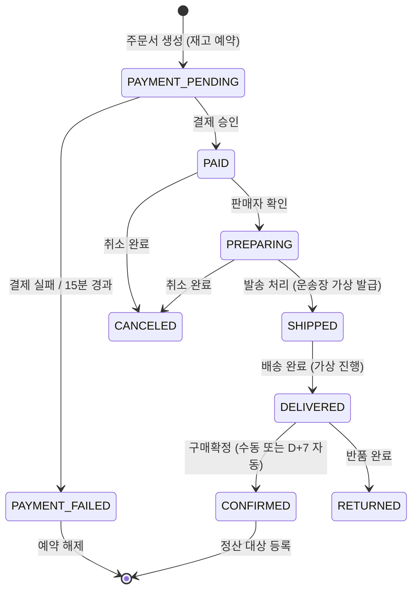
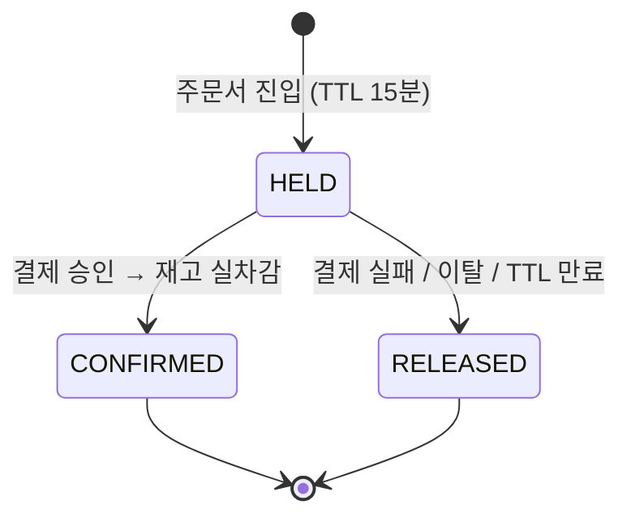
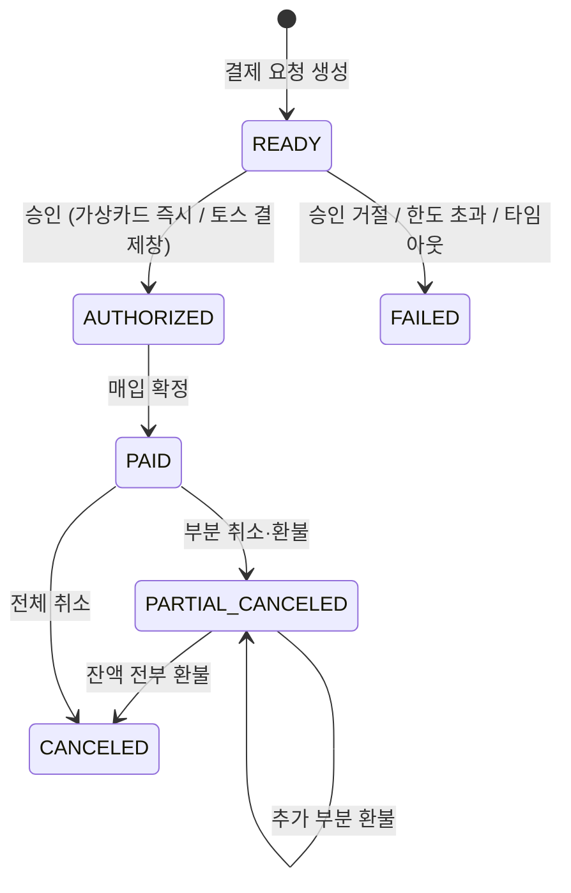
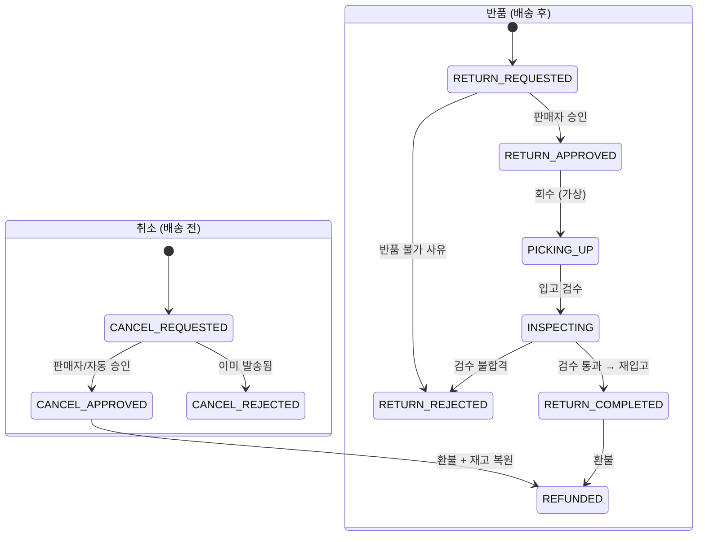
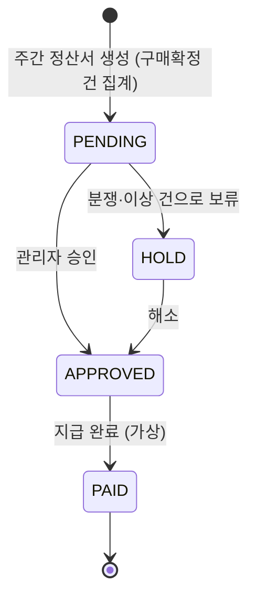
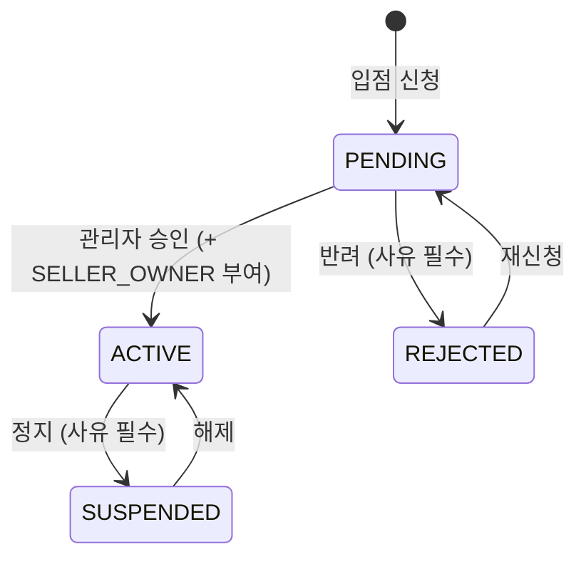
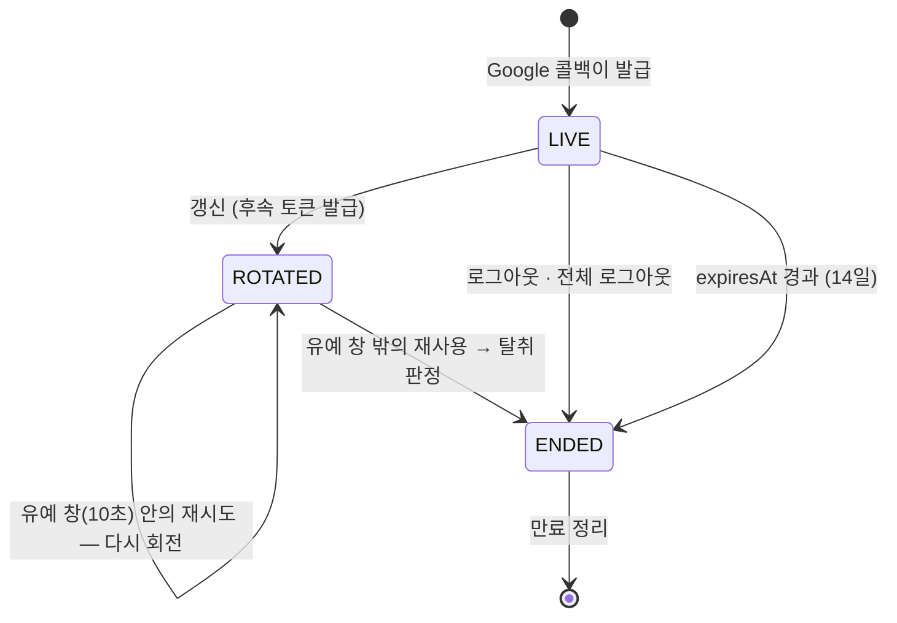
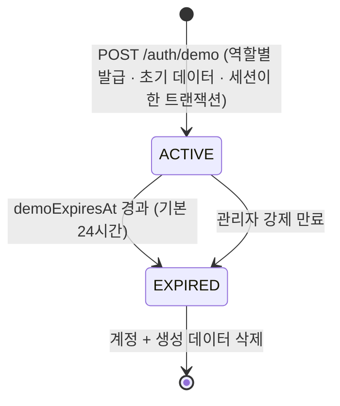

# 상태 머신

> 현재 유효한 상태 전이만 담는다. 최종 갱신: 2026-09-04

## 1. 주문 (SellerOrder)

상태는 `Order` 가 아니라 **`SellerOrder` 에 붙는다.** 판매자 A는 배송완료인데 B는 준비중일 수 있어야 하기 때문이다.



| 상태 | 의미 | 가능한 행동 |
| --- | --- | --- |
| `PAYMENT_PENDING` | 결제 대기 (재고 예약됨) | 결제, 이탈 |
| `PAID` | 결제 완료 | 판매자 확인, 구매자 취소 |
| `PREPARING` | 상품 준비중 | 발송, 취소 |
| `SHIPPED` | 배송중 | 배송완료 처리 |
| `DELIVERED` | 배송 완료 | 구매확정, 반품 신청 |
| `CONFIRMED` | 구매확정 | 리뷰 작성, **적립금 지급**, **정산 대상** |
| `CANCELED` / `RETURNED` | 취소 / 반품 완료 | 종료 |

**구매확정이 있는 이유**: 배송완료 직후 판매자에게 정산하면 반품 시 회수할 방법이 없다. 확정 시점이 정산과 적립금 지급의 트리거다. 미확정 건은 D+7에 자동 확정한다.

부분 취소·부분 반품 시 `SellerOrder` 상태는 남은 항목 기준으로 유지되고, 취소된 `OrderItem` 만 개별 상태를 갖는다.

---

## 2. 재고 예약 (StockReservation)



- 가용재고 = `stock` − 유효한 `HELD` 예약 합계
- 예약 생성은 `UPDATE ... WHERE stock - reserved >= qty` 조건부 갱신. 실패 시 즉시 품절 처리
- **만료 스케줄러가 멈추면 재고가 잠긴다.** 헬스체크에 포함시킨다

---

## 3. 결제 (Payment)



- 두 프로바이더(`VIRTUAL_CARD`, `TOSS`)는 `PaymentProvider { authorize, capture, cancel, refund }` 인터페이스 뒤에 둔다
- 모든 상태 변화와 웹훅 원문은 `PaymentEvent` 에 기록한다. **웹훅은 중복 도착을 전제로 멱등 처리**한다
- 가상 카드는 한도 초과·잔액 부족·승인 거절·승인 지연을 의도적으로 재현할 수 있어야 한다

---

## 4. 클레임 (취소 · 반품)



- `PAID` / `PREPARING` 이면 취소, `DELIVERED` 이면 반품 경로다
- **항목·수량 단위로 신청**한다. 주문 항목 3개 중 1개만 취소하는 것이 정상 흐름이다
- 교환은 구현하지 않는다. 반품 후 재구매로 안내한다
- 환불 금액 계산은 `pricing.md` 의 안분 규칙을 따른다

---

## 5. 정산 (Settlement)



```
지급액 = 판매액 − 플랫폼 수수료 − 판매자 부담 쿠폰 − 반품 차감
```

플랫폼 쿠폰과 적립금은 플랫폼 부담이므로 차감하지 않는다. 실제 이체는 없고 상태만 바뀐다.

---

## 6. 판매자 입점 (Seller)



**재신청(`REJECTED → PENDING`)이 없으면 첫 반려가 영구가 된다.** 반려는 사유를 남기는 답이고, 사유를
받은 사람이 그것을 고쳐 다시 낼 수 없다면 사유를 남길 이유도 없다.

**승인은 상태 전이와 `SELLER_OWNER` 부여를 한 트랜잭션으로 한다.** 한쪽만 남으면 콘솔에 들어가지
못하는 `ACTIVE` 스토어이거나, 심사 없이 파는 스토어다. 데모 판매자는 심사할 사람이 없으므로 발급
경로가 곧바로 `ACTIVE` 로 연다 — 상태와 역할이 함께 간다는 성질은 같다.

| 상태 | 판매자 앱 | 상품 등록 | 주문 처리 |
| --- | --- | --- | --- |
| `PENDING` | 안내 화면만 | ✗ | ✗ |
| `ACTIVE` | 전체 | ✓ | ✓ |
| `REJECTED` | 사유 표시 + 재신청 | ✗ | ✗ |
| `SUSPENDED` | 제한 | ✗ | **✓** |

**`SUSPENDED` 에서 주문 처리를 허용하는 이유**: 이미 결제한 구매자가 있다. 판매자를 정지시켰다고
배송이 멈추면 피해는 보호하려던 쪽이 본다. `PENDING`·`REJECTED` 는 처리할 주문 자체가 없고, 표에는
거절로 적는다 — "해당 없음" 을 세 번째 값으로 두면 판정하는 쪽마다 그것을 어떻게 다룰지 정하게 된다.

스토어 정보(브랜드명·소개·로고) 수정은 **모든 상태에서 열려 있다.** 반려된 이름을 고치는 것과 정지
중에 소개를 바로잡는 것은 막을 이유가 없다. `ACTIVE` 가 아닌 스토어가 못 하는 것은 **파는 것**이다.

---

## 7. 세션 (RefreshToken)

로그인 자체는 상태가 없다. 상태를 갖는 것은 **refresh 토큰 한 장**이고, 세션은 그 토큰들의 사슬이다.



**`ROTATED` 와 `ENDED` 는 컬럼 하나로 갈리지 않는다.** 둘 다 `revokedAt` 이 차 있고, 구분하는 것은
`expiresAt` 이다.

| 상태 | `revokedAt` | `expiresAt` | 다시 제시하면 |
| --- | --- | --- | --- |
| `LIVE` | `null` | 발급 + 14일 | 회전한다 |
| `ROTATED` | 회전 시각 | **발급 + 14일 그대로** | 창 안이면 재시도, 밖이면 탈취 |
| `ENDED` | 종료 시각 | **종료 시각** | 만료로 거절 |

세션을 끝내는 경로는 만료도 함께 당긴다. 그러지 않으면 **탈취 판정으로 죽인 토큰들이 곧바로 유예
창 안에 들어와** 재시도로 통과하고, 세션이 자기 탐지를 살아남는다. 그래서 갱신은 **만료를 폐기보다
먼저** 본다 — 검사 순서가 곧 그 성질이다.

**세션은 앱별이다.** `RefreshToken.app` 이 어느 콘솔의 것인지 담고, 브라우저에서는 쿠키 **이름**이
셋을 가른다(`shopping_refresh_<app>`). `Domain` 을 지정하지 않는 것만으로는 부족하다 — 쿠키를
발급하는 것이 세 앱 공통의 API 오리진이기 때문이다 (D-218).

access 토큰은 여기에 없다. 상태가 없고 폐기 목록도 없으며, 15분 뒤 스스로 무의미해진다.

---

## 8. 데모 계정 수명



**상태를 담는 컬럼이 따로 없다.** `User.isDemo` 와 `demoExpiresAt` 두 칸이
`User_demo_expiry_check` 로 묶여 있어, 데모에는 항상 만료가 있고 실계정에는 없다. 그래서 위
다이어그램의 `ACTIVE` 와 `EXPIRED` 는 **`demoExpiresAt` 과 현재 시각의 비교**이지 저장된
값이 아니다 — 어느 컬럼을 보든 "이 계정이 데모인가"의 답이 하나인 것이 이 설계의 목적이다.

`googleSub` 는 `null` 이다. 살아 있는 실계정에 신원을 요구하는 `User_google_identity_check` 는
데모를 그 플래그로 면제한다.

### 발급 (TASK-0024)

```
POST /api/v1/auth/demo   X-App-Id: shop | seller | admin
     { role: BUYER | SELLER | ADMIN }
  → 200 { demo: { role, expiresAt } } + Set-Cookie: shopping_refresh_<app>
GET  /api/v1/auth/demo   → { demo: { role, expiresAt } | null }
```

- **앱이 세션이 사는 곳을 정하고, 본문이 무엇을 요청했는지 말한다.** 어긋나면 400 이다 — 그대로
  따르면 그 콘솔이 읽지 않는 쿠키로 세션이 나가(D-218) 로그인은 됐는데 못 들어가는 상태가 된다
- **발급 응답에 access 토큰이 없다.** Google 콜백과 같다 — 쿠키만 실려 가고 앱은 첫
  `POST /auth/refresh` 로 받는다
- **계정 · 역할 · 초기 데이터 · 스토어 · refresh 토큰이 한 트랜잭션**이다. 절반만 남으면 방문자는
  이미 그 계정으로 로그인된 상태라 다시 받을 방법이 없다
- **남용 방지는 주소별 어드바이저리 락 + DB 카운트**다. 창 60초 안에 한 주소가 받을 수 있는 계정은
  5개이고, 세는 것은 토큰이 아니라 계정이다(갱신으로 늘어나는 토큰을 세면 탭을 열어 둔 방문자가
  걸린다). 락은 카테고리 트리와 같은 `pg_advisory_xact_lock` 이다

### 역할별 초기 데이터

발급 시점에 채워 두는 것은 **그 역할의 테이블이 이미 있는 만큼**이다.

| 역할 | 지금 채워지는 것 | 받는 TASK |
| --- | --- | --- |
| 구매자 | 기본 배송지 1, 표시 설정 1 | 가상카드(0053) · 쿠폰(0072) · 적립금(0076) · 주문(0049·0059) · 위시리스트(0086) · 최근 본 상품(0087) |
| 판매자 | `ACTIVE` 스토어, 공용 카탈로그에서 복제한 상품 최대 12개(이미지·옵션·Variant·재고 원장 포함) | 주문(0049·0059) · 정산(0080) · 리뷰(0083) |
| 관리자 | 승인 대기 판매자 신청 2건 — **각각 자기 데모 계정이 소유** | 클레임(0065) · 정산서(0080) |

관리자의 신청 2건이 데모 소유인 것이 핵심이다. `DEMO_ADMIN` 은 쓰기가 `demo` 스코프로 좁혀져
있어(D-058), 실계정 신청만 있는 큐는 보기만 하고 누를 수 없는 껍데기가 된다.

### 만료 표시

세 앱 모두 로그인 뒤 `GET /auth/demo` 를 한 번 부르고, 남은 시간을 **분 단위**로 배너에 띄운다.
`SessionResponse` 에 만료를 싣지 않는 이유는 판매자 상태를 싣지 않는 것과 같다 — 세션 계약이
계정 개념을 갖게 된다.

- 상품 카탈로그는 공용이고, 개인 데이터(장바구니·주문·리뷰·판매자 상품)만 삭제 대상이다
- 만료된 데모 계정이 등록한 상품은 삭제하되, **이미 주문에 포함된 상품은 스냅샷이 남아 주문 이력이 깨지지 않는다**
- **복제된 Variant 에는 `INBOUND` 원장 한 줄이 함께 들어간다.** `StockLedger` 는 append-only
  트리거가 걸려 있어 행을 지울 수 없고 `ProductVariant` 로의 간선이 `Restrict` 이므로, 정리는
  상품을 **소프트 삭제**로 다뤄야 한다 (TASK-0025 가 받는다)
