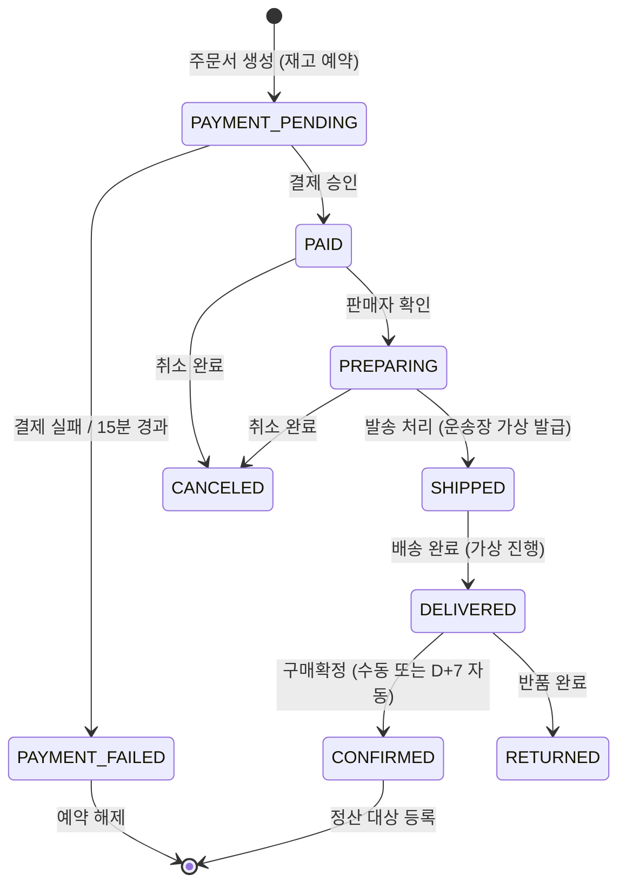
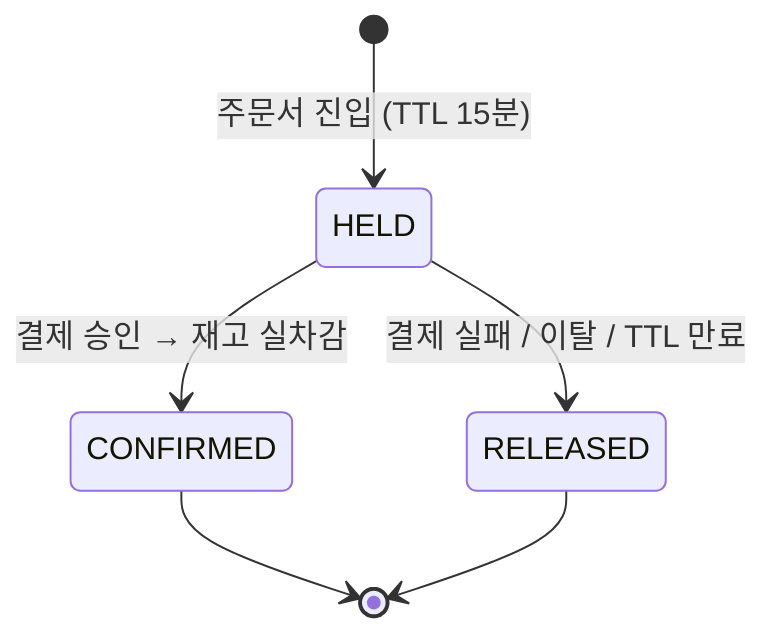
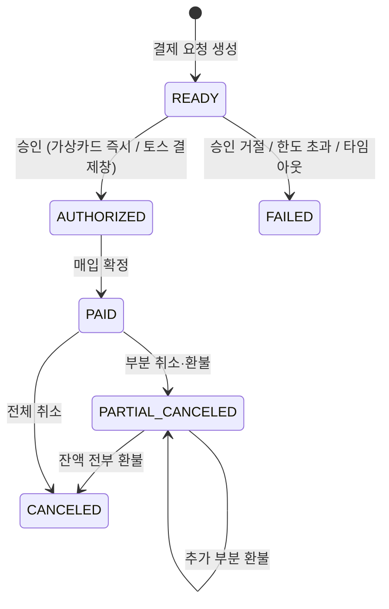
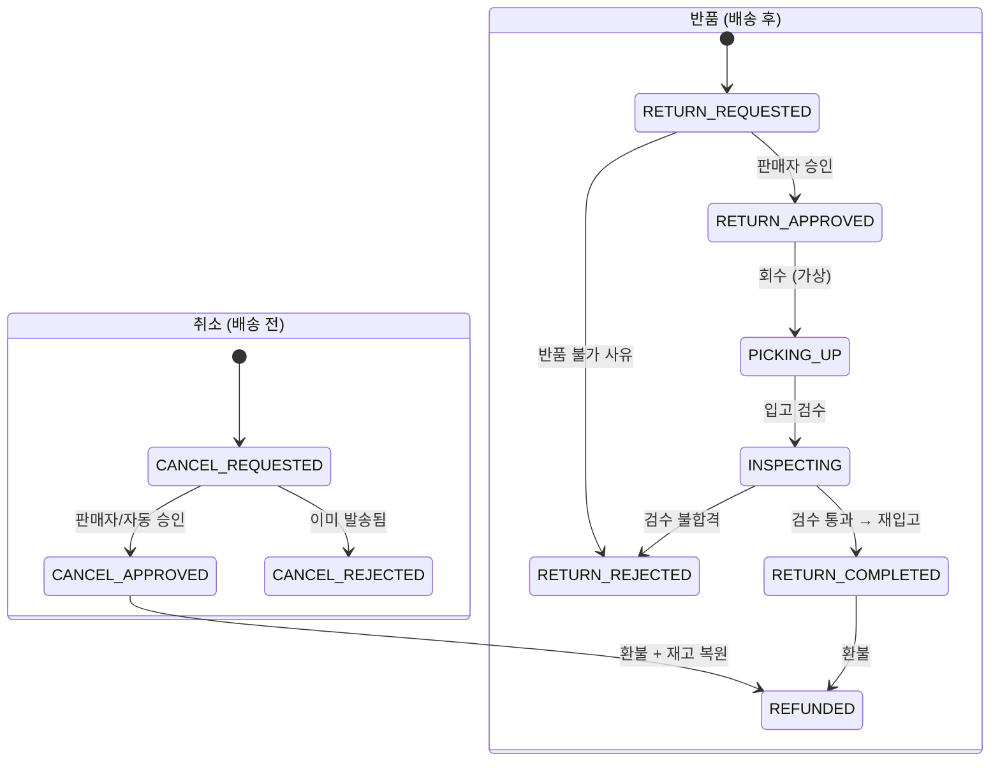
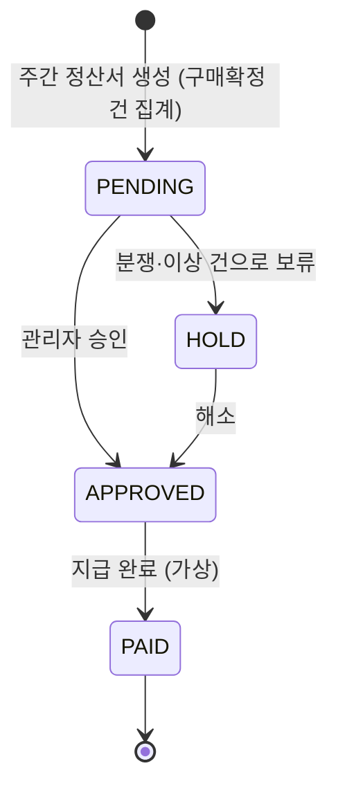
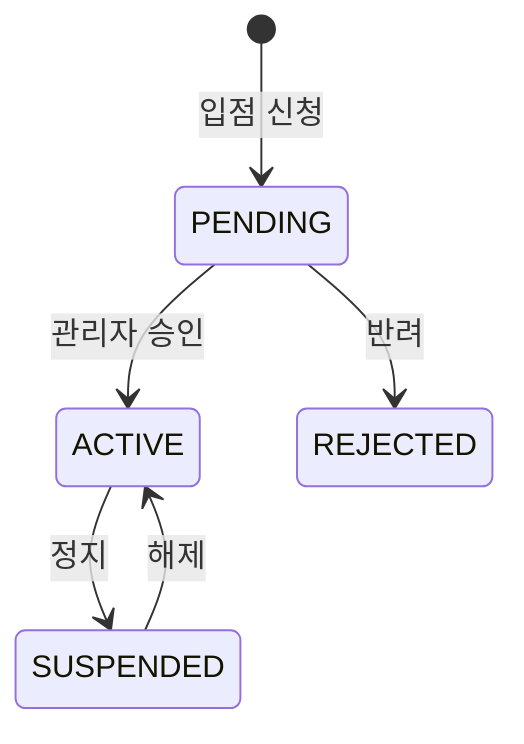
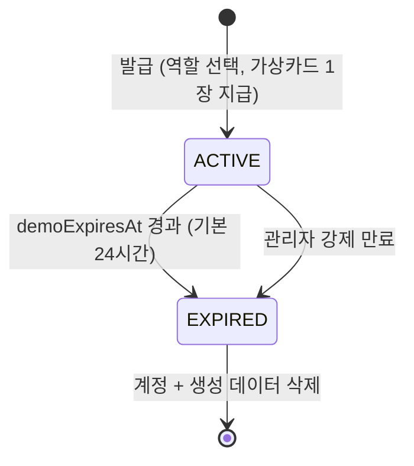

# 상태 머신

> 현재 유효한 상태 전이만 담는다. 최종 갱신: 2026-09-02

## 1. 주문 (SellerOrder)

상태는 `Order` 가 아니라 **`SellerOrder` 에 붙는다.** 판매자 A는 배송완료인데 B는 준비중일 수 있어야 하기 때문이다.



| 상태 | 의미 | 가능한 행동 |
| --- | --- | --- |
| `PAYMENT_PENDING` | 결제 대기 (재고 예약됨) | 결제, 이탈 |
| `PAID` | 결제 완료 | 판매자 확인, 구매자 취소 |
| `PREPARING` | 상품 준비중 | 발송, 취소 |
| `SHIPPED` | 배송중 | 배송완료 처리 |
| `DELIVERED` | 배송 완료 | 구매확정, 반품 신청 |
| `CONFIRMED` | 구매확정 | 리뷰 작성, **적립금 지급**, **정산 대상** |
| `CANCELED` / `RETURNED` | 취소 / 반품 완료 | 종료 |

**구매확정이 있는 이유**: 배송완료 직후 판매자에게 정산하면 반품 시 회수할 방법이 없다. 확정 시점이 정산과 적립금 지급의 트리거다. 미확정 건은 D+7에 자동 확정한다.

부분 취소·부분 반품 시 `SellerOrder` 상태는 남은 항목 기준으로 유지되고, 취소된 `OrderItem` 만 개별 상태를 갖는다.

---

## 2. 재고 예약 (StockReservation)



- 가용재고 = `stock` − 유효한 `HELD` 예약 합계
- 예약 생성은 `UPDATE ... WHERE stock - reserved >= qty` 조건부 갱신. 실패 시 즉시 품절 처리
- **만료 스케줄러가 멈추면 재고가 잠긴다.** 헬스체크에 포함시킨다

---

## 3. 결제 (Payment)



- 두 프로바이더(`VIRTUAL_CARD`, `TOSS`)는 `PaymentProvider { authorize, capture, cancel, refund }` 인터페이스 뒤에 둔다
- 모든 상태 변화와 웹훅 원문은 `PaymentEvent` 에 기록한다. **웹훅은 중복 도착을 전제로 멱등 처리**한다
- 가상 카드는 한도 초과·잔액 부족·승인 거절·승인 지연을 의도적으로 재현할 수 있어야 한다

---

## 4. 클레임 (취소 · 반품)



- `PAID` / `PREPARING` 이면 취소, `DELIVERED` 이면 반품 경로다
- **항목·수량 단위로 신청**한다. 주문 항목 3개 중 1개만 취소하는 것이 정상 흐름이다
- 교환은 구현하지 않는다. 반품 후 재구매로 안내한다
- 환불 금액 계산은 `pricing.md` 의 안분 규칙을 따른다

---

## 5. 정산 (Settlement)



```
지급액 = 판매액 − 플랫폼 수수료 − 판매자 부담 쿠폰 − 반품 차감
```

플랫폼 쿠폰과 적립금은 플랫폼 부담이므로 차감하지 않는다. 실제 이체는 없고 상태만 바뀐다.

---

## 6. 판매자 입점 (Seller)



`ACTIVE` 가 아니면 상품 등록과 판매가 불가능하다. 이미 판매된 주문의 처리는 `SUSPENDED` 에서도 가능해야 한다.

---

## 7. 데모 계정 수명



- 상품 카탈로그는 공용이고, 개인 데이터(장바구니·주문·리뷰·판매자 상품)만 삭제 대상이다
- 만료된 데모 계정이 등록한 상품은 삭제하되, **이미 주문에 포함된 상품은 스냅샷이 남아 주문 이력이 깨지지 않는다**
