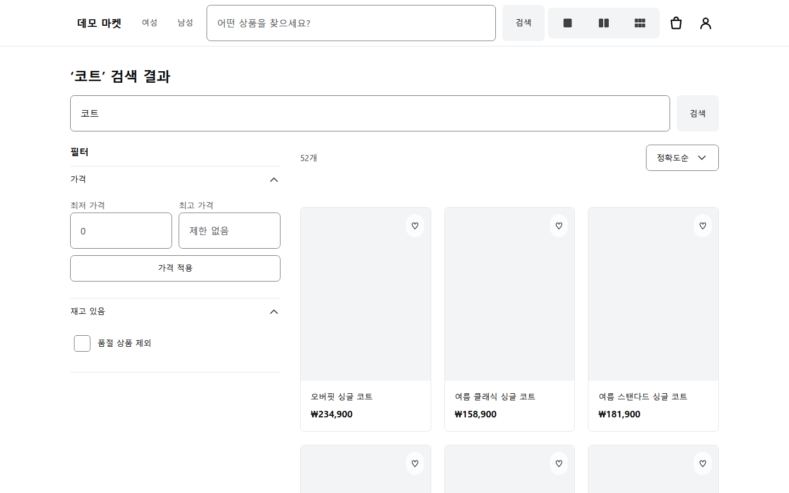
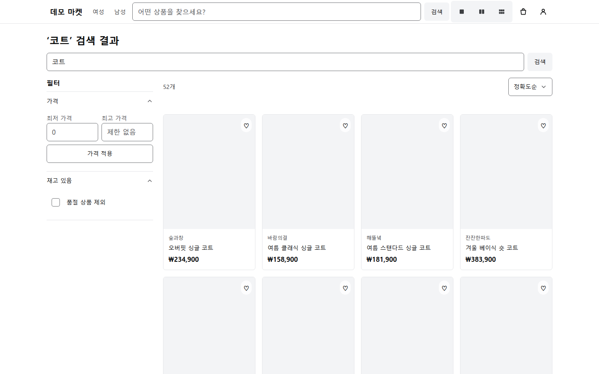
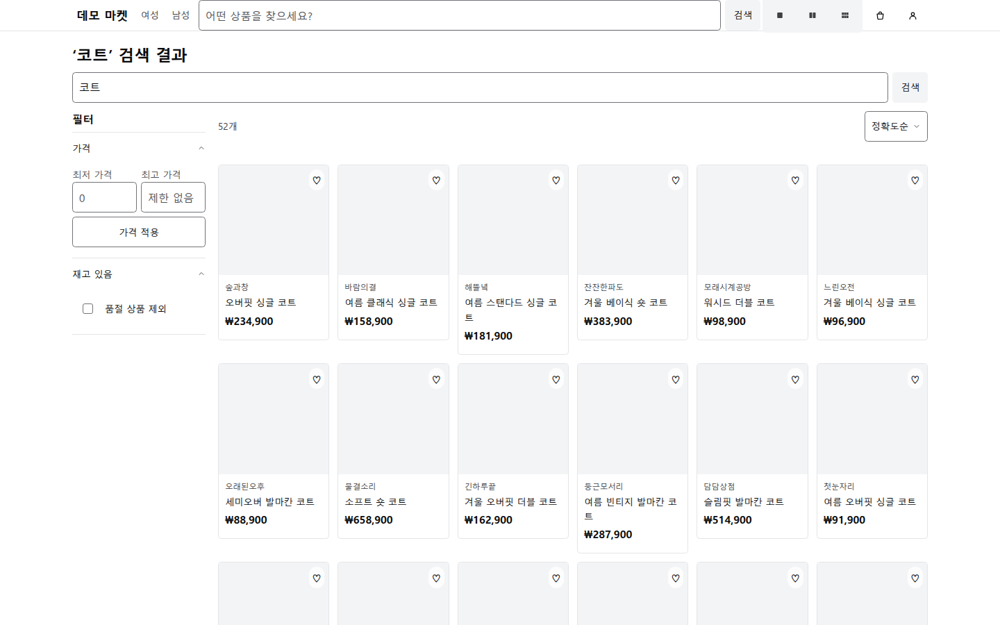

# 밀도 비교 캡처 후보

2026-09-08, `docs/portfolio` 작업 트리의 실제 로컬 운영 빌드에서 촬영했다.
상점과 API는 이 작업 트리에서 실행했고, 별도 PostgreSQL·Meilisearch에 full 시드를 넣었다.
R2를 설정하지 않아 상품 사진이 없다. 공개 README에는 이 후보를 삽입하지 않았다.

| 미니멀 · 3열 | 표준 · 4열 | 맥시멀 · 6열 |
| --- | --- | --- |
|  |  |  |

## 촬영 조건

- Chromium, viewport 1440×900, device scale factor 1, light theme, `ko-KR`.
- 로그인하지 않은 동일 브라우저 세션, 검색어 `코트`, 같은 상품 24개와 같은 정렬.
- 실제 밀도 라디오 버튼을 누르고 CSS의 열 수가 3·4·6인지 확인한 뒤 촬영.
- 첫 방문 밀도 안내는 화면의 닫기 버튼으로 닫음. DOM·상품·스타일을 대체하지 않음.
- API와 DB는 실제 실행. 네트워크 모킹과 이미지 합성 없음.
- [촬영 메타데이터](./capture.json)에 각 단계의 상품 링크와 열 수를 기록.

상품 사진을 준비한 환경에서 다시 촬영한 뒤 공개본에 넣을지 판단한다. 작은 썸네일로도
배치 차이는 보이지만 현재 후보는 사진 영역이 비어 있어 상품 표현의 차이를 충분히 전달하지 못한다.

촬영 중 카테고리 없는 `GET /api/v1/search/filters`의 400 응답을 관측했다.
검색 결과 자체는 200이며 위 24개 상품 비교는 성공했다. 필터 요청의 기대 동작은 별도 확인이 필요하다.
