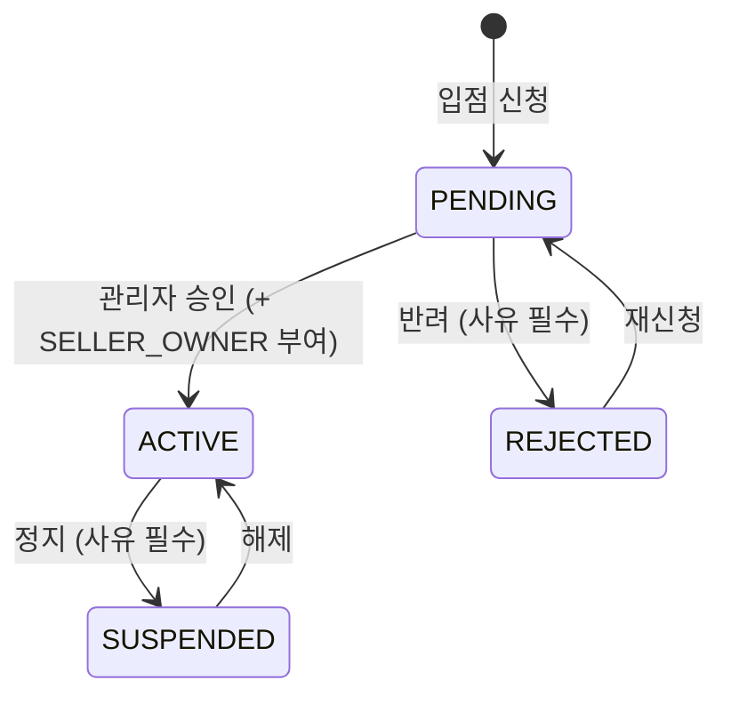

# TASK-0108: 판매자 입점 상태 머신 · API

| 항목 | 내용 |
| --- | --- |
| 마일스톤 | M04 인증·계정 |
| 상태 | 승인됨 |
| 작성일 | 2026-09-03 |
| 브랜치 | `feature/seller-onboarding-api` |
| 선행 작업 | TASK-0022, TASK-0105, TASK-0106 |

> **분할 유래** — TASK-0026(판매자 입점 신청 · 승인)의 백엔드 절반이다. D-208 에 따라 화면과 API 를
> 나눴고, 화면은 TASK-0109(판매자) · TASK-0110(관리자)이 맡는다. TASK-0027 에 있던
> **판매자 스토어 설정(브랜드명·소개·로고 수정)** 도 여기로 옮겼다 — 입점 신청과 스토어 설정은 같은
> 필드를 쓰므로 같은 엔드포인트·같은 스키마가 다뤄야 한다.

## 1. 목적

판매자 입점의 **상태 머신과 API** 를 만든다. `SELLER_OWNER` 역할이 부여되는 유일한 경로이며, 스토어
정보(브랜드명·소개·로고)를 쓰는 유일한 경로다.

이 작업이 끝나면 화면 없이도 다음이 성립한다 — 신청하면 `PENDING` 이 생기고, 승인하면 `ACTIVE` 가
되면서 역할이 붙고, `ACTIVE` 가 아닌 스토어의 상품 등록은 403 으로 막힌다.

**선행이 TASK-0023 이 아닌 이유**: 원본 TASK-0026 의 선행은 TASK-0023(인증 UI · 권한 가드)이었지만,
API 에 필요한 것은 화면이 아니라 **요청 주체를 채우는 JWT**(TASK-0022)와 **퍼미션 가드**(TASK-0105)다
(D-204 — 선행은 마일스톤이 아니라 실제 의존이다). 화면 쪽 의존은 TASK-0109·0110 이 가진다.

## 2. 범위

### 포함
- **입점 신청 API** — 브랜드명 · 스토어 slug · 소개 · 로고 URL. `Seller` 행을 `PENDING` 으로 생성
- **스토어 설정 API** — 브랜드명 · 소개 · 로고 수정 (TASK-0027 에서 이관). 낙관적 잠금(`Seller.version`)
- **상태 머신** — `PENDING → ACTIVE / REJECTED`, `ACTIVE → SUSPENDED`, `SUSPENDED → ACTIVE`,
  `REJECTED → PENDING`(재신청). 정의되지 않은 전이는 400
- **관리자 심사 API** — 승인 · 반려 · 정지 · 해제 (사유 포함), 심사 목록 조회(상태 필터 · 커서)
- **승인 시 `SELLER_OWNER` 역할 자동 부여** — 상태 전이와 같은 트랜잭션
- **상태별 접근 제어** — `assertSellerActive` 가드. 다른 TASK 의 판매자 엔드포인트가 이것을 붙인다
- **브랜드명 · slug 중복 검사** — DB 유니크 제약 + 사전 확인 엔드포인트
- **상태 변경 기록** — `statusChangedAt` · `statusReason`. 알림 발송은 M13(TASK-0090)
- **데모 판매자는 즉시 `ACTIVE`** — TASK-0024 의 발급 경로가 이 서비스를 호출한다
- **퍼미션 `seller.write` 추가** + 권한 매트릭스 재생성 (TASK-0105 R4)
- 절단면이 되는 zod 스키마를 `packages/shared` 에 정의

### 제외 (이번에 하지 않는 것)
- **판매자 입점 신청 · 스토어 설정 화면** → TASK-0109
- **관리자 입점 심사 화면** → TASK-0110
- 사업자 정보 검증 (원본 TASK-0026 의 제외 항목을 그대로 유지)
- 배송 정책 · 개별 수수료율 등 나머지 스토어 설정 → 수수료율은 M12, 배송 정책은 M09
- 상태 변경 **알림 발송** → M13. 이 TASK 는 사유와 시각을 남기기만 한다
- 로고 이미지 **업로드** → 이 API 는 `logoUrl` 문자열만 받는다. 업로드 위젯은 TASK-0033
- `schema.prisma` 변경 — `Seller` 는 TASK-0020 이 이미 만들었다 (4장 참조)

## 3. 요구사항

### 기능 요구사항
- [ ] 로그인한 사용자가 입점을 신청하면 `PENDING` 상태의 `Seller` 가 생성된다
- [ ] 관리자가 승인하면 `ACTIVE` 로 바뀌고 같은 트랜잭션에서 `SELLER_OWNER` 역할이 부여된다
- [ ] `ACTIVE` 가 아닌 판매자의 상품 등록 요청은 403 이다
- [ ] 반려된 판매자가 사유를 응답으로 받고 재신청할 수 있다
- [ ] `SUSPENDED` 에서도 주문 처리 엔드포인트는 열려 있다
- [ ] 브랜드명과 slug 는 중복될 수 없고, 중복 신청은 409 다
- [ ] 판매자가 자기 스토어의 브랜드명·소개·로고를 수정할 수 있다
- [ ] 데모 판매자는 승인 절차 없이 `ACTIVE` 로 생성된다

### 비기능 요구사항
- 상태 전이 판정은 **부수효과 없는 순수 함수**로 분리한다 (Q5 강화 대상)
- 동시 승인 요청이 들어와도 역할이 두 번 부여되지 않는다 (`UserRole` 의 `@@unique([userId, role])`)

## 4. 설계

### 상태 머신

`docs/design/state-machines.md` 6장과 같은 그림이며, **재신청 전이(`REJECTED → PENDING`)만 그곳에
없다.** 원본 TASK-0026 의 F4 가 재신청을 요구하므로 이 TASK 가 설계 문서에 그 화살표를 추가한다(6.3 D2).

| 상태 | 판매자 앱 | 상품 등록 | 주문 처리 |
| --- | --- | --- | --- |
| PENDING | 안내 화면만 | ✗ | – |
| ACTIVE | 전체 | ✓ | ✓ |
| REJECTED | 사유 표시 + 재신청 | ✗ | – |
| SUSPENDED | 제한 | ✗ | **✓** |

**SUSPENDED 에서 주문 처리를 허용하는 이유**: 이미 결제한 구매자가 있다. 판매자를 정지시켰다고 배송이
멈추면 피해는 구매자가 본다.

이 표를 코드로 옮긴 것이 `assertSellerActive(status, capability)` 다. 각 판매자 엔드포인트가 필요한
capability(`product.write` · `order.write`)를 넘기고, 표에 없는 조합이면 403 을 던진다. 상태 분기가
서비스마다 흩어지지 않게 하는 것이 목적이며, TASK-0105 의 `assertResourceAccess` 와 같은 형태다.

### API / 라우트

| 메서드 · 경로 | 용도 | 퍼미션 |
| --- | --- | --- |
| `POST /api/v1/sellers/applications` | 입점 신청 · 재신청 | `seller.write:own` |
| `GET /api/v1/sellers/me` | 내 스토어 상태 · 사유 조회 | `seller.read:own` |
| `PATCH /api/v1/sellers/me` | 스토어 설정 수정 (브랜드명·소개·로고) | `seller.write:own` |
| `GET /api/v1/sellers/brand-name-availability?value=` | 브랜드명 사전 확인 | `seller.write:own` |
| `GET /api/v1/admin/sellers?status=&cursor=` | 심사 목록 (커서) | `seller.read:any` |
| `GET /api/v1/admin/sellers/:id` | 심사 상세 | `seller.read:any` |
| `POST /api/v1/admin/sellers/:id/approve` | 승인 | `seller.approve` |
| `POST /api/v1/admin/sellers/:id/reject` | 반려 (사유 필수) | `seller.approve` |
| `POST /api/v1/admin/sellers/:id/suspend` | 정지 (사유 필수) | `seller.suspend` |
| `POST /api/v1/admin/sellers/:id/reinstate` | 정지 해제 | `seller.suspend` |

**정지·해제가 `seller.approve` 가 아닌 이유**: TASK-0105 가 `seller.suspend` 를 `ADMIN_SUPER` 에만
줬다. 정지는 판매자의 영업을 끊는 동작이라 일상 운영자와 분리한 결정이고, **해제도 같은 퍼미션으로
둔다** — 되돌리는 동작에 더 낮은 권한을 주면 정지를 우회할 수 있다.

### 퍼미션 추가 — `seller.write`

`packages/shared/src/auth/permissions.ts` 의 목록에 **`seller.write` 하나를 추가**한다. TASK-0105 R4 가
"만드는 TASK 가 추가한다"고 예고한 그 퍼미션이다.

| 역할 | 그랜트 | 이유 |
| --- | --- | --- |
| `BUYER` | `seller.write:own` | **입점 신청은 아직 판매자가 아닌 사람이 한다.** 스코프가 `own` 이므로 자기 스토어 행 외에는 닿지 않는다 |
| `SELLER_OWNER` | `seller.write:own` | 스토어 설정 수정 |
| `ADMIN_SUPER` | `seller.write:any` | 목록 전체를 가지므로 자동 |
| `ADMIN_OPERATOR` | **없음** | 운영자가 남의 브랜드 문구를 고칠 이유가 없다. 상태 변경은 `seller.approve`·`seller.suspend` 로 충분하다 |

`DEMO_ADMIN` 은 `ADMIN_OPERATOR` 에서 파생되므로 자동으로 `seller.write` 를 갖지 않는다.

퍼미션을 늘렸으므로 `docs/design/permission-matrix.md` 를 다시 생성한다. 생성물을 커밋하지 않으면
`permission-matrix.spec.ts` 의 바이트 비교가 CI 에서 실패한다.

### 데이터 모델 변경

**없다.** `Seller` 는 TASK-0020 이 이미 만들었고 이 TASK 가 쓰는 컬럼이 전부 있다 —
`brandName`(unique) · `slug`(unique) · `introduction` · `logoUrl` · `status` · `statusReason` ·
`statusChangedAt` · `version`.

그래서 **4장 데이터 게이트는 해당 없음**이다. 다만 **S5(제약이 실제로 강제되는가)는 자발적으로
적용**한다 — `Seller.brandName` · `Seller.slug` 의 유니크 제약을 실제로 쓰는 첫 TASK 이고, D-207 이
지적한 "마이그레이션 파일에 SQL 문자열이 있는지만 검사했다"는 상태를 여기서 끝낸다.

### 절단면 — `packages/shared` 의 zod 스키마

이 TASK 가 **정의**하고 그대로 응답한다. TASK-0109·0110 이 **같은 스키마로 모킹 데이터를 만든다.**

| 스키마 | 내용 | 쓰는 곳 |
| --- | --- | --- |
| `sellerStatusSchema` | `PENDING` / `ACTIVE` / `REJECTED` / `SUSPENDED` | 0108 · 0109 · 0110 |
| `sellerApplicationRequestSchema` | 신청·재신청 본문 (brandName, slug, introduction, logoUrl) | 0108 · 0109 |
| `sellerStoreUpdateRequestSchema` | 스토어 설정 수정 본문 + `version` | 0108 · 0109 |
| `sellerResponseSchema` | 스토어 1건 (id, brandName, slug, introduction, logoUrl, status, statusReason, statusChangedAt, version) | 0108 · 0109 · 0110 |
| `brandNameAvailabilityResponseSchema` | `{ value, available }` | 0108 · 0109 |
| `sellerReviewListQuerySchema` | 심사 목록 질의 (status, cursor, limit) | 0108 · 0110 |
| `sellerReviewListResponseSchema` | 심사 목록 응답 (items, nextCursor) | 0108 · 0110 |
| `sellerDecisionRequestSchema` | 승인·반려·정지·해제 본문 (reason, version) | 0108 · 0110 |

**브랜드명 제약은 스키마에 적는다** (길이 2~40, 앞뒤 공백 금지, 중복은 서버 판정). 화면이 같은 규칙으로
먼저 걸러야 하는데, 규칙을 두 곳에 적으면 반드시 어긋난다.

### 역할별 권한

| 역할 | 할 수 있는 것 |
| --- | --- |
| 구매자(BUYER) | 입점 신청 · 재신청, 자기 스토어 상태 조회 |
| 판매자(SELLER_OWNER) | 위 + 스토어 설정 수정 |
| 관리자(ADMIN_OPERATOR) | 심사 목록·상세 조회, 승인·반려 |
| 관리자(ADMIN_SUPER) | 위 + 정지·해제 |
| 데모 관리자(DEMO_ADMIN) | 승인·반려를 **데모 계정이 만든 신청에만** (`seller.approve:demo`) |

## 5. 구현 계획

1. `packages/shared` 에 절단면 스키마 8종 정의 + `index.ts` export
2. `seller.write` 퍼미션 추가, 그랜트 반영, `pnpm --filter @shopping/api docs:matrix` 재생성
3. 상태 전이 판정 순수 함수(`nextSellerStatus`) + 접근 제어 표(`assertSellerActive`)
4. 입점 신청 · 재신청 API (브랜드명·slug 중복 처리)
5. 스토어 설정 API (낙관적 잠금 · 409 충돌 응답)
6. 관리자 심사 API 4종 + 목록 조회(커서)
7. 승인 트랜잭션 — 상태 전이 + `UserRole` 부여를 한 트랜잭션으로
8. 데모 판매자 즉시 `ACTIVE` 경로 (TASK-0024 가 호출할 서비스 진입점)
9. 실제 PostgreSQL 통합 테스트 — 상태 전이 · 권한 · 동시성 · 유니크 제약

## 6. 완료 기준 (Definition of Done)

### 6.1 기능

| # | 기준 | 측정 방법 | 목표 | 충족 |
| --- | --- | --- | --- | --- |
| F1 | 신청 | `POST /sellers/applications` 호출 | 201, `status=PENDING` 인 `Seller` 1행 | [ ] |
| F2 | 승인 + 역할 부여 | 승인 API 호출 후 `UserRole` 조회 | `status=ACTIVE` **그리고** `SELLER_OWNER` 1행 (한 트랜잭션) | [ ] |
| F3 | PENDING 제한 | `PENDING` 판매자로 `assertSellerActive('product.write')` 경유 엔드포인트 호출 | 403 + `FORBIDDEN` 공통 포맷 | [ ] |
| F4 | 반려 · 재신청 | 반려 후 `GET /sellers/me` → 재신청 | 응답에 `statusReason` 포함, 재신청 시 `PENDING` 복귀 | [ ] |
| F5 | 정지 | `ACTIVE → SUSPENDED` 후 두 엔드포인트 호출 | 상품 등록 403, 주문 처리 200 | [ ] |
| F6 | 브랜드명 중복 | 이미 있는 브랜드명으로 신청 | 409 + 필드 지정 에러. **DB 유니크 제약이 거부**(S5) | [ ] |
| F7 | 데모 판매자 | 데모 발급 경로로 스토어 생성 | 즉시 `ACTIVE`, 승인 API 호출 0회 | [ ] |
| F8 | 스토어 설정 수정 | `PATCH /sellers/me` 로 브랜드명 변경 | 200, `version` 1 증가, 재조회 시 반영 | [ ] |
| F9 | 낙관적 잠금 | 같은 `version` 으로 두 번 `PATCH` | 두 번째 409, 첫 변경이 덮이지 않음 | [ ] |
| F10 | 잘못된 전이 | `REJECTED` 를 `SUSPENDED` 로 전이 시도 | 400 + 허용 전이 목록 안내 | [ ] |
| F11 | 정지 권한 분리 | `ADMIN_OPERATOR` 토큰으로 정지 호출 | 403 (`seller.suspend` 없음) | [ ] |
| F12 | 데모 관리자 스코프 | `DEMO_ADMIN` 이 실계정 신청을 승인 시도 | 403. 데모 계정 신청은 200 | [ ] |
| F13 | 동시 승인 | 같은 신청에 승인 2건 동시 호출 | `SELLER_OWNER` 행 1개, 상태 1회만 전이 | [ ] |
| F14 | 매트릭스 재생성 | `pnpm --filter @shopping/api docs:matrix` 후 `git diff` | `docs/design/permission-matrix.md` 에 `seller.write` 반영, `permission-matrix.spec.ts` 통과 | [ ] |

### 6.2 품질 게이트

[공통 품질 게이트](../QUALITY-GATES.md) 적용. 이 TASK 는 **엔드포인트를 추가하는 백엔드 TASK** 이므로
1장 · 3장 · 5장(C1·C3) · 7장을 받는다.

| 장 | 적용 | 비고 |
| --- | --- | --- |
| 1장 코드 게이트 | Q1~Q4 · Q6 · Q7 전부 | |
| Q5 테스트 충실도 | **커버리지 수치는 면제**(M05 부터). **상태 전이 판정은 분기 커버리지 100%**(Q5 강화) | 대역: **실제 PostgreSQL**. 외부 시스템 없음 |
| **2장 화면 게이트** | **해당 없음** | 사용자 대상 화면이 없다. 화면은 TASK-0109·0110 |
| 3장 API 게이트 | A1~A7 전부 | A7 = F13 동시 승인 |
| 4장 데이터 게이트 | **해당 없음** (`schema.prisma` 무변경). 단 **S5 적용** | `Seller.brandName`·`slug` 유니크가 실제로 거부하는지 확인(F6) |
| 5장 계약 게이트 | **C1 · C3** | C2 는 프론트 모킹 데이터 검증이라 TASK-0109·0110 이 받는다 |
| 7장 문서 게이트 | D1~D5 | |

| # | 기준 | 측정 방법 | 목표 | 충족 |
| --- | --- | --- | --- | --- |
| A1 | 응답 시간 | 심사 목록 100건 p95 | 300ms 이하 | [ ] |
| A2 | 입력 검증 | 브랜드명 1자 · 알 수 없는 상태값 | 400 + 통일된 에러 포맷 | [ ] |
| A3 | 권한 | `BUYER` 토큰으로 승인 API 호출 | 403 | [ ] |
| A4 | 인증 | 토큰 없이 호출 | 401 | [ ] |
| A5 | N+1 | 심사 목록 조회 쿼리 로그 | 신청 건수와 무관하게 쿼리 수 일정 | [ ] |
| A6 | 실 DB | 서비스·API 테스트 실행 대상 | Prisma 모킹 0건, 실제 PostgreSQL | [ ] |
| A7 | 동시 요청 | F13 | 중복 처리 0건 | [ ] |
| S5 | 제약 강제 | 유니크를 위반하는 INSERT 를 psql 로 직접 시도 | **DB 가** 거부 | [ ] |
| C1 | 스키마 단일 출처 | 응답 DTO 출처 확인 | 전부 `packages/shared` 의 zod 스키마 | [ ] |
| C3 | 실제 응답 검증 | 통합 테스트에서 실제 응답을 `sellerResponseSchema` 등으로 `parse` | 전부 통과 | [ ] |

### 6.3 문서

| # | 기준 | 충족 |
| --- | --- | --- |
| D1 | 상태를 `완료` 로 변경 + `docs/tasks/README.md` · `M04-auth/README.md` 인덱스 갱신 | [ ] |
| D2 | `docs/design/state-machines.md` 6장에 상태별 권한표와 **재신청 전이**를 반영 | [ ] |
| D3 | 결정 변경 없음 확인 (`DECISIONS.md` 2장과 대조) | [ ] |
| D4 | 새 환경변수 없음 확인 | [ ] |
| D5 | 새 라이브러리 없음 확인 (8장) | [ ] |

## 7. 리스크 / 열린 질문

| # | 내용 | 대응 |
| --- | --- | --- |
| R1 | 승인 대기가 데모 체험을 막는다 | 데모 판매자는 승인 절차를 건너뛰고 즉시 `ACTIVE` (F7) |
| R2 | **신청 폼의 "연락처"를 저장할 컬럼이 없다.** 원본 TASK-0026 은 연락처를 받는다고 했지만 `Seller` 에 전화번호 컬럼이 없다 | 이 TASK 는 **스키마를 바꾸지 않는다.** 승인 시 둘 중 하나를 정한다 — ① 연락처는 계정의 배송지에서 가져오고 스토어에는 두지 않는다(권장), ② `Seller.phone` 을 추가한다. ②를 택하면 `schema.prisma` 를 건드리는 **별도 TASK 로 분리**한다(병행 규칙 1 — 스키마 TASK 는 동시에 하나) |
| R3 | 상태 변경 이력이 최신 1건(`statusReason`·`statusChangedAt`)만 남는다 | 원본이 요구한 "기록만"의 최소 형태다. 전체 이력이 필요해지면 M13 알림 또는 M14 판매자 관리에서 이력 테이블을 추가한다 |
| R4 | 브랜드명 변경이 기존 링크를 깬다 | `slug` 가 URL 을 담당하고 `brandName` 과 분리되어 있다(`schema.prisma`). 스토어 설정에서 `slug` 변경은 이번 범위에 넣지 않는다 |
| R5 | 승인 트랜잭션 안에서 역할 부여가 실패하면 상태만 바뀐다 | 같은 트랜잭션으로 묶고 F2 가 그것을 검증한다 |

## 8. 확정된 버전

새 의존성 없음.

## 9. 변경 이력

| 날짜 | 내용 |
| --- | --- |
| 2026-09-03 | 최초 작성. D-208 에 따라 TASK-0026 에서 분할, TASK-0027 의 스토어 설정을 이관 |
