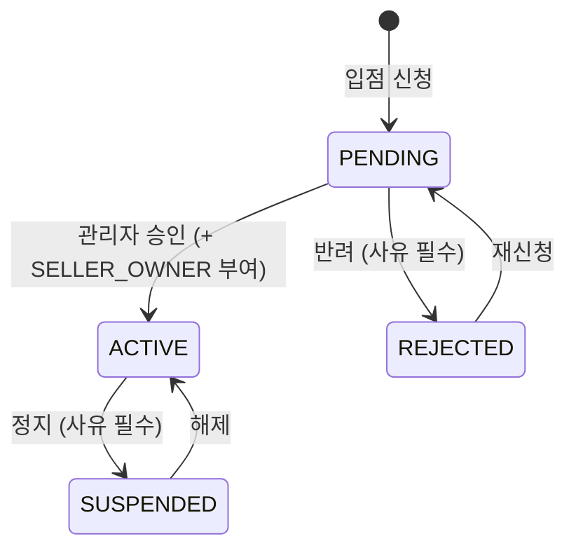

# TASK-0108: 판매자 입점 상태 머신 · API

| 항목 | 내용 |
| --- | --- |
| 마일스톤 | M04 인증·계정 |
| 상태 | 완료 |
| 작성일 | 2026-09-03 |
| 브랜치 | `feature/seller-onboarding-api` |
| 선행 작업 | TASK-0022, TASK-0105, TASK-0106 |

> **분할 유래** — TASK-0026(판매자 입점 신청 · 승인)의 백엔드 절반이다. D-208 에 따라 화면과 API 를
> 나눴고, 화면은 TASK-0109(판매자) · TASK-0110(관리자)이 맡는다. TASK-0027 에 있던
> **판매자 스토어 설정(브랜드명·소개·로고 수정)** 도 여기로 옮겼다 — 입점 신청과 스토어 설정은 같은
> 필드를 쓰므로 같은 엔드포인트·같은 스키마가 다뤄야 한다.

## 1. 목적

판매자 입점의 **상태 머신과 API** 를 만든다. `SELLER_OWNER` 역할이 부여되는 유일한 경로이며, 스토어
정보(브랜드명·소개·로고)를 쓰는 유일한 경로다.

이 작업이 끝나면 화면 없이도 다음이 성립한다 — 신청하면 `PENDING` 이 생기고, 승인하면 `ACTIVE` 가
되면서 역할이 붙고, `ACTIVE` 가 아닌 스토어의 상품 등록은 403 으로 막힌다.

**선행이 TASK-0023 이 아닌 이유**: 원본 TASK-0026 의 선행은 TASK-0023(인증 UI · 권한 가드)이었지만,
API 에 필요한 것은 화면이 아니라 **요청 주체를 채우는 JWT**(TASK-0022)와 **퍼미션 가드**(TASK-0105)다
(D-204 — 선행은 마일스톤이 아니라 실제 의존이다). 화면 쪽 의존은 TASK-0109·0110 이 가진다.

## 2. 범위

### 포함
- **입점 신청 API** — 브랜드명 · 스토어 slug · 소개 · 로고 URL. `Seller` 행을 `PENDING` 으로 생성
- **스토어 설정 API** — 브랜드명 · 소개 · 로고 수정 (TASK-0027 에서 이관). 낙관적 잠금(`Seller.version`)
- **상태 머신** — `PENDING → ACTIVE / REJECTED`, `ACTIVE → SUSPENDED`, `SUSPENDED → ACTIVE`,
  `REJECTED → PENDING`(재신청). 정의되지 않은 전이는 400
- **관리자 심사 API** — 승인 · 반려 · 정지 · 해제 (사유 포함), 심사 목록 조회(상태 필터 · 커서)
- **승인 시 `SELLER_OWNER` 역할 자동 부여** — 상태 전이와 같은 트랜잭션
- **상태별 접근 제어** — `assertSellerActive` 가드. 다른 TASK 의 판매자 엔드포인트가 이것을 붙인다
- **브랜드명 · slug 중복 검사** — DB 유니크 제약 + 사전 확인 엔드포인트
- **상태 변경 기록** — `statusChangedAt` · `statusReason`. 알림 발송은 M13(TASK-0090)
- **데모 판매자는 즉시 `ACTIVE`** — TASK-0024 의 발급 경로가 이 서비스를 호출한다
- **퍼미션 `seller.write` 추가** + 권한 매트릭스 재생성 (TASK-0105 R4)
- 절단면이 되는 zod 스키마를 `packages/shared` 에 정의

### 제외 (이번에 하지 않는 것)
- **판매자 입점 신청 · 스토어 설정 화면** → TASK-0109
- **관리자 입점 심사 화면** → TASK-0110
- 사업자 정보 검증 (원본 TASK-0026 의 제외 항목을 그대로 유지)
- 배송 정책 · 개별 수수료율 등 나머지 스토어 설정 → 수수료율은 M12, 배송 정책은 M09
- 상태 변경 **알림 발송** → M13. 이 TASK 는 사유와 시각을 남기기만 한다
- 로고 이미지 **업로드** → 이 API 는 `logoUrl` 문자열만 받는다. 업로드 위젯은 TASK-0033
- `schema.prisma` 변경 — `Seller` 는 TASK-0020 이 이미 만들었다 (4장 참조)

## 3. 요구사항

### 기능 요구사항
- [ ] 로그인한 사용자가 입점을 신청하면 `PENDING` 상태의 `Seller` 가 생성된다
- [ ] 관리자가 승인하면 `ACTIVE` 로 바뀌고 같은 트랜잭션에서 `SELLER_OWNER` 역할이 부여된다
- [ ] `ACTIVE` 가 아닌 판매자의 상품 등록 요청은 403 이다
- [ ] 반려된 판매자가 사유를 응답으로 받고 재신청할 수 있다
- [ ] `SUSPENDED` 에서도 주문 처리 엔드포인트는 열려 있다
- [ ] 브랜드명과 slug 는 중복될 수 없고, 중복 신청은 409 다
- [ ] 판매자가 자기 스토어의 브랜드명·소개·로고를 수정할 수 있다
- [ ] 데모 판매자는 승인 절차 없이 `ACTIVE` 로 생성된다

### 비기능 요구사항
- 상태 전이 판정은 **부수효과 없는 순수 함수**로 분리한다 (Q5 강화 대상)
- 동시 승인 요청이 들어와도 역할이 두 번 부여되지 않는다 (`UserRole` 의 `@@unique([userId, role])`)

## 4. 설계

### 상태 머신

`docs/design/state-machines.md` 6장과 같은 그림이며, **재신청 전이(`REJECTED → PENDING`)만 그곳에
없다.** 원본 TASK-0026 의 F4 가 재신청을 요구하므로 이 TASK 가 설계 문서에 그 화살표를 추가한다(6.3 D2).

| 상태 | 판매자 앱 | 상품 등록 | 주문 처리 |
| --- | --- | --- | --- |
| PENDING | 안내 화면만 | ✗ | ✗ |
| ACTIVE | 전체 | ✓ | ✓ |
| REJECTED | 사유 표시 + 재신청 | ✗ | ✗ |
| SUSPENDED | 제한 | ✗ | **✓** |

**SUSPENDED 에서 주문 처리를 허용하는 이유**: 이미 결제한 구매자가 있다. 판매자를 정지시켰다고 배송이
멈추면 피해는 구매자가 본다.

**PENDING·REJECTED 의 주문 처리는 원래 "–" 였고 "✗" 로 확정했다.** 처리할 주문이 아직 없다는 뜻이지만,
표를 코드로 옮기면 그 칸도 값을 가져야 한다. "해당 없음" 을 세 번째 값으로 두면 호출하는 쪽마다 그것을
어떻게 다룰지 정하게 되고, "처리할 주문이 없다" 의 안전한 해석은 거절뿐이다 (9장, 2026-09-04).

이 표를 코드로 옮긴 것이 `assertSellerActive(status, capability)` 다. 각 판매자 엔드포인트가 필요한
capability(`product.write` · `order.write`)를 넘기고, 표에 없는 조합이면 403 을 던진다. 상태 분기가
서비스마다 흩어지지 않게 하는 것이 목적이며, TASK-0105 의 `assertResourceAccess` 와 같은 형태다.

### API / 라우트

| 메서드 · 경로 | 용도 | 퍼미션 |
| --- | --- | --- |
| `POST /api/v1/sellers/applications` | 입점 신청 · 재신청 | `seller.write:own` |
| `GET /api/v1/sellers/me` | 내 스토어 상태 · 사유 조회 | `seller.read:own` |
| `PATCH /api/v1/sellers/me` | 스토어 설정 수정 (브랜드명·소개·로고) | `seller.write:own` |
| `GET /api/v1/sellers/brand-name-availability?value=` | 브랜드명 사전 확인 | `seller.write:own` |
| `GET /api/v1/admin/sellers?status=&cursor=` | 심사 목록 (커서) | `seller.approve` |
| `GET /api/v1/admin/sellers/:id` | 심사 상세 | `seller.approve` |
| `POST /api/v1/admin/sellers/:id/approve` | 승인 | `seller.approve` |
| `POST /api/v1/admin/sellers/:id/reject` | 반려 (사유 필수) | `seller.approve` |
| `POST /api/v1/admin/sellers/:id/suspend` | 정지 (사유 필수) | `seller.suspend` |
| `POST /api/v1/admin/sellers/:id/reinstate` | 정지 해제 | `seller.suspend` |

**심사 목록·상세가 `seller.read` 가 아닌 이유**: 이 표는 원래 `seller.read:any` 였는데, **그 그랜트는 모든
`BUYER` 가 가진다** (`role-permissions.ts`) — 스토어 조회는 공개이기 때문이다. 그대로 두면 로그인한 아무
구매자나 대기 중인 신청 전체를 신청자 계정 id 까지 붙여서 페이지네이션할 수 있다. 심사 큐는 심사자의
작업 목록이므로 승인하는 퍼미션이 정한다. 엔드포인트 하나에 퍼미션 하나라는 규칙(TASK-0105)은 그대로다
(9장, 2026-09-04).

`DEMO_ADMIN` 은 `seller.approve:demo` 를 가지므로 **큐 전체를 읽는다.** 조회는 좁히지 않는다는 결정
(`docs/design/erd.md` 1 — "시드·실계정 데이터는 조회만")을 따르고, 실제로 손을 대려 할 때 스코프 검사가
막는다 (F12).

**정지·해제가 `seller.approve` 가 아닌 이유**: TASK-0105 가 `seller.suspend` 를 `ADMIN_SUPER` 에만
줬다. 정지는 판매자의 영업을 끊는 동작이라 일상 운영자와 분리한 결정이고, **해제도 같은 퍼미션으로
둔다** — 되돌리는 동작에 더 낮은 권한을 주면 정지를 우회할 수 있다.

### 퍼미션 추가 — `seller.write`

> **이 절은 이미 충족됐다.** 웨이브가 TASK-0111 과 퍼미션 파일을 공유하므로, 오케스트레이터가
> 착수 전에 커밋 `89b1e50` 으로 `seller.write` 와 그랜트, 재생성된 매트릭스를 먼저 갈라 두었다.
> 이 TASK 는 그것을 쓰기만 한다 — 아래 표는 그때 반영된 내용의 기록이다.

`packages/shared/src/auth/permissions.ts` 의 목록에 **`seller.write` 하나를 추가**한다. TASK-0105 R4 가
"만드는 TASK 가 추가한다"고 예고한 그 퍼미션이다.

| 역할 | 그랜트 | 이유 |
| --- | --- | --- |
| `BUYER` | `seller.write:own` | **입점 신청은 아직 판매자가 아닌 사람이 한다.** 스코프가 `own` 이므로 자기 스토어 행 외에는 닿지 않는다 |
| `SELLER_OWNER` | `seller.write:own` | 스토어 설정 수정 |
| `ADMIN_SUPER` | `seller.write:any` | 목록 전체를 가지므로 자동 |
| `ADMIN_OPERATOR` | **없음** | 운영자가 남의 브랜드 문구를 고칠 이유가 없다. 상태 변경은 `seller.approve`·`seller.suspend` 로 충분하다 |

`DEMO_ADMIN` 은 `ADMIN_OPERATOR` 에서 파생되므로 자동으로 `seller.write` 를 갖지 않는다.

퍼미션을 늘렸으므로 `docs/design/permission-matrix.md` 를 다시 생성한다. 생성물을 커밋하지 않으면
`permission-matrix.spec.ts` 의 바이트 비교가 CI 에서 실패한다.

### 데이터 모델 변경

**없다.** `Seller` 는 TASK-0020 이 이미 만들었고 이 TASK 가 쓰는 컬럼이 전부 있다 —
`brandName`(unique) · `slug`(unique) · `introduction` · `logoUrl` · `status` · `statusReason` ·
`statusChangedAt` · `version`.

그래서 **4장 데이터 게이트는 해당 없음**이다. 다만 **S5(제약이 실제로 강제되는가)는 자발적으로
적용**한다 — `Seller.brandName` · `Seller.slug` 의 유니크 제약을 실제로 쓰는 첫 TASK 이고, D-207 이
지적한 "마이그레이션 파일에 SQL 문자열이 있는지만 검사했다"는 상태를 여기서 끝낸다.

### 절단면 — `packages/shared` 의 zod 스키마

이 TASK 가 **정의**하고 그대로 응답한다. TASK-0109·0110 이 **같은 스키마로 모킹 데이터를 만든다.**

| 스키마 | 내용 | 쓰는 곳 |
| --- | --- | --- |
| `sellerStatusSchema` | `PENDING` / `ACTIVE` / `REJECTED` / `SUSPENDED` | 0108 · 0109 · 0110 |
| `sellerApplicationRequestSchema` | 신청·재신청 본문 (brandName, slug, introduction, logoUrl) | 0108 · 0109 |
| `sellerStoreUpdateRequestSchema` | 스토어 설정 수정 본문 + `version` | 0108 · 0109 |
| `sellerSchema` / `sellerResponseSchema` | 스토어 1건 (id, **userId**, brandName, slug, introduction, logoUrl, status, statusReason, statusChangedAt, version, **createdAt**) 과 그것을 담는 `{ seller }` 봉투 | 0108 · 0109 · 0110 |
| `brandNameAvailabilityResponseSchema` | `{ value, available }` | 0108 · 0109 |
| `sellerReviewListQuerySchema` | 심사 목록 질의 (status, cursor, limit) | 0108 · 0110 |
| `sellerReviewListResponseSchema` | 심사 목록 응답 (items, nextCursor) | 0108 · 0110 |
| `sellerDecisionRequestSchema` | 승인·해제 본문 (reason 선택, version) | 0108 · 0110 |
| `sellerReasonedDecisionRequestSchema` | 반려·정지 본문 — 같은 모양에 **reason 필수** | 0108 · 0110 |

**브랜드명 제약은 스키마에 적는다** (길이 2~40, 앞뒤 공백 금지, 중복은 서버 판정). 화면이 같은 규칙으로
먼저 걸러야 하는데, 규칙을 두 곳에 적으면 반드시 어긋난다.

**세 가지가 표에서 달라졌다** (9장, 2026-09-04).

- `sellerResponseSchema` 는 `{ seller }` **봉투**이고 필드를 담는 것은 `sellerSchema` 다.
  `productResponseSchema` 와 같은 모양이며, 벌거벗은 엔티티를 돌려주면 형제 필드를 나중에 붙일 자리가
  없다.
- 스토어 1건에 **`userId` 와 `createdAt`** 을 더했다. 누가 언제 신청했는지 말하지 못하는 심사 목록은
  아무도 처리할 수 없고, 없으면 TASK-0110 이 화면 한 장에 행마다 계정 조회를 붙이게 된다 (A5 가 재는
  바로 그 회귀다).
- 사유 필수를 **스키마로 갈랐다.** 반려·정지는 판매자가 보고 행동해야 하는 결정이라 사유가 필수이고,
  서비스 안의 검사로 두는 것보다 스키마로 두는 편이 낫다 — 거절이 폼이 이미 그릴 줄 아는
  `details[].field = 'reason'` 400 이 되고, 콘솔이 같은 객체로 필수 여부까지 읽는다.

**도메인 오류 코드는 늘리지 않았다.** `details[].code` 는 `INVALID` 이고 상태 코드가 종류를 말한다.
`domainErrorCodes` 에 하나를 더하면 `apps/seller`·`apps/admin` 의 메시지 카탈로그가
`Record<UserFacingErrorCode, string>` 이라 두 앱을 함께 고쳐야 하는데, 둘 다 이번 웨이브의 다른 TASK
소유다. TASK-0032 가 같은 이유로 같은 선택을 했다 (`product.service.ts`). 코드는 화면 TASK 가 들어올 때
함께 붙인다.

### 역할별 권한

| 역할 | 할 수 있는 것 |
| --- | --- |
| 구매자(BUYER) | 입점 신청 · 재신청, 자기 스토어 상태 조회 |
| 판매자(SELLER_OWNER) | 위 + 스토어 설정 수정 |
| 관리자(ADMIN_OPERATOR) | 심사 목록·상세 조회, 승인·반려 |
| 관리자(ADMIN_SUPER) | 위 + 정지·해제 |
| 데모 관리자(DEMO_ADMIN) | 승인·반려를 **데모 계정이 만든 신청에만** (`seller.approve:demo`) |

## 5. 구현 계획

1. `packages/shared` 에 절단면 스키마 8종 정의 + `index.ts` export
2. `seller.write` 퍼미션 추가, 그랜트 반영, `pnpm --filter @shopping/api docs:matrix` 재생성
3. 상태 전이 판정 순수 함수(`nextSellerStatus`) + 접근 제어 표(`assertSellerActive`)
4. 입점 신청 · 재신청 API (브랜드명·slug 중복 처리)
5. 스토어 설정 API (낙관적 잠금 · 409 충돌 응답)
6. 관리자 심사 API 4종 + 목록 조회(커서)
7. 승인 트랜잭션 — 상태 전이 + `UserRole` 부여를 한 트랜잭션으로
8. 데모 판매자 즉시 `ACTIVE` 경로 (TASK-0024 가 호출할 서비스 진입점)
9. 실제 PostgreSQL 통합 테스트 — 상태 전이 · 권한 · 동시성 · 유니크 제약

## 6. 완료 기준 (Definition of Done)

### 6.1 기능

| # | 기준 | 측정 방법 | 목표 | 충족 |
| --- | --- | --- | --- | --- |
| F1 | 신청 | `POST /sellers/applications` 호출 | 201, `status=PENDING` 인 `Seller` 1행 | [x] |
| F2 | 승인 + 역할 부여 | 승인 API 호출 후 `UserRole` 조회 | `status=ACTIVE` **그리고** `SELLER_OWNER` 1행 (한 트랜잭션) | [x] |
| F3 | PENDING 제한 | `PENDING` 판매자로 `assertSellerActive('product.write')` 경유 엔드포인트 호출 | 403 + `FORBIDDEN` 공통 포맷 | [x] |
| F4 | 반려 · 재신청 | 반려 후 `GET /sellers/me` → 재신청 | 응답에 `statusReason` 포함, 재신청 시 `PENDING` 복귀 | [x] |
| F5 | 정지 | `ACTIVE → SUSPENDED` 후 두 엔드포인트 호출 | 상품 등록 403, 주문 처리 200 | [x] |
| F6 | 브랜드명 중복 | 이미 있는 브랜드명으로 신청 | 409 + 필드 지정 에러. **DB 유니크 제약이 거부**(S5) | [x] |
| F7 | 데모 판매자 | 데모 발급 경로로 스토어 생성 | 즉시 `ACTIVE`, 승인 API 호출 0회 | [x] |
| F8 | 스토어 설정 수정 | `PATCH /sellers/me` 로 브랜드명 변경 | 200, `version` 1 증가, 재조회 시 반영 | [x] |
| F9 | 낙관적 잠금 | 같은 `version` 으로 두 번 `PATCH` | 두 번째 409, 첫 변경이 덮이지 않음 | [x] |
| F10 | 잘못된 전이 | `REJECTED` 를 `SUSPENDED` 로 전이 시도 | 400 + 허용 전이 목록 안내 | [x] |
| F11 | 정지 권한 분리 | `ADMIN_OPERATOR` 토큰으로 정지 호출 | 403 (`seller.suspend` 없음) | [x] |
| F12 | 데모 관리자 스코프 | `DEMO_ADMIN` 이 실계정 신청을 승인 시도 | 403. 데모 계정 신청은 200 | [x] |
| F13 | 동시 승인 | 같은 신청에 승인 2건 동시 호출 | `SELLER_OWNER` 행 1개, 상태 1회만 전이 | [x] |
| F14 | 매트릭스 재생성 | `pnpm --filter @shopping/api docs:matrix` 후 `git diff` | `docs/design/permission-matrix.md` 에 `seller.write` 반영, `permission-matrix.spec.ts` 통과 | [x] |

**어디서 증명되는가**

| # | 검사 |
| --- | --- |
| F1 · F4 · F6 · F8 · F9 · F10 · F11 · F12 | `apps/api/test/api/sellers.integration.spec.ts` |
| F2 (원자성) | `apps/api/test/db/seller-approval.spec.ts` |
| F3 · F5 | `apps/api/test/api/sellers-capability.spec.ts` + `apps/api/src/sellers/seller-status.spec.ts` |
| F6 (DB 제약) | `apps/api/test/db/seller-constraints.spec.ts` |
| F7 | `sellers.integration.spec.ts` — `SellerService.openDemoStore` 를 컨테이너에서 꺼내 호출 |
| F13 | `apps/api/test/db/seller-contention.spec.ts` |
| F14 | `apps/api/src/auth/permission-matrix.spec.ts` (바이트 비교) + 재생성 후 `git diff` 없음 |

> **F3 · F5 는 픽스처 컨트롤러로 잰다.** 게이트가 판정하는 두 능력(`product.write` · `order.write`)은 이
> TASK 가 소유하지 않은 엔드포인트의 것이다 — `apps/api/src/catalog` 는 TASK-0032 의 것이고 주문 처리는
> M09 에 온다. 4장이 "다른 TASK 의 판매자 엔드포인트가 이것을 붙인다" 고 적은 대로, 이 TASK 가 지는 것은
> 판정과 거절의 모양과 쓸 수 있는 이음매다. 픽스처는 **실제 애플리케이션 안에서** 돌고(같은 가드, 같은
> 예외 필터, 같은 봉투), 실제 `Seller` 행을 읽는다. 채택하는 엔드포인트가 쓸 줄과 정확히 같은 한 줄이다.
>
> **TASK-0032 는 지금 승인되지 않은 스토어에 409 를 준다** (`product.service.ts` 의 인라인 검사). 이
> TASK 는 403 으로 정했다 — 409 는 "해소되면 다시 해보라" 인데 심사 대기 중인 판매자에게는 다시 해볼
> 것이 없다. 옮기는 것은 남의 소유 경로 한 줄이므로 **고치지 않고 보고한다** (9장).
>
> **F7 의 "승인 API 호출 0회" 는 경로로 증명된다.** 데모 스토어는 `openDemoStore` 하나로 열리고, 그
> 안에서 `ACTIVE` 와 `SELLER_OWNER` 가 같은 트랜잭션으로 간다 — 심사 경로가 만들지 않는 모양을 데모
> 경로가 만들 수 없다.
>
> **F10 을 쓰다가 알게 된 것.** 반려된 스토어를 승인하려 하면 `version` 이 낡았더라도 409 가 아니라
> 400 이다. 다시 읽어 와도 승인은 여전히 불가능하므로 답이 `version` 에 달려 있지 않다. 409 는 "다시
> 읽고 해보라" 는 뜻이고, 여기서는 거짓말이 된다.

### 6.2 품질 게이트

[공통 품질 게이트](../QUALITY-GATES.md) 적용. 이 TASK 는 **엔드포인트를 추가하는 백엔드 TASK** 이므로
1장 · 3장 · 5장(C1·C3) · 7장을 받는다.

| 장 | 적용 | 비고 |
| --- | --- | --- |
| 1장 코드 게이트 | Q1~Q4 · Q6 · Q7 전부 | |
| Q5 테스트 충실도 | **커버리지 수치는 면제**(M05 부터). **상태 전이 판정은 분기 커버리지 100%**(Q5 강화) | 대역: **실제 PostgreSQL**. 외부 시스템 없음 |
| **2장 화면 게이트** | **해당 없음** | 사용자 대상 화면이 없다. 화면은 TASK-0109·0110 |
| 3장 API 게이트 | A1~A7 전부 | A7 = F13 동시 승인 |
| 4장 데이터 게이트 | **해당 없음** (`schema.prisma` 무변경). 단 **S5 적용** | `Seller.brandName`·`slug` 유니크가 실제로 거부하는지 확인(F6) |
| 5장 계약 게이트 | **C1 · C3** | C2 는 프론트 모킹 데이터 검증이라 TASK-0109·0110 이 받는다 |
| 7장 문서 게이트 | D1~D5 | |

**측정 결과**

| # | 기준 | 실측 | 목표 | 충족 |
| --- | --- | --- | --- | --- |
| Q1 | `pnpm typecheck` | error 0 | 0 | [x] |
| Q2 | `pnpm lint` | error 0 · warning 0 | 0 | [x] |
| Q3 | `pnpm build` | 전 앱 성공 (api · shop · seller · admin) | 성공 | [x] |
| Q4 | `pnpm test` | **2,790개 통과 · 1개 skip**. `apps/api` **1,419개** (착수 시 1,335 → **+84**) | 전부 통과 | [x] |
| Q5 | 커버리지 | 전역 라인 **95.52%** (임계 80). `seller-status.ts` **분기 2/2 = 100%** · `seller-access.ts` **분기 6/6 = 100%** | 80% / 100% | [x] |
| Q6 | CI | PR 에서 확인 — 오케스트레이터 | 전 job green | [ ] |
| Q7 | 커밋 규칙 | commitlint 훅 통과, 논리 단위 **10개** | 위반 0 | [x] |
| A1 | 응답 시간 p95 | 심사 목록 100건 **7.5ms** · `status` 필터 **6.1ms** (50회 측정) | 300ms 이하 | [x] |
| A2 | 입력 검증 | 브랜드명 1자 → 400 `brandName` · 앞뒤 공백 → 400 · 알 수 없는 상태값 → 400 `status` · `version` 누락 → 400 | 400 + 통일 포맷 | [x] |
| A3 | 권한 | `BUYER` 로 승인 → 403 · `BUYER` 로 심사 목록 → 403 · `ADMIN_OPERATOR` 로 정지 → 403 | 403 | [x] |
| A4 | 인증 | 토큰 없이 4개 경로 호출 → 401 `AUTH_REQUIRED` | 401 | [x] |
| A5 | N+1 | 목록 5건과 100건 모두 **`Seller` 관련 문장 1개**. 상세 1개, 승인 4개 | 건수와 무관 | [x] |
| A6 | 실 DB | 통합·경합·제약 스펙 전부 실제 PostgreSQL. **Prisma 모킹 0건** (승인 실패 주입도 DB 트리거로) | 모킹 0 | [x] |
| A7 | 동시 요청 | 승인 2건 · 5건, 같은 브랜드명 동시 신청, 같은 `version` 동시 수정 — 각 10라운드. **음성 대조군 2종** | 중복 처리 0건 | [x] |
| S5 | 제약 강제 | 원시 SQL `INSERT` 로 위반 시도 → `23505` + `Seller_brandName_key` · `Seller_slug_key` · `Seller_userId_key` · `UserRole_userId_role_key` | **DB 가** 거부 | [x] |
| C1 | 스키마 단일 출처 | 요청·응답이 전부 `packages/shared/src/api/sellers.ts` 의 zod 스키마. 앱에서 재정의 0건 | 전부 | [x] |
| C3 | 실제 응답 검증 | 모든 호출이 `createApiClient` 를 지나며 스키마로 `parse` 된다 — 불일치는 `malformed_response` 로 실패 | 전부 통과 | [x] |

**A5 를 목록에 건 이유가 A1 보다 크다.** 심사 목록은 평평한 리스트라 N+1 이 없어 보이지만, `userId` 를
응답에 실은 목적이 TASK-0110 이 행마다 계정을 조회하지 않게 하려는 것이다. 그것을 잃는 가장 값싼 방법은
누군가 신청자 이름을 띄우려고 `include` 를 하나 붙이는 것이고, 그러면 100건이 100번의 왕복이 되는데
기능 검사는 전부 초록이다. 승인 한 건의 문장 수(4개)까지 단언한 것도 같은 이유다.

**A7 의 음성 대조군 2종이 각 방어를 지목한다.** 인덱스 없는 스크래치 테이블에서는 확인 후 생성이 두 행을
남기고(브랜드명), 조건 없는 갱신은 승인 하나에 `version` 이 2 가 되면서 둘 다 성공한 것처럼 보인다(전이).
둘 다 아무것도 실패하지 않고 아무 제약도 위반되지 않는다는 것이 요점이다 — 그래서 대조군 없이는 양성
검사가 "두 호출이 겹치지 않았다" 를 증명하고 있어도 알 수 없다.

**F2 의 원자성은 도발해야 증명된다.** 상태를 바꾸고 커밋한 뒤 역할을 부여하는 구현도 정상 경로 단언은
전부 통과하고, 두 번째 문장이 처음 실패하는 날 콘솔에 들어가지 못하는 `ACTIVE` 스토어를 남긴다(R5 가
말하는 바로 그것). 그래서 `UserRole` INSERT 를 거부하는 트리거를 걸고 승인시켜 상태가 `PENDING` 에
남는 것을 본다. Prisma 를 모킹하지 않는다 — A6 가 금지하고, 묻는 것이 "PostgreSQL 트랜잭션이 두 쓰기를
함께 잡고 있는가" 이므로 스텁이 명령대로 거절하는 것에서는 배울 것이 없다.

### 6.3 문서

| # | 기준 | 충족 |
| --- | --- | --- |
| D1 | 상태를 `완료` 로 변경 + `docs/tasks/README.md` · `M04-auth/README.md` 인덱스 갱신 | [x] 상태 변경 / **인덱스 두 곳은 오케스트레이터** (병행 규칙 — 작업자는 인덱스를 건드리지 않는다) |
| D2 | `docs/design/state-machines.md` 6장에 상태별 권한표와 **재신청 전이**를 반영 | [x] |
| D3 | 결정 변경 없음 확인 (`DECISIONS.md` 2장과 대조) | [x] 역할·퍼미션·스코프 모델을 그대로 쓴다. 새 결정 없음 |
| D4 | 새 환경변수 없음 확인 | [x] `.env.example` 무변경 |
| D5 | 새 라이브러리 없음 확인 (8장) | [x] `package.json` 무변경 |

## 7. 리스크 / 열린 질문

| # | 내용 | 대응 |
| --- | --- | --- |
| R1 | 승인 대기가 데모 체험을 막는다 | 데모 판매자는 승인 절차를 건너뛰고 즉시 `ACTIVE` (F7) |
| R2 | **신청 폼의 "연락처"를 저장할 컬럼이 없다.** 원본 TASK-0026 은 연락처를 받는다고 했지만 `Seller` 에 전화번호 컬럼이 없다 | **①로 두고 구현했다** — 신청 본문에 연락처가 없다. 계약에 없는 필드를 프론트에만 만들면 서버가 절대 안 보내는 죽은 코드가 된다. ②(`Seller.phone`)가 필요해지면 `schema.prisma` 를 건드리는 별도 TASK 다(병행 규칙 1 — 스키마 TASK 는 동시에 하나). **오케스트레이터 판단 필요** |
| R3 | 상태 변경 이력이 최신 1건(`statusReason`·`statusChangedAt`)만 남는다 | 원본이 요구한 "기록만"의 최소 형태다. 전체 이력이 필요해지면 M13 알림 또는 M14 판매자 관리에서 이력 테이블을 추가한다 |
| R4 | 브랜드명 변경이 기존 링크를 깬다 | `slug` 가 URL 을 담당하고 `brandName` 과 분리되어 있다(`schema.prisma`). 스토어 설정에서 `slug` 변경은 이번 범위에 넣지 않는다 |
| R5 | 승인 트랜잭션 안에서 역할 부여가 실패하면 상태만 바뀐다 | 같은 트랜잭션으로 묶고 F2 가 그것을 검증한다 |

## 8. 확정된 버전

새 의존성 없음.

## 9. 변경 이력

| 날짜 | 내용 |
| --- | --- |
| 2026-09-03 | 최초 작성. D-208 에 따라 TASK-0026 에서 분할, TASK-0027 의 스토어 설정을 이관 |
| 2026-09-04 | 구현 중 문서를 먼저 고쳤다. 아래 6건 |

**2026-09-04 — 구현하며 고친 것**

1. **심사 목록·상세의 퍼미션을 `seller.read:any` → `seller.approve` 로 바꿨다** (4장 API 표). 문서가
   적은 그랜트는 **모든 `BUYER` 가 가진다** — 스토어 조회가 공개라서 TASK-0105 가 그렇게 준 것이다.
   그대로 구현했다면 로그인한 아무 구매자나 `GET /api/v1/admin/sellers` 로 대기 중인 신청 전체를
   신청자 계정 id 까지 붙여서 읽을 수 있었다. 설계에 난 구멍이라 코드를 쓰기 전에 표를 고쳤다.
2. **상태별 접근 제어표의 "–" 두 칸을 "✗" 로 확정했다** (4장). `PENDING`·`REJECTED` 의 주문 처리는
   "처리할 주문이 없다" 는 뜻이었는데, 표를 코드로 옮기면 그 칸도 값을 가져야 한다. 세 번째 값을 두면
   호출하는 쪽마다 다르게 해석하고, 안전한 해석은 거절뿐이다.
3. **절단면 스키마를 3건 조정했다** (4장). `sellerResponseSchema` 는 `{ seller }` 봉투이고 필드는
   `sellerSchema` 가 담는다(`productResponseSchema` 와 같은 모양). 스토어 1건에 `userId` 와
   `createdAt` 을 더했다 — 누가 언제 신청했는지 없는 심사 목록은 처리할 수 없고, 없으면 TASK-0110 이
   행마다 계정을 조회하게 된다. 반려·정지의 사유 필수를 `sellerReasonedDecisionRequestSchema` 로
   갈랐다 — 서비스 검사보다 스키마가 낫다. 거절이 폼이 이미 그릴 줄 아는 400 이 되고, 콘솔이 같은
   객체에서 필수 여부까지 읽는다.
4. **`assertSellerActive` 는 403 을 던진다.** 4장의 F3·F5 가 요구하는 대로다. 다만 **TASK-0032 가
   이미 상품 등록에 409 를 주고 있다**(`product.service.ts` — "승인된 스토어만 상품을 등록할 수
   있어요."). 옮기는 것은 남의 소유 경로 한 줄이라 이 TASK 는 게이트를 만들어 내보내기만 하고
   붙이지 않았다. **오케스트레이터 판단 필요.**
5. **도메인 오류 코드를 늘리지 않았다** (4장). `domainErrorCodes` 에 하나를 더하면
   `apps/seller`·`apps/admin` 의 메시지 카탈로그가 `Record<UserFacingErrorCode, string>` 이라 두 앱을
   함께 고쳐야 하는데 둘 다 다른 TASK 소유다. TASK-0032 가 같은 이유로 같은 선택을 했다. 실패는
   상태 코드와 `details[].field` 로 말하고, 코드는 화면 TASK 가 들어올 때 붙인다.
6. **「퍼미션 추가」 절은 착수 시점에 이미 충족돼 있었다** (커밋 `89b1e50`). 웨이브가 TASK-0111 과
   퍼미션 파일을 공유하므로 오케스트레이터가 먼저 갈라 두었고, 그 사실을 절 머리에 적었다.

**표에 남지 않는 발견 하나** — 반려된 스토어를 승인하려 하면 `version` 이 낡았더라도 409 가 아니라
400 이다. 다시 읽어 와도 승인은 여전히 불가능하므로 답이 `version` 에 달려 있지 않고, 409 는 "다시
읽고 해보라" 는 뜻이라 여기서는 거짓말이 된다. `sellers.integration.spec.ts` 가 두 경우를 나란히
검사한다.
